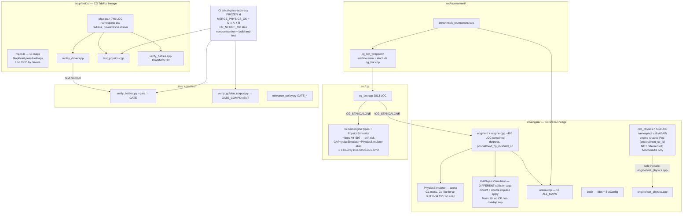
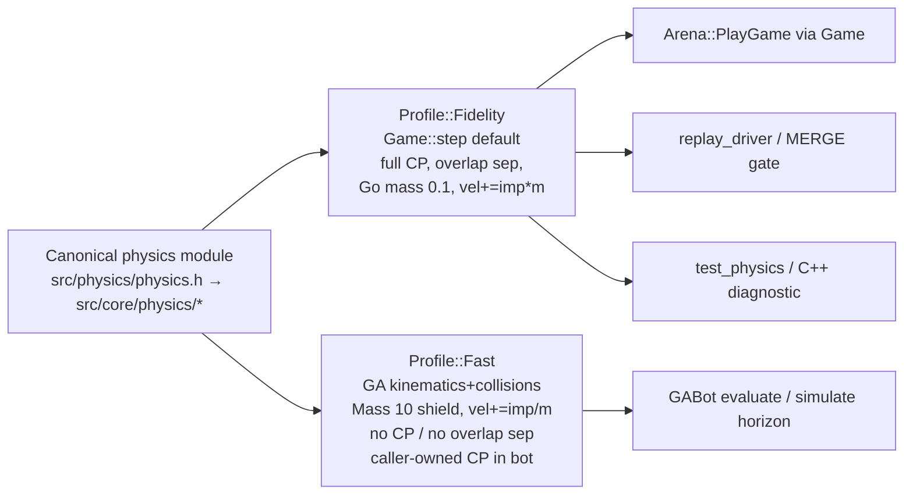
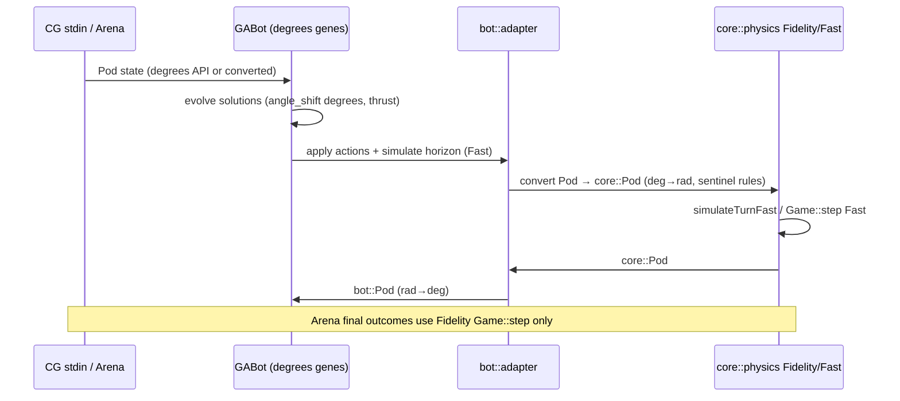
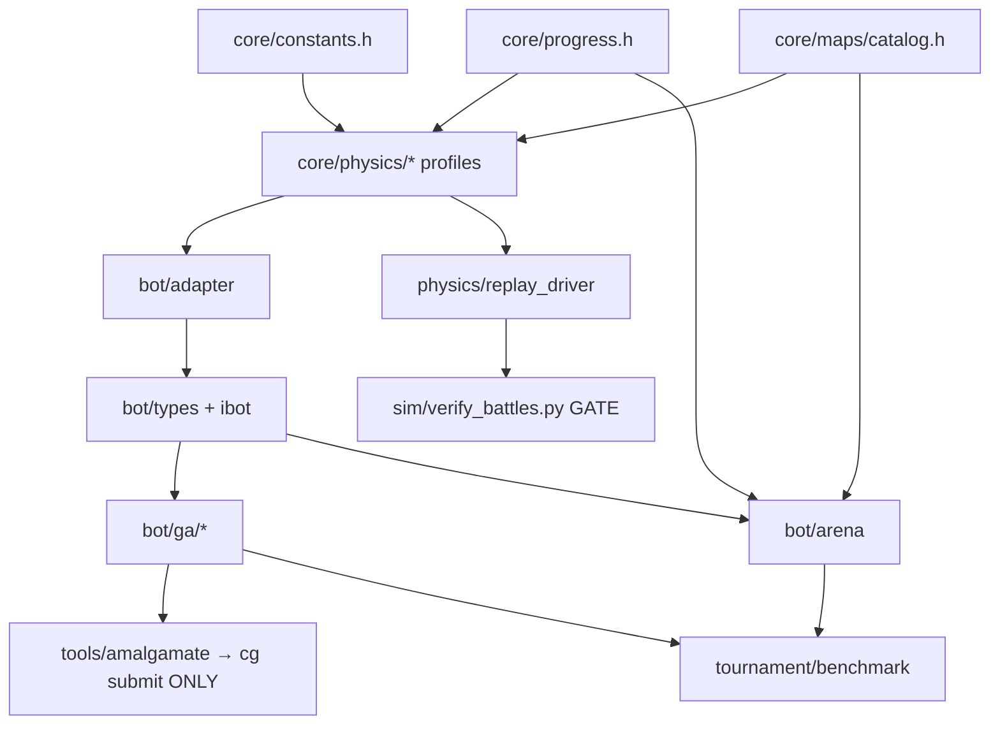
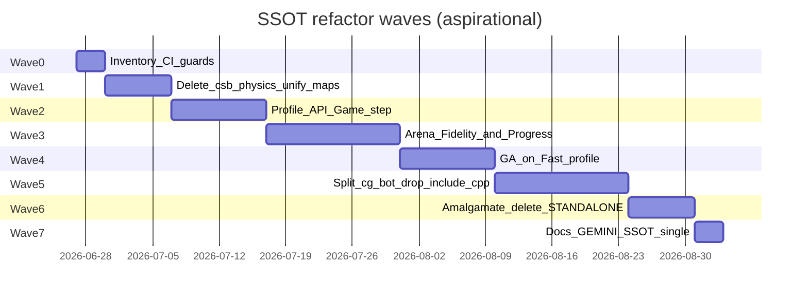

# Mad Pod Arena — Full-Repo Single Source of Truth (SSOT) Refactor

| Field | Value |
|---|---|
| **Title** | Full-Repo SSOT Refactor Path |
| **Author** | TBD (staff / agent implementer) |
| **Date** | 2026-06-27 |
| **Status** | Approved for implementation (OQ2/3/8 locked) (rev 3.1 — honesty pass with plan 1.1 / design-vs-code review) |
| **Repo** | `/Users/samsi/csb/mad_pod_arena` |
| **Supersedes (negative scope)** | `docs/archive/CODE_REVIEW_SOLID_AND_SPAGHETTI.md` (was blocked under verification-only task; **this** design is the authorized full-repo program) |
| **Preserves (locked)** | `docs/VERIFICATION_TRUTH_POLICY.md` — job id `physics-accuracy`, compound gate roles, `GATE_*` tolerances unless a policy+checker PR co-moves them |

---

## Overview

`mad_pod_arena` is a Coders Strike Back / Mad Pod Racing codebase with **three physics lineages**, **two map catalogs**, **two pod type systems**, and a **~2.8k LOC GA monolith** that either includes the engine or inlines a partial copy for CodinGame submission. The README and `GEMINI.md` currently advertise **two** physics SSOTs (`src/physics/physics.h` for CG fidelity, `src/engine/` for bot/arena). That framing was pragmatic for verification governance but is the root of long-term drift: constants diverge, field names diverge (radians/`p`/`s` vs degrees/`pos`/`vel`), and mental models collide (`namespace csb` appears in both `physics.h` and the experimental `csb_physics.h`).

This design defines **SSOT as a layered contract**, not as “one function for every use case”:

1. **One canonical physics module** — evolved from `src/physics/physics.h` (**746 LOC** as of 2026-06-27, header-only `namespace csb`, battle-gated) — owns kinematics, collisions, checkpoints, shields, timeouts, and turn order. Fidelity and Fast may be **two documented algorithms in that module** (see Fast semantic matrix / Alt E — Fast is a **full GA collision port**, not a mass-factor branch), not three hand-maintained headers across packages.
2. **Profiles / policies** distinguish **Fidelity** (merge-gate / arena outcomes / replay) from **Fast** (GA multi-core search approximations), implemented as `Game::step(StepOptions)` branches or named `simulateWorldFidelity` / `simulateWorldFast` in the **same TU** — with an explicit semantic matrix so implementers do not pretend GA impulse algebra is “Fidelity minus skips.”
3. **Thin adapters** expose engine-facing types (`Pod` with `pos`/`vel`/degrees) and CG I/O without forking physics math.
4. **Amalgamation** (generated or scripted) produces the CodinGame single-file submission from modular sources; `#ifdef CG_STANDALONE` inline copies and `#include "cg/cg_bot.cpp"` tournament hacks become deletion targets. Submit pulls **Fast-only kinematics** by default (matches today’s standalone).
5. **Maps, constants, bot interfaces, progress encoding, and verification policy** each have exactly one authoritative home; duplicates become generated views or are deleted.

The path is **incremental PRs**, each mergeable with full **`PR_MERGE_OK`** green (battle-retention ∧ `bazel test //...` / `build-and-test` ∧ `physics-accuracy`) or an explicit migration window that co-updates policy + checker. No vague cleanup — modules, paths, and deletion targets are named below.

---

## Background & Motivation

### Current architecture (as-built)



### Pain points (concrete)

| Symptom | Evidence in tree |
|---|---|
| **Three physics implementations** | `src/physics/physics.h` (746 LOC); `src/engine/engine.{h,cpp}` (`PhysicsSimulator` + `GAPhysicsSimulator`, ~495 LOC combined); `src/engine/csb_physics.h` (`csb::PhysicsEngine`, 504 LOC) |
| **Namespace / ODR collision risk** | Both `physics.h` and `csb_physics.h` use `namespace csb` with **different** `Pod` layouts — referee (`p`/`s`/`next`) vs **engine-isomorphic** (`pos`/`vel`/`next_cp_id`). Safe only because they are not co-included in one TU today; one mistaken include = ODR timebomb |
| **Type inconsistency** | Referee: radians, `p`/`s`/`next`/`shieldtimer`/`boosted`. Engine: degrees, `pos`/`vel`/`next_cp_id`/`shield_cd`/`boost_available` |
| **Impulse / collision fork (not just skips / mass)** | Fidelity/`PhysicsSimulator`: Go-style `force = n·relv/(m1+m2)`, single `vel += impulse * m`, 0.1 shield, overlap sep, snapNearInteger on Fidelity. `GAPhysicsSimulator`: **mcoeff** formula, impulse applied **twice**, Mass 10, no overlap sep, different `GetCollisionTime` (−1 sentinels) — full algorithm port for Fast |
| **Maps duplicated and inconsistent** | `arena.cpp` `ALL_MAPS` = **18** CG-captured maps; `physics/maps.h` `possibleMaps` = **13** Go-referee-shaped. **Not a subset** — coordinates differ (e.g. hostile territories). Alternate catalog only |
| **GA bot monolith + dual build modes** | `cg_bot.cpp` inlines engine under `#ifdef CG_STANDALONE` (lines ~49–597) while tournament uses `#include "cg/cg_bot.cpp"` via `cg_bot_wrapper.h` with `#define main`. Standalone aliases `GAPhysicsSimulator = PhysicsSimulator` (L599–602) → **Fast-only kinematics in CG submit** |
| **Caller-owned CP in GA** | ~149 `next_cp_id` + ~36 `laps_completed` tokens in `cg_bot.cpp` (~185 progress-touching); disk `360000` checks ~13 sites only; not Fidelity segment `cpCollide` / global `next` |
| **Two “SSOTs” in docs** | `README.md` / `GEMINI.md` / `src/README.md` explicitly teach dual physics SSOTs — incentivizes divergence |
| **Unused dep** | `nlohmann_json` in `MODULE.bazel` but unused in `src/` (JSON via `json_minimal.h`) |
| **Peripheral consumers (non-blocking)** | `src/cg/patch_*.py` and `docs/research/**` may assume current paths; not in gate; update opportunistically in Wave 7 / PR-11 |
| **Verification locked vs refactor scope** | Policy task correctly forbade bot/engine unspaghetti; that negative scope must not block **this** program |

### Why SSOT now

Without a single physics **module**, every fidelity fix risks a silent GA/arena regression (or the reverse). Without map SSOT, tournament win rates are not comparable to CG map distributions. Without amalgamation SSOT, CodinGame submit and local tournament bots can diverge on search physics. The verification gate protects **referee fidelity** only; it does **not** protect engine↔physics agreement or standalone↔shared agreement.

---

## Goals & Non-Goals

### Goals

1. **Physics SSOT module**: Exactly one **editable package** for collision sweep, impulse (both Fidelity and Fast algebras documented), friction truncation, position rounding, shield/mass, rotate limits, checkpoint pass (Fidelity), and timeout rules — living under a dedicated module (canonical path: evolve `src/physics/physics.h` into a modular package; see Proposed Design). Fast is **not** a second header across `src/engine/`.
2. **Profile model**: Fidelity vs Fast are **policies / named algorithms** on that module (`Game::step` + `StepOptions` or `simulateWorldFidelity` / `simulateWorldFast`), not independent codebases in different packages.
3. **Adapter layer**: Engine/bot code consumes a stable `Pod` / `Vec2` / degrees-friendly API **or** migrates to referee types; conversion is explicit and tested.
4. **Maps SSOT**: One catalog — the **18 CG-captured** arena maps as primary. Go’s **13-map list is a reference-only alternate catalog**, not a subset of the 18; delete or quarantine under a non-SSOT name.
5. **Constants SSOT**: One header for radii, friction, max rotate, thrust bounds, timeouts, lap defaults.
6. **Progress SSOT**: One encoding helper (`RaceProgress` / global CP) used by arena win/timeout rules; bot eval may migrate later but arena must not keep a divergent win model.
7. **Bot modularization**: Split `cg_bot.cpp` into GA core, eval, heuristics, I/O; tournament links a normal `cc_library`; CG submit is **generated amalgamation** (Fast-only kinematics by default).
8. **Verification continuity**: Keep full **`PR_MERGE_OK`** green every PR (retention + `build-and-test`/`bazel test //...` + `physics-accuracy`); do not rename job id `physics-accuracy` or change `GATE_*` without policy + `check_verification_policy.py` co-change.
9. **Incremental delivery**: Ordered PRs, each reviewable, with explicit deletion targets and staffing/time caveat (calendar waves are aspirational; gate-green serial work may exceed Gantt).

### Non-Goals

- Rewriting the GA algorithm or eval weights for leaderboard climbing (orthogonal; may land on top of modular bot later).
- Replacing Bazel, changing C++17 → C++20 (open question; not required for SSOT).
- Making GA search **bit-exact** with the referee on day one (may be a later optional profile; Fast may remain approximate **if measured and gated**).
- Sweeping `docs/agent_pack/**` or `docs/research/**` (out of verification policy scope; optional hygiene only).
- Promoting C++ `verify_battles` 0.01-style strictness to the merge gate (policy F3; separate decision).
- Editing `third_party/referees/**` (read-only references).
- Full SOLID redesign for its own sake — SSOT and deletable copies are the success criteria.
- Generating Go 13-map coordinates from `csbref.go` unless a dedicated Go-parity test needs them.

---

## Proposed Design

### SSOT definition for this repo

**Single source of truth** means: for each *concern*, there is exactly one **authoritative editable artifact**; all other representations are (a) adapters, (b) generated amalgams, (c) read-only third_party refs, or (d) deleted.

| Concern | Authoritative artifact (target) | Consumers (non-authoritative) |
|---|---|---|
| **Referee kinematics & rules (Fidelity)** | `src/core/physics/` (evolved from `src/physics/physics.h`) profile **Fidelity** via `Game::step` | `replay_driver`, Python gate via driver, arena runner, optional GA **if** profile Fidelity |
| **GA-speed physics (Fast)** | **Same module / TU**, profile **Fast** — see semantic matrix (may differ in impulse algebra, not only skips) | GA eval loop only; divergences **documented + acceptance-tested vs current `GAPhysicsSimulator`** |
| **Race progress / win / timeout encoding** | `src/core/progress.h` (`RaceProgress`) | Arena outcomes; bot eval (later migration); CG I/O converts **local** CP at boundary |
| **Map catalog** | `src/core/maps/catalog.h` (data from arena’s 18 maps) | Arena, tests, optional physics unit tests; delete `physics/maps.h` or quarantine as `go_referee_maps_reference.h` (**alternate catalog**, not subset) |
| **Game constants** | `src/core/constants.h` | Physics, adapters, bot eval (no local magic numbers for radii/friction/rotate) |
| **Bot types / IBot** | `src/bot/types.h` + `src/bot/ibot.h` (today `engine.h` Pod/PodAction + `bot.h`) | GA, arena, tournament |
| **GA bot logic** | Modular `src/bot/ga/*` (split from `cg_bot.cpp`) | Amalgam `dist/cg_bot_submit.cpp` (submit-only); tournament links library (no amalgam) |
| **Verification tolerances & roles** | `sim/tolerance_policy.py` + `docs/VERIFICATION_TRUTH_POLICY.md` + checker | CI, docs mirrors (docs may describe; code+policy pair is authority for numbers) |
| **Battle retention** | `battles/RETENTION.md` | `enforce_retention.py` |
| **External referee behavior** | CodinGame server (observed via corpora); Go/C++ under `third_party/` are **references only** | Never edited as SSOT |

**What SSOT is *not*:** “every call site runs full referee physics at full cost,” nor “Fast ≡ Fidelity with three `if` skips.” Fast is allowed **because it lives in the same editable module** with an explicit semantic matrix (shared rotate/friction/trunc where true; divergent mass/impulse and CP locus where today’s GA differs). Parallel **packages** (`GAPhysicsSimulator` class + `csb_physics.h`) are deletion targets.

### Target package layout

```text
src/
  core/                          # NEW — physics + constants + maps + progress SSOT
    constants.h                  # kPodRadius, kFriction, kMaxRotate, …
    progress.h                   # RaceProgress: global_next ↔ (lap, local_cp), win, timeout
    maps/
      catalog.h                  # 18 CG maps (from arena.cpp ALL_MAPS)
      # optional quarantine: go_referee_maps_reference.h (NOT subset of 18)
    physics/
      types.h                    # Point, Pod (canonical: radians, p/s/…)
      move.h                     # PlayerMove, parseMove
      collide.h / step.h         # collision helpers
      game.h                     # Game, initializeFromTrack, applyAction, step(StepOptions)
      profile.h                  # enum class PhysicsProfile { Fidelity, Fast }
      physics.h                  # umbrella include (keeps replay_driver path stable via shim)
  bot/                           # NEW — bot-facing types + GA (split from engine/ + cg/)
    types.h                      # Vec2, Pod (degrees API) OR thin typedefs over core
    adapter.h / adapter.cpp      # core::Pod ↔ bot::Pod conversions (angle sentinel rules)
    ibot.h                       # IBot, BotConfig (from bot.h)
    arena.h / arena.cpp          # uses Fidelity profile on csb::Game
    ga/
      bot.h / bot.cpp            # GABot
      evolution.cpp
      eval.cpp
      heuristics.cpp
      io_main.cpp                # CG stdin/stdout main only
  physics/                       # COMPAT SHIMS during migration (then thin or gone)
    physics.h                    # #include "src/core/physics/physics.h" OR moved
    maps.h                       # deleted or go_referee_maps_reference.h
    replay_driver.cpp            # unchanged protocol; deps on core
    verify_battles.cpp
    test_physics.cpp
    BUILD.bazel
  engine/                        # SHRINK → delete physics bodies; keep only until adapters land
    engine.h                     # becomes #include bot/types + deprecated aliases
    engine.cpp                   # DELETE physics; move LUT/rand to core/util if needed
    csb_physics.h                # DELETE (PR-1)
    test_physics.cpp             # DELETE or rewrite without csb_physics (PR-1 must green //...)
    arena.*                      # move to bot/arena.*
    bot.h                        # move to bot/ibot.h
  cg/
    cg_bot.cpp                   # becomes thin #include amalgam OR deleted post-split
    patch_*.py                   # peripheral; update paths opportunistically
    BUILD.bazel                  # cg_bot links //src/bot:ga; standalone = genrule amalgam
  tournament/
    cg_bot_wrapper.h             # DELETE in PR-7 (merged with modular link); no separate PR-8
    benchmark_tournament.cpp
sim/                             # unchanged authority for gate roles
docs/
  VERIFICATION_TRUTH_POLICY.md   # locked unless co-PR
  SSOT.md                        # NEW — points here / summarizes ownership table
tools/
  amalgamate_cg_bot.py           # NEW — produce single-file submit from modular sources
  cpp_opts.bzl
```

Migration may keep paths `src/physics/physics.h` as the **on-disk** home for longer (lower churn for gate caches) and only introduce `src/core/` when splitting the header becomes necessary. The **logical** SSOT is the referee-faithful implementation plus co-located Fast algorithm; physical directory moves are secondary and may lag.

### Physics profile model (core decision)



#### Fast vs Fidelity semantic matrix (normative for PR-3 / PR-6)

| Concern | Fidelity (gate / arena) | Fast (GA search today → profile) | Implementation choice |
|---|---|---|---|
| **Rotate / max 18° / `hasRotated` first snap** | Go-style `diffAngle`, invalid-input, target==pos rules in `physics.h` | Engine `ApplyServerAction`-style degree clamp (GA applies genes differently) | **Shared Fidelity rotate on `Game` path**; GA may keep gene→thrust application bot-side until eval migrates — document if Fast uses simplified rotate in search-only pods |
| **Friction / trunc / position round** | `physics.h` trunc friction, round positions | Same intent in `GAPhysicsSimulator` | **Branch in shared code** (one implementation) |
| **Collision / impulse algorithm** | Unit normal; `force = n·relv/(m1+m2)`; single apply; 0.1 mass; overlap sep; Fidelity `snapNearInteger` | `mcoeff=(m1+m2)/(m1*m2)`; double impulse apply; Mass 10; no overlap; different time solver (−1) | **Port entire GAPhysicsSimulator body** into Fast — **not** a mass-factor branch; trajectory goldens mandatory |
| **Collision pair loop** | General n-body style in `Game` | Unrolled 4-pod pair loops | Fast may keep unrolled loops **inside** Fast function for perf; same impulse result as Fast algebra |
| **Overlap separation** | Yes (Fidelity) | No (`GAPhysicsSimulator`) | Fast: **skip** (`separate_overlaps = false`) |
| **CP detection locus** | Segment `cpCollide` during bounce-aware subsegments; advances global `next` | **None in simulator**; bot uses end-position disk `DistanceSq <= 360000` on **local** `next_cp_id` / `laps_completed` | Fast: **no CP inside physics**; **caller-owned** (~149+36 progress tokens; ~13 disk checks). Do **not** silently move CP into Fast without eval migration PR |
| **Team timeouts / `won` / `playerTimeout`** | `Game` team arrays, reset 101 on CP, decrement per world step; `won` when `next >= globalNumCp` | Not in GA sim (search horizon only) | Fidelity only on `Game`; Fast kinematics does not own race outcome |
| **Early-outs** | Full collision resolution | Optional geometric early-out | Fast may enable `collision_early_out` if trajectory tests still pass |
| **Angle storage** | Radians; spawn `angle = -1.0 * kDegToRad` | Degrees; spawn `angle = -1.0` | Adapter / arena contract (see Arena turn); Fast search pods may stay degrees via adapter |

**PR-3 acceptance (blocking for Fast plumbing):** trajectory golden tests — fixed seeds / fixed action sequences — Fast profile outputs **match current `GAPhysicsSimulator`** (positions/velocities within tight epsilon) **before** PR-6 switches GA call sites. If match is impossible without copying GA algebra, implement that algebra under Fast explicitly (Alt E honesty) and still delete the separate class in PR-6.

**PR-6 acceptance:** GA call sites use Fast API; optional Elo delta measured via **regression oracle** (below); gate still green (GA not in gate). Document residual divergence Fast vs Fidelity (impulse + CP).

### Authoritative API: `Game::step` (not free-function-only)

Prefer evolving **`csb::Game`** so Fidelity gate path and Fast search share one type for world state where applicable. Free-function `simulateTurn` on raw pods is **optional convenience** for GA pod arrays, but **must** delegate into the same Fast kinematics implementation as `Game::step` when profile is Fast — not a second physics body.

```cpp
// src/core/physics/profile.h
enum class PhysicsProfile { Fidelity, Fast };

struct StepOptions {
    PhysicsProfile profile = PhysicsProfile::Fidelity;
    bool check_checkpoints = true;   // Fidelity: true; Fast: false (caller-owned CP)
    bool separate_overlaps = true;   // Fidelity: true; Fast: false
    bool collision_early_out = false;
    // Impulse algebra is selected by profile, not a separate bool:
    //   Fidelity → mass factor 0.1, vel += impulse * m
    //   Fast     → shield Mass() 10, vel += impulse / m
};

// AUTHORITATIVE for gate + arena (PR-3):
class Game {
public:
    // ... existing initializeFromTrack, applyAction, globalCp, playerTimeout, ...

    // Default Fidelity preserves MERGE_PHYSICS_OK (zero gate delta in PR-3).
    // PR-3 forbids semantic edits to CP bounce / friction / angle storage in the
    // same PR as profile plumbing — plumbing only.
    void step(const StepOptions& opt = {});
    // step() replaces / wraps simulateWorld + nextTurn orchestration.

    // Named entry points (Alt E transparency; may be private impl details):
    // void simulateWorldFidelity();
    // void simulateWorldFast();  // no CP, no overlap sep, Fast impulse algebra
};

// OPTIONAL GA convenience — delegates to Fast kinematics; does NOT implement
// a third collision model. Nullable CP list is FORBIDDEN for Fidelity misuse:
// Fidelity always runs through Game with globalCp. Fast ignores CP list.
void simulateTurnFast(Pod* pods, int n, const StepOptions& opt);
// assert(opt.profile == PhysicsProfile::Fast);
```

**Migration from today’s classes:**

| Today | Tomorrow |
|---|---|
| `csb::Game::nextTurn` / pod methods in `physics.h` | `Game::step({Fidelity})` (unchanged semantics for gate) |
| `PhysicsSimulator` in `engine.cpp` | Adapter calling Fidelity `Game::step` **or** deleted once arena uses `Game` directly |
| `GAPhysicsSimulator` in `engine.cpp` | `Game::step({Fast})` / `simulateTurnFast` with Fast impulse algebra + skips |
| `csb::PhysicsEngine` in `csb_physics.h` | **Delete** (PR-1); benchmarks retarget Fidelity vs Fast profiles |

**Angle representation (OQ3 locked):** Keep **canonical storage in radians** (matches CG keyframes and gate A). Bot-facing adapter converts to degrees for GA genes / existing eval code **until** eval is migrated; **optional all-radians only after that migration**. Do **not** store degrees in the fidelity pod and convert only at I/O — that reintroduced gate regressions historically (see `physics.h` header comment on angle quantization).

**Angle sentinel asymmetry (adapter must implement exactly):**

| Context | Sentinel meaning |
|---|---|
| Engine / bot `Pod.angle` | `-1.0` means “unset” in **degrees** |
| Core `csb::Pod.angle` after `initializeFromTrack` | `-1.0 * kDegToRad` (~`-0.01745`) means “unset” in **radians** |
| Adapter bot→core | If `bot.angle == -1.0` (degrees sentinel), set `core.angle = -1.0 * kDegToRad`, **not** `-1.0` rad |
| Adapter core→bot | If `core` still at radian sentinel, expose `bot.angle = -1.0` degrees |
| First rotate | Core uses `hasRotated` + invalid-input / target==pos rules; do **not** emulate with only `angle < 0 → 0` then degree clamp on the Fidelity arena path |

### Adapter layer (bot ↔ core)



Critical conversions (must be unit-tested):

| Field core (`physics.h`) | Field bot (`engine.h`) | Rule |
|---|---|---|
| `p` | `pos` | identity |
| `s` | `vel` | identity |
| `angle` radians | `angle` degrees | `* kRadToDeg` / `* kDegToRad`; **sentinel table above** — do not treat `-1` as degrees when core expects radian sentinel |
| `next` (global CP index) | `next_cp_id` + `laps_completed` | encode/decode via `RaceProgress` (track length); CG stdin speaks **local** CP only at I/O boundary |
| `shieldtimer` | `shield_cd` | identity semantics (4 on activate) |
| `boosted` | `boost_available` | invert (`boosted==0` ↔ `boost_available==true`) |
| team timeouts on `Game` | per-pod `timeout` | **converge on team model** in arena (PR-4 / PR-4b); per-pod counters are legacy engine semantics |

### Progress model & `RaceProgress` (Key Decision 7 — dedicated delivery)

Checkpoint / progress is the hardest SSOT sub-problem: `physics.h` `Game::buildGlobalCp` (track × laps + CP0) vs `engine` `next_cp_id` modulo track with `laps_completed`. **Canonical = global index model** (referee).

**Deliver in PR-4b** (not optional folklore):

```cpp
// src/core/progress.h
struct RaceProgress {
    int track_len = 0;
    int laps = 0;              // race lap count (CG laps)
    // global_next in [0, track_len * laps + 1) style per physics.h globalNumCp

    static int Encode(int lap /*0-based completed? document*/, int local_cp, int track_len);
    static void Decode(int global_next, int track_len, int* lap, int* local_cp);
    static bool HasWon(int global_next, int global_num_cp);  // next >= globalNumCp
};
```

| Layer | Progress ownership after PR-4b |
|---|---|
| **Arena** | Solely `csb::Game` / `won` / `playerTimeout[2]`; no independent `laps_completed == laps_` win check |
| **CG I/O** | Still speaks **local** `next_cp_id` (viewer/CG contract); convert at boundary only |
| **GA eval** | May keep local index + `laps_completed` **until** optional PR-7b / Open Question 7; must not re-fork arena |

**Max turns policy (explicit):**

| Path | Today | Target |
|---|---|---|
| Physics / CG-faithful | `kMaxGameTurns = 500` | **Arena on Fidelity uses 500** to match CG / `Game` |
| Engine arena | **1000** tournament safety | **Change to 500** when switching arena to `Game` (intentional rule alignment, not silent). Document in PR-4 release notes; if product wants 1000 for local tourneys, gate behind `ArenaConfig::max_turns` defaulting to **500** |

### Arena turn on Fidelity (normative pseudo-code for PR-4)

Preferred architecture: **arena owns `csb::Game` as source of truth**; convert to bot `Pod` degrees view only for `IBot::GetActions` inputs; convert `PodAction` → `PlayerMove` at apply boundary. Avoid “degrees pods + kinematics-only step” on the Fidelity path.

```text
// One arena turn (Fidelity) — implementers must follow this contract

ArenaState {
  csb::Game game;                    // SSOT world state
  vector<IBot*> bots;                // team 0, team 1
  int max_turns = 500;               // match kMaxGameTurns unless ArenaConfig overrides
}

// Setup (once):
game.initializeFromTrack(catalog[map_id], laps);
// pods have angle = -1° in radians sentinel; hasRotated = false; playerTimeout = {100,100} or per physics.h

for turn in 0 .. max_turns-1:
  // 1. Build IBot view (degrees) from game.pods — adapter with sentinel rules
  bot_pods = adapter::ToBotPods(game);

  // 2. Query bots (still degrees PodAction: tx, ty, thrust/shield/boost tokens)
  actions0 = bots[0]->GetActions(team_slice(bot_pods, 0))
  actions1 = bots[1]->GetActions(team_slice(bot_pods, 1))

  // 3. PodAction → PlayerMove (string or structured); NOT ApplyServerAction on degrees pods
  for i in 0..3:
    move = adapter::ToPlayerMove(actions[i])  // may set invalid_input if malformed
    game.applyAction(i, move)

  // 4. World step — Fidelity only
  game.step(StepOptions{PhysicsProfile::Fidelity})
  // internally: rotate with hasRotated rules, thrust, collisions (mass 0.1 algebra),
  // CP segment checks → advances next / may set won, timeout reset to 101 on CP,
  // friction trunc, position round, playerTimeout decrement, shield timers, …

  // 5. Termination
  if any pod.won OR both teams timed out OR turn+1 >= max_turns:
    determine winner from game (won flags, playerTimeout, tie rules per physics.h)
    break

// DO NOT: increment per-pod timeout and eliminate when all pods timeout >= 100
// DO NOT: win on laps_completed == laps_ independent of global next
// DO NOT: PhysicsSimulator::SimulateTurn on degrees pods for arena outcomes
```

**Intentional behavior changes vs today’s arena (document in PR-4):**

| Topic | Legacy arena | Fidelity arena (target) | Class |
|---|---|---|---|
| Timeouts | Per-pod `timeout++`; team out if all pods `>= 100` | Team `playerTimeout[2]`; reset 101 on CP pass; decrement each step | **Bug fix / rule alignment** |
| Win | `laps_completed == laps_` | `won` when `next >= globalNumCp` | **Rule alignment** |
| Max turns | 1000 | **500** default (`kMaxGameTurns`) | **Intentional**; optional config for 1000 local-only |
| First angle | `angle < 0 → 0` then degree clamp | `hasRotated` + physics invalid-input / target==pos | **Rule alignment** |
| Action path | `ApplyServerAction` + `PhysicsSimulator` | `PlayerMove` + `applyAction` + `Game::step` | **Architecture** |

**Regression tests (PR-4/4b acceptance — OQ2 binding):** (1) fixed action logs → same winner vs **current** arena where rules already agreed; (2) after alignment, synthetic / recorded action traces vs `replay_driver` / Fidelity `Game` — outcomes and pod state within **`GATE_*` tolerances** (non-negotiable; ties PR-12 CI smoke). Expect some winner flips vs *legacy* arena when timeout/win models differed — treat as **correctness**, capture in PR description; do **not** treat legacy arena winners as the oracle.

### Maps SSOT

- **Authoritative list:** migrate `ALL_MAPS` from `src/engine/arena.cpp` (18 maps, comment: “captured from real CodinGame server”) into `src/core/maps/catalog.h` as `inline constexpr` / `const` data with stable indices 0..17. Move is **byte-identical** for those 18 coordinate lists.
- **`src/physics/maps.h` (13 maps):** Grep shows `possibleMaps` is **not** included by active C++ drivers in `src/physics/*.cpp` today — low-risk deletion. If retained for historical curiosity, rename to `go_referee_maps_reference.h` with comment **“reference-only alternate catalog; coordinates are NOT a subset of arena’s 18 (e.g. hostile territories differ)”**. Do **not** generate from Go unless a dedicated parity test needs it.
- Spawn offsets (`startPointMult` / `start_mults`) live once next to catalog or in `Game::initializeFromTrack` only.

### Bot modularization & amalgamation

**Split targets** from `cg_bot.cpp` (2813 LOC):

| Module | Approx. content today | Target path |
|---|---|---|
| Thread pool | `GABotThreadPool` ~L205+ | `src/bot/ga/thread_pool.h` |
| GABot + Evolution | `GABot`, `Evolution` | `src/bot/ga/bot.cpp`, `evolution.cpp` |
| Sim context / team actions | `SimCtx`, `TeamAction`, simulate helpers using `GAPhysicsSimulator` | `src/bot/ga/sim.cpp` → Fast profile (caller-owned CP remains in eval until optional migration) |
| Heuristic blocker | `HeuristicBlocker` ~L2482 | `src/bot/ga/heuristics.cpp` |
| `main` / CG I/O | stdin protocol | `src/bot/ga/io_main.cpp` |
| Standalone engine block | L49–597 `#ifdef CG_STANDALONE` | **Delete** — amalgamation pulls real headers; **Fast-only kinematics** in amalgam (matches L599–602 alias behavior) |

**Amalgamation pipeline** (prefer over dual engines; **submit-only** — tournament never amalgamates):

```text
tools/amalgamate_cg_bot.py
  inputs: FIXED Bazel filegroup (not user-supplied paths) — src/core/**/*.h (physics Fast-capable),
          src/bot/**/*.{h,cpp} ordered; excludes tests and tournament-only TUs
  algorithm:
    1. Topological order headers by #include graph within filegroup
    2. Strip #pragma once / include guards / #include "src/..." lines that resolve inside amalgam
    3. Keep #include <...> standard headers once (dedupe)
    4. Concatenate .cpp bodies once; single main from io_main.cpp
    5. Preserve thread_local, LUTs (cos_lut/sin_lut), InitLUT, g_friendly_collision — one TU ODR-safe
  output: dist/cg_bot_submit.cpp (or bazel-bin path); also compile as //src/cg:cg_bot_standalone
  size budget: prefer Fast-only kinematics (do not force full Fidelity CP path into submit unless measured OK).
              Target: amalgam ≤ ~1.2× current standalone preprocessed effective size; hard fail CI if
              output exceeds 1.5 MB source (adjust if CG limit documented tighter).
  CI parity: modular //src/cg:cg_bot (no STANDALONE) vs amalgam binary on FIXED seed list
             (document seeds in tools/amalgamate_parity_seeds.txt — e.g. 5 maps × 3 seeds).
             Golden = **identical stdout actions** (exact thrust/angle lines), not loose tolerance.
  supply chain: inputs are repo filegroup only; script must not read arbitrary CLI paths in CI
                (optional --input-list only for local debug; CI uses hardcoded list).
```

**Tournament:** delete `cg_bot_wrapper.h` include-cpp pattern **in PR-7** (merged scope; no separate PR-8); `benchmark_tournament.cpp` depends on `//src/bot:ga` `cc_library` exporting `GABot` implementing `IBot`. No `#define main`. No amalgam in tournament builds.

### Constants SSOT

Extract from `physics.h` lines 44–72 and engine magic numbers (`800.0`, `640000.0`, `360000.0`, `0.85`, `18°`, thrust 200/650, timeout 100):

```cpp
// src/core/constants.h (names already partially present as k* in physics.h)
inline constexpr double kPodRadius = 400.0;
inline constexpr double kPodCollisionRsq = 800.0 * 800.0;
inline constexpr double kCpRadius = 600.0;
inline constexpr double kCpRsq = 600.0 * 600.0;
inline constexpr double kFriction = 0.85;
inline constexpr double kMaxRotateRad = 18.0 * (M_PI / 180.0);
inline constexpr int kMaxGameTurns = 500;
// ...
```

Engine must **include** this header; forbid re-declaring literals in `engine.cpp` / `cg_bot.cpp`.

### Verification policy SSOT (docs vs code)

Unchanged ownership from locked policy:

| Artifact | Authority for |
|---|---|
| `sim/tolerance_policy.py` | `GATE_*` / `EXPLORE_*` numeric values |
| `docs/VERIFICATION_TRUTH_POLICY.md` | Compound gate definition, roles, job id freeze, file ownership |
| `sim/check_verification_policy.py` | Automated subset (§9) |
| `.github/workflows/ci.yml` | Job id `physics-accuracy`, step titles, `MAD_POD_GATE_STRICT` |

Refactor PRs **must not** casually edit these. If Fast-profile work needs a new CI signal (e.g. “arena vs referee agreement rate”), add a **new job** — do not overload `physics-accuracy` without policy PR.

**Every PR checklist (normative):**

```text
PR_MERGE_OK =
  battle-retention (enforce_retention) ∧
  build-and-test (bazel test //... / CI equivalent) ∧
  physics-accuracy (MERGE_PHYSICS_OK = U ∧ A ∧ B)
```

Gate-green alone is **insufficient** (engine deletions can fail `//src/engine:test_physics` while `physics-accuracy` stays green). PR-0 must run `sim/check_verification_policy.py` after README/GEMINI pointer edits (keep required gate strings intact).

### Target dependency graph



### Risks

| Risk | Severity | Mitigation |
|---|---|---|
| Adapter breaks `next` vs `next_cp_id` / laps → wrong arena winners | **High** | PR-4b `RaceProgress`; arena on `Game` only; unit tests; golden traces |
| Fast impulse algebra regresses GA strength | **High** | PR-3 acceptance vs `GAPhysicsSimulator` trajectories; PR-6 regression oracle |
| Fast “profile” becomes dual physics again | **High** | Semantic matrix + same TU; forbid free-function Fidelity with nullable CP |
| Standalone/amalgam diverges from today’s Fast-only submit | **High** | PR-9 parity vs **current** `cg_bot_standalone` actions; Fast-only in amalgam |
| Gate fails due to physics.h move / include path | **High** | Prefer in-place evolution; shims; never change `replay_driver` text protocol in same PR as math |
| `build-and-test` red while gate green (PR-1) | **Med** | PR-1 must delete/rewrite `engine/test_physics.cpp` and drop `csb_physics.h` from `hdrs` so `bazel build //...` passes |
| ODR `namespace csb` while `csb_physics.h` still present | **Med** | Delete `csb_physics.h` early (PR-1) |
| Scope creep into eval tuning | **Low** | PR plan forbids weight changes unless labeled optional |
| Calendar Gantt optimistic | **Med** | Waves aspirational; serialize on gate-green; no staffing assumption |

---

## API / Interface Changes

### Before (simplified)

```cpp
// engine — degrees world
PhysicsSimulator::SimulateTurn(pods, cps);
GAPhysicsSimulator::SimulateTurn(pods);  // no cps; different impulse algebra

// physics — radians world
csb::Game game;
game.initialize(cps, laps);
game.applyAction(i, move);
game.nextTurn();
```

### After (target)

```cpp
// AUTHORITATIVE — Game owns Fidelity (and can run Fast internals for tests)
csb::Game game;
game.initializeFromTrack(track, laps);
game.applyAction(i, move);
game.step({csb::PhysicsProfile::Fidelity});  // gate + arena

// GA search — Fast kinematics (same module); CP remains caller-owned in bot eval
csb::StepOptions fast{csb::PhysicsProfile::Fast};
// fast.check_checkpoints = false; fast.separate_overlaps = false;  // defaults for Fast
csb::simulateTurnFast(pods4, fast);  // delegates to Fast algebra; not a third implementation

// Bot-facing convenience (optional thin wrapper)
bot::simulateSearchTurn(bot_pods, fast);  // converts, Fast step, converts back
```

### IBot (stable)

Keep virtual surface from `src/engine/bot.h` so arena/tournament churn is minimal:

```cpp
class IBot {
public:
    virtual ~IBot() = default;
    virtual std::string GetName() const = 0;
    virtual void Initialize(int laps, int cp_count,
                            const std::vector<Vec2>& cps, int team_id) = 0;
    virtual std::vector<PodAction> GetActions(const std::vector<Pod>& pods) = 0;
    virtual void SetRoles(int runner_idx, int blocker_idx) {}
};
```

`Vec2` / `Pod` may later become aliases; signature stability is a feature.

### Build targets (target)

| Target | Role |
|---|---|
| `//src/core:physics` | Canonical physics hdrs (Fidelity + Fast in one module) |
| `//src/core:progress` | `RaceProgress` helpers |
| `//src/bot:types` / `//src/bot:ga` | Bot library |
| `//src/bot:arena` | Arena runner on `Game` Fidelity |
| `//src/physics:replay_driver` | Unchanged gate driver (deps core) |
| `//src/physics:test_physics` | Gate (U) |
| `//src/cg:cg_bot` | Modular bot + main |
| `//src/cg:cg_bot_standalone` | Amalgam `genrule` output (Fast-only kinematics) |
| `//src/tournament:benchmark_tournament` | Links `//src/bot:ga`, no include-cpp, no amalgam |
| **Delete** `//src/engine` physics bodies + `csb_physics.h` + include-cpp wrapper; package may vanish or become alias |

---

## Data Model Changes

No on-disk battle JSON schema changes. In-memory models converge:

1. **Canonical pod** = today’s `csb::Pod` in `physics.h` (radians, `p`/`s`/`next`/`shieldtimer`/`boosted`/`won`/`hasRotated`).
2. **Bot pod** = adapter view or gradually deprecated degrees struct.
3. **Maps** = one `std::vector<std::vector<Point>>` (or `MapPoint`) catalog, **18** entries (CG-captured). Go 13-map list is **not** part of this model.
4. **Progress** = global index in `Game`; `RaceProgress` encode/decode for boundaries.
5. **No DB migrations**; corpora under `battles/` unchanged; retention rule unchanged.

---

## Alternatives Considered

### Alt A — Keep dual SSOT forever (status quo docs)

- **Pros:** Zero migration; gate stays simple; GA Fast remains isolated.
- **Cons:** Permanent drift; three implementations already exist; CG_STANDALONE copy; map skew; violates user mandate.
- **Reject** as end state; acceptable only as **intermediate** during PR-0..PR-2.

### Alt B — Engine becomes canonical; port gate to engine

- **Pros:** Bot code already uses engine types; GA path “native.”
- **Cons:** Gate fidelity is battle-proven on `physics.h` (radians, Go `diffAngle`, `trunc` friction, global CP). Porting risks weeks of gate red; engine lacks `hasRotated` / invalid input / global CP model.
- **Reject** as primary direction.

### Alt C — Canonical physics module + thin adapters + profile Fast (this design)

- **Pros:** Preserves `MERGE_PHYSICS_OK`; deletes third implementation and parallel packages; amalgamation SSOT for CG; one constants/maps/progress home.
- **Cons:** Adapter complexity (especially progress model); Fast must be carved carefully; impulse algebra differs from Fidelity (documented in semantic matrix, not pretended away).
- **Accept** — with honesty that Fast may be a **second algorithm in the same module** (see Alt E relationship).

### Alt D — Codegen Fast from annotated Fidelity (heavy)

- **Pros:** Strongest “cannot diverge” story.
- **Cons:** Build complexity; overkill for ~1k LOC physics; poor agent ergonomics.
- **Defer**; profile branches / named functions are enough at this size.

### Alt E — One file / module, two named algorithms (no false “branch-identity”)

- **Pros:** Most honest SSOT at this repo’s actual divergence: `simulateWorldFidelity` vs `simulateWorldFast` (or `Game::step` switch) **co-located** in `physics.h` / `src/core/physics/*`, with Fast preserving today’s GA impulse/unroll semantics without claiming it is Fidelity-minus-three-skips. Still deletes `GAPhysicsSimulator` class and `csb_physics.h` as separate packages. Single place to review physics.
- **Cons:** Purists may say “not one algorithm”; still requires discipline not to fork a third path.
- **Relationship to Alt C:** Alt C is the program; Alt E is the **implementation honesty layer** for Fast. **Accept Alt E as the Fast implementation style** when semantic matrix rows cannot be expressed as pure skips (mass/impulse row). Reject only if a future measurement shows Fast can adopt Go `0.1` mass without Elo loss (then converge — PR-13).

---

## Security & Privacy Considerations

- No network services; bots read stdin. Threat model is **supply-chain / CI integrity** and **local RCE via malicious battle JSON** only if parsers are unsafe.
- Prefer continuing `json_minimal.h` (bounded parsers in C++ verifiers) or well-bounded parsers; if adopting `nlohmann_json`, use it consistently and drop the unused-only MODULE dep situation (either use it or remove `bazel_dep`).
- Battle corpora may contain player handles; retention policy already limits IDs — do not log full replays in CI artifacts beyond existing practice.
- Amalgamation scripts must not embed secrets (none expected). **Amalgam inputs are a fixed Bazel filegroup**, not arbitrary user paths, in CI — prevents path-traversal / unexpected file inclusion if the script is ever fed untrusted lists. Optional local `--input-list` is debug-only.

---

## Observability

| Signal | Where | Purpose |
|---|---|---|
| `MERGE_PHYSICS_OK` | CI `physics-accuracy` | Fidelity SSOT not broken |
| Full `PR_MERGE_OK` | retention + `build-and-test` + `physics-accuracy` | Every refactor PR |
| `role=GATE` / `DIAGNOSTIC` stderr lines | `sim/verify_battles.py` | Honest gate labeling (policy) |
| Arena outcome parity job (PR-12; OQ8: non-blocking first, promote after soak) | CI non-blocking → blocking after soak | Fidelity arena vs `replay_driver` on synthetic action logs |
| GA Fast vs Fidelity eval delta | Local benchmark / optional CI | Quantify approximation error (e.g. mean CP-progress error over 10k turns) |
| Amalgam parity | Unit/integration test | Modular vs submit binary **exact** actions |
| Tournament regression oracle | `benchmark_tournament` pinned command | Bot strength post-refactor |

**Regression oracle (normative for PR-4 / PR-6 / PR-7) — real CLI only:**

```bash
# Self-play CGBot vs CGBot; maps 0..17 inclusive via [start, end); no --seed today
BOT_THREADS=1 bazel run //src/tournament:benchmark_tournament -- \
  --start-map 0 --end-map 18 --repeats 10 --time-budget 7.5
# Record printed scores/wins in PR description; interpret shifts vs baseline.
# Do not document --maps / --games_per_pair / --seed until implemented.
```

Pinned in `docs/SSOT.md` (PR-0). Tool has no multi-bot pair matrix — “pair win rates” means self-play score lines the binary actually prints.

**Metrics targets (initial):**

- Gate (A)/(B): **100%** pass at current `GATE_*` (5.0 / 3.0 / 1.0° / 1 timeout) — no silent tighten.
- Fast profile throughput: retain **≥1.5×** Fidelity turn sim rate on GA hot path (today claims ~2×; re-measure in PR-3/6 harness: time 100k Fast turns vs 100k Fidelity turns on 4 pods, no I/O).
- Adapter overhead: **<5%** of GA turn budget when converting 4 pods × horizon 6 × population 50 (measure in PR-6); if higher, keep GA on core types without convert.
- Amalgam: exact action match on parity seeds; size under budget (see amalgamation section).

**Alerting:** CI red on `physics-accuracy` or `build-and-test` is the alert; no production paging.

---

## Rollout Plan

### Principles

1. **Full `PR_MERGE_OK` green every PR** (or policy co-PR for intentional migration windows) — not gate alone.
2. **Delete before decorate** — remove `csb_physics.h` and dead maps early to reduce confusion; PR-1 must green `bazel build //...`.
3. **Fidelity path first for arena** — switch arena to core `Game` Fidelity before deleting `PhysicsSimulator`; ship PR-4b progress helpers with or immediately after PR-4.
4. **Fast profile second** — replace `GAPhysicsSimulator` once Fidelity-on-core is proven and Fast acceptance tests match current GA trajectories.
5. **Amalgamation last among bot tasks** — modular link first (PR-7 includes tournament wrapper deletion); amalgam requires **PR-6** Fast migration complete; then delete `CG_STANDALONE` block.
6. **Feature flags:** compile-time `CSB_PHYSICS_PROFILE_*` and runtime `StepOptions`; no need for remote flags.
7. **Rollback:** revert single PR; shims keep old include paths (`src/engine/engine.h` → wrappers) for one release window.
8. **Staffing / time:** Gantt waves (~8–10 weeks calendar) are **aspirational** with no staffing assumption; serial gate-green delivery may take longer. Prefer correct PR-4/4b/6 over schedule.

### Staged rollout diagram



---

## Open Questions

1. **Must GA search remain approximate forever?**  
   - If leaderboard time budget allows Fidelity at horizon 6 / pop 50 / multi-thread, prefer Fast→Fidelity convergence and delete Fast.  
   - **Needs measurement** on target CG hardware class (2 vCPU-ish) and local M-series — **owner: implementer of PR-6**; data feeds PR-13. Track in `docs/SSOT.md` “Open Question 1 decision log.”

2. **Must arena outcomes match referee bit-exact (or within GATE tolerances)?** — **RESOLVED (rev 3, user decision).**  
   - **Yes — binding.** Arena tournament outcomes **MUST** match referee physics within `GATE_*` tolerances on recorded action traces (win/loss and final standings).  
   - Design default confirmed; **PR-4 + PR-4b implement this** as non-negotiable acceptance criteria (not aspirational).  
   - Tournament rankings must be the same game as CG at the physics/rules layer; divergences are defects.

3. **Canonical pod type for bot code long-term: degrees or radians?** — **RESOLVED (rev 3, user decision).**  
   - **Long-term: core radians + bot degrees adapter** (recommended path accepted).  
   - Optional all-radians only **after** eval migration (not a prerequisite for arena SSOT).  
   - Aligns with Key Decision 3 / angle sentinel rules.

4. **C++20?**  
   - `std::span`, `constexpr` improvements help profiles; not required. Defer unless staff wants language bump in same program.

5. **Keep `src/physics/` path forever for gate cache stability?**  
   - Reasonable; `src/core/` can be alias. Decide in PR-3.

6. **Adopt `nlohmann_json` or remove MODULE dep?**  
   - Cleanup PR-10; prefer remove if `json_minimal.h` stays.

7. **Global CP vs per-lap progress in bot eval?**  
   - Moving eval to global index is more referee-faithful but touches most fitness code — **optional PR-7b** after arena progress SSOT (PR-4b). Arena does **not** wait on this.

8. **Whether to add CI job `arena-fidelity`** (synthetic actions through arena vs `replay_driver`) as blocking — **RESOLVED (rev 3, user decision).**  
   - Ship **PR-12 as non-blocking first**; promote to blocking **after soak**.  
   - New job id (do not rename `physics-accuracy`). Catches adapter/progress regressions; complements (does not replace) PR-4/4b acceptance tests.

---

## References

- `src/physics/physics.h` — referee-faithful implementation (current CG fidelity SSOT; **746 LOC**)
- `src/engine/engine.h`, `src/engine/engine.cpp` — bot/arena + `GAPhysicsSimulator` (~495 LOC combined)
- `src/engine/csb_physics.h` — experimental third physics; **engine-isomorphic** `Pod`; deletion target
- `src/engine/arena.cpp` — 18-map `ALL_MAPS`
- `src/physics/maps.h` — 13-map `possibleMaps` (Go-shaped **alternate** catalog, unused by drivers)
- `src/cg/cg_bot.cpp` — GA monolith + `CG_STANDALONE` inline engine (2813 LOC)
- `src/tournament/cg_bot_wrapper.h` — `#define main` + include-cpp
- `docs/VERIFICATION_TRUTH_POLICY.md` — locked merge gate governance
- `sim/tolerance_policy.py` — `GATE_*` values
- `docs/archive/CODE_REVIEW_SOLID_AND_SPAGHETTI.md` — historical negative scope under verification task
- `third_party/referees/coders-strike-back-referee/` — Go reference (read-only)
- `README.md`, `GEMINI.md`, `src/README.md` — current dual-SSOT teaching (to be revised in Wave 7)
- `.github/workflows/ci.yml` — job `physics-accuracy`
- `src/cg/patch_*.py` — peripheral path consumers (non-blocking)

---

## Key Decisions

1. **Canonical physics = evolve `src/physics/physics.h` (referee-faithful), not `src/engine/`.**  
   Rationale: only lineage with `MERGE_PHYSICS_OK` battle corpora, Go-aligned rotate/friction/CP model, and locked CI job. Porting the gate to engine is higher risk than adapting bot code.

2. **SSOT is one physics module with profiles; Fast may be a second documented algorithm (Alt E), not a parallel package.**  
   Rationale: GA needs speed and today uses different impulse mass algebra — claiming “Fidelity with skips only” is false. One editable module + semantic matrix still deletes `GAPhysicsSimulator` / `csb_physics.h` as separate maintenance surfaces. GA CP remains **caller-owned** until an explicit eval migration.

3. **Canonical state uses radians and referee field semantics; bot degrees API is an adapter (including angle sentinel asymmetry).** — **Locked (OQ3).**  
   Rationale: Gate regressions from degree quantization are documented in `physics.h`; keep fidelity storage honest. Long-term remains **core radians + bot degrees adapter**; optional all-radians only after eval migration.

4. **Maps SSOT = arena’s 18 CG-captured maps; retire or quarantine the 13-map `maps.h` as a reference-only alternate catalog (not a subset).**  
   Rationale: Tournament and CG-facing play should share the catalog; Go’s 13 maps differ in coordinates and must not be taught as subset truth.

5. **CodinGame submit = amalgamation from modular sources (Fast-only kinematics by default); delete `CG_STANDALONE` inline engine and include-cpp tournament glue.**  
   Rationale: Prefer one bot codebase; dual maintenance is how standalone diverges. Amalgam is a build artifact, not an SSOT. Parity vs **current** standalone actions. Tournament does not use amalgam.

6. **Verification policy files remain SSOT for gate numbers/roles; every PR requires full `PR_MERGE_OK`, not gate alone; no silent tolerance tighten or `physics-accuracy` rename.**  
   Rationale: Locked governance; physics SSOT refactor is orthogonal and must not break trust in merge green.

7. **Progress model converges on referee global CP (`next` / `globalCp`) via `RaceProgress` in PR-4b; arena win/timeout/max-turns rebased on `Game` (500 default).**  
   Rationale: Largest semantic gap between engine and physics; leaving it forked guarantees “SSOT” is cosmetic. Bot eval global migration may lag (PR-7b / OQ7).

8. **Incremental PRs with shims; delete experimental `csb_physics.h` early (PR-1 must green `//...` including engine test target removal/rewrite) to remove `namespace csb` collision risk.**  
   Rationale: Low user value today (benchmark-only; sole include `engine/test_physics.cpp`); high confusion cost; engine-shaped Pod is not referee-isomorphic.

9. **Authoritative step API is `Game::step(StepOptions)`; optional `simulateTurnFast` delegates into the same Fast implementation.**  
   Rationale: Avoid free-function Fidelity with nullable CP reintroducing dual physics; gate path stays on `Game`.

10. **Arena outcomes MUST match referee physics (within `GATE_*` tolerances / recorded action traces). Binding (OQ2 locked).**  
    Rationale: Tournament rankings must not be “a different game” than CG. PR-4 + PR-4b implement this as **non-negotiable acceptance criteria** (action-trace / outcome parity vs `replay_driver` / Fidelity `Game`); PR-12 adds non-blocking CI smoke and promotes after soak (OQ8). Intentional rule alignment deltas vs *legacy* arena (timeouts, win, max turns, first angle) are correctness, not exemptions from referee match.

11. **PR-12 `arena-fidelity` CI starts non-blocking; promote after soak (OQ8 locked).**  
    Rationale: Catches adapter/progress regressions without blocking the program on day one of the job; promotion is the planned end state, not an open debate.

---

## PR Plan

Ordered for dependency safety. **Each PR leaves full `PR_MERGE_OK` green** (retention ∧ `bazel test //...` ∧ `physics-accuracy`) unless an explicit policy co-PR is filed.

### PR-0 — SSOT charter + CI guardrails (docs-only / checker-safe)

| | |
|---|---|
| **Title** | `docs: SSOT refactor charter; dual-physics warning` |
| **Affects** | `docs/SSOT.md` (new), `README.md` / `GEMINI.md` (pointer: “dual SSOT is transitional”), **no** policy tolerance edits |
| **Depends on** | — |
| **Description** | Publish ownership table, semantic matrix summary, PR roadmap, regression oracle command, deletion targets. Do not implement physics moves yet. Run `sim/check_verification_policy.py` in PR description (must pass; keep gate strings). Optional: add `sim` or workflow comment linking charter. |
| **PR_MERGE_OK** | Docs-only; still run retention + existing CI |

### PR-1 — Delete experimental third physics

| | |
|---|---|
| **Title** | `refactor(engine): remove csb_physics.h; retarget or delete engine benchmarks` |
| **Affects** | **Delete** `src/engine/csb_physics.h`; **delete or rewrite** `src/engine/test_physics.cpp` so it does not depend on `csb_physics`; remove from `src/engine/BUILD.bazel` `hdrs` / `test_physics` target as needed; any include sites |
| **Depends on** | PR-0 (soft) |
| **Description** | Eliminate `namespace csb` twin and 504 LOC. **Hard requirement:** `bazel build //...` and `bazel test //...` pass — gate-only green is insufficient because `build-and-test` runs full `//...`. Benchmarks compare engine simulator / later profiles only. Gate (`//src/physics:test_physics`) untouched. |

### PR-2 — Constants + maps SSOT

| | |
|---|---|
| **Title** | `refactor(core): single constants header and 18-map catalog` |
| **Affects** | New `src/core/constants.h`, `src/core/maps/catalog.h` (content from `arena.cpp` `ALL_MAPS` — **byte-identical** coords for the 18); `arena.cpp` includes catalog; `physics.h` includes constants (replace local `k*` or keep as aliases); **delete** `src/physics/maps.h` **or** quarantine as `go_referee_maps_reference.h` with “alternate catalog, not subset” comment; BUILD files |
| **Depends on** | PR-1 preferred |
| **Description** | One map index space for tournaments; constants not re-typed in engine. No behavior change intended for the 18 maps. Do not claim Go 13 is subset. |

### PR-3 — Physics profile API on `Game::step` inside canonical module

| | |
|---|---|
| **Title** | `feat(physics): PhysicsProfile Fidelity/Fast on Game::step; Fast trajectory goldens` |
| **Affects** | `src/physics/physics.h` (or split headers under `src/core/physics/` with shim `physics.h`); `src/physics/test_physics.cpp` (Fidelity cases unchanged + Fast vs `GAPhysicsSimulator` trajectory goldens — may temporarily compare against engine class still present); docs note Fast semantic matrix |
| **Depends on** | PR-2 |
| **Description** | Implement `StepOptions` + `Game::step`; Fast impulse algebra + skip CP/overlap per matrix. Default Fidelity — **zero gate delta**. **Forbid** semantic edits to CP bounce rules / friction / angle storage in this PR (plumbing + Fast additivity only). Fast path initially unused by GA. Optional `simulateTurnFast` delegates to same Fast body. |

### PR-4 — Arena on Fidelity `Game` (adapter at IBot boundary)

| | |
|---|---|
| **Title** | `refactor(arena): run games on physics Fidelity via csb::Game` |
| **Affects** | `src/engine/arena.cpp` / future `src/bot/arena.cpp`; adapter for `GetActions` inputs; win/timeout/max-turns per arena-turn contract; remove dependency on `PhysicsSimulator::SimulateTurn` for arena outcomes |
| **Depends on** | PR-3 |
| **Description** | Implement “Arena turn on Fidelity” pseudo-code. `PodAction` → `PlayerMove` → `applyAction` ×4 → `game.step(Fidelity)`. Default `max_turns = 500`. Document intentional rule deltas (timeouts, win, first angle). Deterministic regression: fixed actions → stable winner. Keep `IBot` degrees API via conversion **only** at query/apply boundaries. **Non-negotiable acceptance (OQ2 / Key Decision 10):** on recorded action traces, arena outcomes (win/loss, standings, and pod state within `GATE_*` tolerances) **MUST** match referee / Fidelity `Game` / `replay_driver` — not merely “closer than legacy arena.” |

### PR-4b — `RaceProgress` + global CP convergence for arena (Key Decision 7)

| | |
|---|---|
| **Title** | `feat(core): RaceProgress helpers; arena outcomes solely from Game progress` |
| **Affects** | New `src/core/progress.h` (+ tests); arena includes; adapter encode/decode; remove legacy `laps_completed == laps_` win path if any remains |
| **Depends on** | PR-4 (may land as stacked PR in same wave; **must not** be deferred past PR-5) |
| **Description** | Shared encode/decode `global_next ↔ (lap, local_cp)`; win = `HasWon` / `pod.won`; timeouts = `playerTimeout`. CG I/O remains **local** CP at boundary. **Does not** require full `cg_bot` eval migration (see PR-7b). **Closes the progress half of OQ2 acceptance with PR-4:** arena outcomes solely from `Game` progress so winners cannot diverge from referee on action traces. |

### PR-5 — Replace `PhysicsSimulator` body with core Fidelity calls

| | |
|---|---|
| **Title** | `refactor(engine): PhysicsSimulator becomes adapter to core Fidelity` |
| **Affects** | `src/engine/engine.cpp` / `engine.h`; any remaining direct callers |
| **Depends on** | PR-4, PR-4b |
| **Description** | Single Fidelity implementation. Engine class may remain as façade for degrees `Pod` for transitional GA callers not yet on Fast. |

### PR-6 — GA uses Fast profile; delete `GAPhysicsSimulator` class

| | |
|---|---|
| **Title** | `refactor(ga): search sim uses PhysicsProfile::Fast; remove GAPhysicsSimulator` |
| **Affects** | `src/engine/engine.cpp` (delete GA class); `src/cg/cg_bot.cpp` call sites (`GAPhysicsSimulator::SimulateTurn` → Fast API / adapter); standalone block still present until PR-9 but should call same Fast API if touched |
| **Depends on** | PR-3 (Fast goldens green), PR-5 recommended |
| **Description** | Switch GA to Fast; CP remains **caller-owned** in eval. Run regression oracle (`BOT_THREADS=1` benchmark command). Document residual divergence vs Fidelity. Gate still green (GA not in gate). Record Open Question 1 measurement notes for PR-13. |

### PR-7 — Split `cg_bot.cpp` into `src/bot/ga/*` library **and** drop tournament include-cpp

| | |
|---|---|
| **Title** | `refactor(bot): modularize GABot; normal link for tournament; delete cg_bot_wrapper` |
| **Affects** | New `src/bot/ga/*`; slim `src/cg/cg_bot.cpp` or re-exports; `src/cg/BUILD.bazel`; `src/tournament/BUILD.bazel`; **delete** `src/tournament/cg_bot_wrapper.h`; `benchmark_tournament.cpp` includes bot headers / links `//src/bot:ga` |
| **Depends on** | PR-6 (sim API stable; Fast migration done) |
| **Description** | Reviewable modules; `GABot` implements `IBot` without `#include ".cpp"`. Behavior parity tests on fixed seeds. **PR-8 merged into this PR** — no separate wrapper-only PR. |

### PR-7b (optional) — GA eval on global CP indices

| | |
|---|---|
| **Title** | `refactor(ga): eval fitness uses RaceProgress global indices` |
| **Affects** | `src/bot/ga/eval.cpp` and related (~149 `next_cp_id` + ~36 `laps_completed` token class) |
| **Depends on** | PR-4b, PR-7 |
| **Description** | Closes Open Question 7 for bot code; not required for arena SSOT. |

### PR-8 — *(merged into PR-7)*

Removed as standalone PR to avoid overlapping scope. Historical checklist item: “delete `cg_bot_wrapper.h`” is a **required deliverable of PR-7**.

### PR-9 — Amalgamation for CG submit; delete `CG_STANDALONE` inline engine

| | |
|---|---|
| **Title** | `build(cg): amalgamate submit binary; remove CG_STANDALONE engine fork` |
| **Affects** | New `tools/amalgamate_cg_bot.py`; `src/cg/BUILD.bazel` (`genrule` / `cg_bot_standalone`); **delete** `#ifdef CG_STANDALONE` blocks in bot sources; parity test modular vs amalgam; size budget check |
| **Depends on** | **PR-6** (Fast profile in bot sources — amalgam must not embed pre-Fast degrees engine fork physics) **and PR-7** (modular layout) |
| **Description** | Prefer amalgamation over maintaining dual engines. CodinGame paste file is build output. **Amalgam uses Fast-only kinematics** (matches today’s standalone alias behavior). Parity: modular `//src/cg:cg_bot` vs amalgam on fixed seeds with **identical stdout actions**; also compare amalgam actions to **pre-PR-9** `cg_bot_standalone` on same seeds before deleting STANDALONE (capture goldens in PR-6/7 if needed). Tournament does not amalgam. Inputs = fixed filegroup only. |

### PR-10 — Delete dead engine physics; optional package moves

| | |
|---|---|
| **Title** | `chore: remove obsolete engine physics; finalize src/core and src/bot layout` |
| **Affects** | Delete unused `engine.cpp` physics remnants; move arena/bot headers; update `src/README.md`; remove `nlohmann_json` dep **or** adopt it in verifiers; note `patch_*.py` path updates if broken |
| **Depends on** | PR-5, PR-6, PR-7, PR-9 |
| **Description** | Tree matches dependency graph; no third physics; no dual map file; no include-cpp. |

### PR-11 — Docs SSOT convergence

| | |
|---|---|
| **Title** | `docs: single physics SSOT narrative (README, GEMINI, src/README)` |
| **Affects** | `README.md`, `GEMINI.md`, `src/README.md`, `docs/SSOT.md`, cross-links; **do not** alter gate tolerances without policy PR |
| **Depends on** | PR-10 (or parallel once behavior matches) |
| **Description** | Retire “two physics SSOTs” teaching; document profiles + semantic matrix + adapter + amalgam + progress. Point verification policy as gate SSOT still. Re-run `check_verification_policy.py`. |

### PR-12 (optional) — Arena fidelity CI job

| | |
|---|---|
| **Title** | `ci: non-blocking arena vs replay_driver agreement smoke` |
| **Affects** | New script under `sim/` or `src/physics/`; `.github/workflows/ci.yml` or scheduled; **new job id** (not renaming `physics-accuracy`) |
| **Depends on** | PR-4+ / PR-4b |
| **Description** | Catches adapter/progress regressions. **OQ8 locked:** land **non-blocking first**; promote to blocking **after soak** (not open for debate). Complements PR-4/4b acceptance tests; does not relax Key Decision 10. |

### PR-13 (optional) — Fast→Fidelity convergence experiment

| | |
|---|---|
| **Title** | `perf: measure GA on Fidelity; gate Fast deletion decision` |
| **Affects** | Benchmarks only / maybe default profile flip behind flag |
| **Depends on** | PR-6, Open Question 1 data (**owner: PR-6 implementer**; decision recorded in `docs/SSOT.md`) |
| **Description** | If Fidelity fits time budget **and** Fast impulse can adopt Go mass without Elo loss, delete Fast profile branches and simplify SSOT further. Otherwise Fast remains Alt E dual-algorithm in one module — success criteria still met. |

---

## Success criteria (program done)

- [ ] Exactly **one** physics **module/package**; `csb_physics.h` and hand-maintained `GAPhysicsSimulator` **gone**
- [ ] Fast vs Fidelity differences documented in semantic matrix; Fast acceptance tests existed before GA switch
- [ ] Exactly **one** map catalog (18 CG maps) used by arena/tournament; Go 13 not taught as subset SSOT
- [ ] Constants not duplicated as magic numbers in bot/engine
- [ ] **Single progress encoding** (`RaceProgress` / global CP) drives arena win/timeout outcomes
- [ ] No `#ifdef CG_STANDALONE` engine copy; no `#include "cg_bot.cpp"` in tournament
- [ ] Amalgam submit is Fast-only kinematics by default; exact action parity on pinned seeds
- [ ] Full `PR_MERGE_OK` green continuously; job id still `physics-accuracy`
- [ ] README/GEMINI describe **one** physics SSOT module + profiles (Alt E honesty) + adapters + progress
- [ ] Open questions either decided or explicitly deferred with owner (OQ1 → PR-6 implementer / PR-13)

---

*End of design document (rev 2).*
