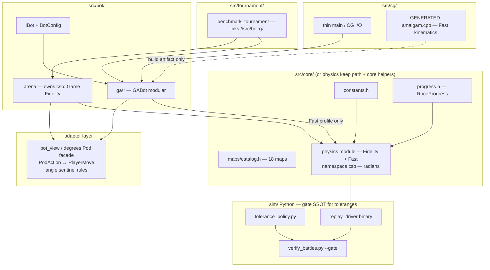

# Mad Pod Arena — SSOT Full-Repo Refactor Implementation Plan

| Field | Value |
|---|---|
| **Document type** | Operational implementation plan (not code) |
| **Status** | Ready for execution — **rev 1.1** incorporates design-vs-code review (`/tmp/grok-ssot-design-vs-code-review.md`); still **no application code** under this plan |
| **Date** | 2026-06-27 (rev 1.1 same day) |
| **Repo root** | `/Users/samsi/csb/mad_pod_arena` |
| **Governing design** | [`docs/SSOT_REFACTOR_DESIGN.md`](SSOT_REFACTOR_DESIGN.md) (rev 3+; OQ2/OQ3/OQ8 locked; matrix honesty updated with plan 1.1) |
| **Locked gate policy** | [`docs/VERIFICATION_TRUTH_POLICY.md`](VERIFICATION_TRUTH_POLICY.md) only (there is **no** root-level copy) |
| **Historical negative scope** | [`docs/archive/CODE_REVIEW_SOLID_AND_SPAGHETTI.md`](archive/CODE_REVIEW_SOLID_AND_SPAGHETTI.md) — superseded for *this* program |
| **Policy vs SSOT** | Verification policy §6 still says bot/engine unspaghetti is out of scope for *gate* work; **this SSOT program authorizes** those deletions while **gate numbers/job id stay frozen** — PR-0 must state that so agents do not refuse PR-1+ |

This document is the **how we execute** companion to the design. It is deliberately deeper on: wave structure, per-PR work breakdown, acceptance commands, risk matrices, rollback, staffing, file inventories, semantic contracts, and day-by-day sequencing. **Implementers must not invent a second SSOT story** — when this plan conflicts with code reality, update the plan in a PR; when it conflicts with gate policy, co-move policy + checker.

---

## 0. One-page mandate

### 0.1 Single focus

**Always keep exactly one authoritative editable artifact per concern.** Adapters, amalgams, profiles, and third_party referees are *derived or external* — never a second competing owner of physics math, map coords, gate tolerances, or progress encoding.

### 0.2 Locked user decisions (do not re-litigate in PRs)

| ID | Decision |
|---|---|
| **OQ2** | Arena tournament outcomes **MUST** match referee / Fidelity `Game` / `replay_driver` within `GATE_*` on recorded action traces. |
| **OQ3** | Long-term bot API = **core radians + degrees adapter**; optional all-radians only after GA eval migration. |
| **OQ8** | PR-12 arena-fidelity CI starts **non-blocking**; promote after soak. |

### 0.3 Definition of done (program)

- [ ] One physics **module** owns Fidelity + Fast (Fast may be Alt-E second algorithm **in that module only**)
- [ ] `src/engine/csb_physics.h` **gone**
- [ ] `GAPhysicsSimulator` class **gone**
- [ ] One map catalog: **18** CG maps (arena lineage); Go-13 not taught as subset SSOT
- [ ] Arena win/timeout/max-turns driven by `csb::Game` + `RaceProgress` (global CP)
- [ ] No `#ifdef CG_STANDALONE` **engine fork**; no tournament `#include "cg/cg_bot.cpp"`
- [ ] CG submit = **amalgam artifact**, Fast-only kinematics default, action-parity goldens
- [ ] Continuous **full `PR_MERGE_OK`**: battle-retention ∧ `bazel test //...` (build-and-test) ∧ job `physics-accuracy`
- [ ] README / GEMINI / `src/README` teach **one** physics SSOT + profiles + adapters
- [ ] Design OQ1/4/5/6/7 either decided with owner log in `docs/SSOT.md` or explicitly deferred

### 0.4 Hard non-negotiables during migration

1. **Do not rename** CI job id `physics-accuracy` without policy + `sim/check_verification_policy.py` co-PR.
2. **Do not tighten** `GATE_*` (5.0 / 3.0 / 1.0° / 1) as a “refactor side effect.”
3. **Do not** change Fidelity CP/bounce/friction/angle storage in the same PR that introduces Fast plumbing (PR-3 rule).
4. **Gate green alone is insufficient** — `build-and-test` runs `//...`; deleting headers without fixing dependents fails `PR_MERGE_OK`.
5. **No code in this planning document’s creation** — execution starts only when an implementer opens PR-0+.

---

## 1. Current state inventory (ground truth)

Counts are approximate as of 2026-06-27; re-verify with `wc -l` at PR start.

### 1.1 First-party C++ by role

| Path | ~LOC | Role today | Fate under SSOT |
|---|---:|---|---|
| `src/physics/physics.h` | **746** (`wc -l`; re-measure at PR start) | Referee-faithful header-only `namespace csb` | **Canonical physics module** (evolve in place or split under shim) |
| `src/physics/replay_driver.cpp` | **144** | Text protocol for Python gate | Keep protocol stable; include canonical physics only |
| `src/physics/test_physics.cpp` | ~131 | Unit/smoke for physics | Expand; Fidelity regression + Fast goldens |
| `src/physics/verify_battles.cpp` | ~508 | DIAGNOSTIC C++ corpus tool | Keep role; optional later `nlohmann_json` |
| `src/physics/maps.h` | ~23 | 13-map `possibleMaps` (unused by drivers) | Delete or quarantine as Go **alternate** catalog |
| `src/physics/json_minimal.h` | ~155 | Minimal JSON helpers | Keep or replace in verifier PR |
| `src/engine/engine.h` | ~83 | Degrees `Pod`, simulators, globals | Shrink to adapter / bot-facing types |
| `src/engine/engine.cpp` | ~412 | `PhysicsSimulator`, `GAPhysicsSimulator`, LUT, RNG | Delete GA class; façade Fidelity; later delete remnants |
| `src/engine/csb_physics.h` | ~504 | Experimental third physics, `namespace csb` again | **Delete PR-1** |
| `src/engine/test_physics.cpp` | ~335 | Benchmark vs `csb_physics` | Rewrite/delete with PR-1 |
| `src/engine/arena.cpp` / `arena.h` | ~140 / ~29 | 18 `ALL_MAPS`, drives `PhysicsSimulator` | Move outcomes to Fidelity `Game` |
| `src/engine/bot.h` | ~58 | `IBot`, `BotConfig` | Move toward `src/bot/` |
| `src/cg/cg_bot.cpp` | ~2813 | GA monolith + `CG_STANDALONE` fork | Modularize; amalgam for submit |
| `src/tournament/cg_bot_wrapper.h` | ~52 | `#define main` + include-cpp | **Delete in PR-7** |
| `src/tournament/benchmark_tournament.cpp` | ~180 | Bot vs bot harness | Link real bot library |

### 1.2 Physics lineages (the problem)

```text
Lineage A — CANONICAL TARGET
  src/physics/physics.h
  radians, Pod.{p,s,angle,next,shieldtimer,boosted,hasRotated,won}
  Game.{track,globalCp,playerTimeout,pendingMoves}
  bounce: shield mass factor 0.1, vel += impulse * m
  CP: segment cpCollide strict < rsq, global next, mid-turn aware
  Consumers: replay_driver, physics test_physics, verify_battles.cpp, Python gate

Lineage B — ARENA / LEGACY (NOT “almost Fidelity”)
  engine PhysicsSimulator — impulse *looks* Go-like (0.1 mass, vel += impulse * m) but **outcomes diverge**:
  degrees, Pod.{pos,vel,angle,next_cp_id,shield_cd,laps_completed}
  CP: local next_cp_id + laps_completed via CheckpointCollide (not globalCp / won)
  Timeouts: per-pod timeout++ every turn; team out if all pods timeout >= 100
  Win: laps_completed == laps_; max turns **1000** (arena.cpp) vs Fidelity **500**
  Rotate: angle < 0 degrees snap via ApplyServerAction — not hasRotated / invalid_input / target==pos
  Numerics: **no** snapNearInteger on thrust/post-bounce (Fidelity has it)
  IBot: arena passes **full 4-pod vector** to both bots (not team_slice)
  Consumers: arena.cpp
  **OQ2 implication:** adapters on degrees pods + PhysicsSimulator **cannot** satisfy OQ2 — only owning csb::Game does.

Lineage C — GA FAST (FULLY DIFFERENT COLLISION ALGORITHM — Alt E)
  engine GAPhysicsSimulator (+ CG_STANDALONE inlines **this** body under the name PhysicsSimulator,
  then aliases GAPhysicsSimulator = PhysicsSimulator — naming trap when porting “Fast”)
  ResolveCollision: mcoeff=(m1+m2)/(m1*m2), fx/fy from (nx*product)/(nxnysquare*mcoeff),
    impulse applied **twice** (pre + post min-120 rescale), Mass() 10.0 on shield frame, **no** overlap sep
  GetCollisionTime: different quadratic (a,b,c), early-outs c>3360000 / moving apart, returns **-1** never-collide
    (Fidelity/PhysicsSimulator-style path returns **10.0** sentinel — not interchangeable)
  No CP in sim; unrolled 6-pair loop; sets thread_local g_friendly_collision on teammate pairs
  CP updated **caller-owned** in cg_bot.cpp (~**149** next_cp_id + ~**36** laps_completed tokens;
    disk 360000 checks only ~**13** sites — not “159 disk checks”)
  Consumers: GA eval hot path, standalone submit
  **PR-3 implication:** simulateWorldFast = **port GA body nearly verbatim**, not “flip a mass branch.”

Lineage D — EXPERIMENTAL (DELETE)
  src/engine/csb_physics.h
  namespace csb again; engine-shaped Pod; claims referee mode but NOT gate SoT
  Sole include: engine/test_physics.cpp
```

### 1.3 Type / unit mismatch cheat sheet (adapter must encode)

| Concept | Fidelity (`physics.h`) | Engine / IBot today |
|---|---|---|
| Angle unit | **radians** | **degrees** |
| Uninit angle | spawn `angle = -1.0 * kDegToRad` (~−0.017 rad) + `hasRotated=false` | `angle = -1.0` degrees; `angle < 0` snap path |
| Position | `p.{x,y}` | `pos.{x,y}` |
| Velocity | `s.{x,y}` | `vel.{x,y}` |
| Checkpoint | global `next` over `globalCp` (track×laps + CP0) | `next_cp_id` local + `laps_completed` |
| Shield | `shieldtimer` (4 on activate) | `shield_cd` |
| Boost | `boosted` int 0/1 | `boost_available` bool |
| Win | `pod.won` / `next` past global end | `laps_completed == laps_` |
| Timeout | team `playerTimeout[2]`, set 101 on pass, decrement EOT | per-pod `timeout++`, team out if all pods ≥ 100 |
| Max turns | `kMaxGameTurns = 500` | arena often **1000** (must converge to **500** default under OQ2) |
| Action in | `PlayerMove` / thrust string | `PodAction` tx,ty,thrust (`-1` shield, `650` boost conventions in engine) |

### 1.4 Map catalogs

| Catalog | Location | Count | Used by gate? | Used by tournament? | Plan |
|---|---|---:|---|---|---|
| Arena CG-captured | `arena.cpp` `ALL_MAPS` | **18** | No (gate uses battle JSON tracks) | **Yes** | **SSOT** → `src/core/maps/catalog.h` |
| Physics maps.h | `possibleMaps` | **13** | No | No | Delete or quarantine; **not a subset** of the 18 (coords differ, e.g. hostile territories) |
| Go referee | `third_party/.../csbref.go` | 13-ish | Reference only | No | Read-only external |

### 1.5 Verification / CI SSOT (do not break)

Compound gate (job id **`physics-accuracy`**):

```text
(U)  bazel test --config=ci //src/physics:test_physics
(A)  MAD_POD_GATE_STRICT=1 python3 sim/verify_battles.py --gate battles/test_session_battles
(B)  MAD_POD_GATE_STRICT=1 python3 battles/scripts/verify_golden_corpus.py --tier pass
```

Copy Bazel `//src/physics:replay_driver` → `sim/replay_driver` before (A)/(B) when using driver path conventions.

**Full PR merge OK** (policy): at least `battle-retention` ∧ `build-and-test` ∧ `physics-accuracy` (+ branch protection).

**C++ `verify_battles`**: DIAGNOSTIC only — not merge gate; do not delete “for purity” in this program unless a dedicated decision says so.

### 1.6 Bazel packages today

| Target | Package | Notes |
|---|---|---|
| `//src/physics:physics` | hdrs only | Public |
| `//src/physics:replay_driver` | binary | Gate driver |
| `//src/physics:test_physics` | **cc_test** | Gate (U) |
| `//src/physics:verify_battles` | binary | Diagnostic |
| `//src/engine:engine` | lib | arena + engine |
| `//src/engine:test_physics` | **cc_binary** (not test!) | Depends on `csb_physics` — PR-1 casualty |
| `//src/cg:cg_bot` | binary | Linked engine |
| `//src/cg:cg_bot_hdr` | hdrs = `cg_bot.cpp` | Tournament include hack |
| `//src/cg:cg_bot_standalone` | `-DCG_STANDALONE` | Submit fork |
| `//src/cg:cg_bot_verify` | `-DLOCAL_VERIFY` | Local |
| `//src/tournament:benchmark_tournament` | binary | include-cpp path |

Centralize flags over time via `tools/cpp_opts.bzl` (today inconsistent `-Wall` / opts across targets).

---

## 2. Target architecture

### 2.1 End-state dependency graph



### 2.2 Ownership table (SSOT register)

| Concern | Authority (edit here) | Derived / forbidden |
|---|---|---|
| Physics kinematics, collisions, CP, shield, boost, friction | `src/physics/physics.h` (canonical module) | No second `bounce` in engine; no `csb_physics.h` |
| Fast vs Fidelity semantics | Semantic matrix in `docs/SSOT.md` + code branches in **same module** | No third package implementing Fast |
| Map coordinates (tournament) | `src/core/maps/catalog.h` from arena 18 | `maps.h` 13 not SSOT |
| Progress / win / team timeout encoding | `src/core/progress.h` + `csb::Game` fields | Arena must not invent parallel win rules |
| Gate tolerances / roles / job id | `sim/tolerance_policy.py` + `docs/VERIFICATION_TRUTH_POLICY.md` | Do not hardcode alternate GATE in C++ merge path |
| Bot search policy / genes / eval weights | `src/bot/ga/*` | Not in physics |
| CG paste file | **Generated** amalgam only | Not hand-edited; not a second bot |
| Go referee | `third_party/...` read-only | Never “sync by copy-paste” into engine |

### 2.3 Fast vs Fidelity semantic matrix (normative for implementers)

Implement PR-3/PR-6 against **this table**, not against memory.  
**Rev 1.1:** Fast is a **different collision algorithm** (Alt E), not “Fidelity with mass 10 and divide.”

| Dimension | **Fidelity** (`Game::bounce` / gate / future arena) | **Fast** (port of `GAPhysicsSimulator` — GA + submit) | Implementation note |
|---|---|---|---|
| Force construction | Unit normal; `force = n·relv / (m1+m2)`; then `force += 120` or `force += force` | `mcoeff = (m1+m2)/(m1*m2)`; `fx,fy = (n * (n·dv)) / (\|n\|² * mcoeff)` style (see `engine.cpp` L321–355) | **Not** a mass-factor toggle |
| Shield mass encoding | Inverse-mass style **0.1** / **1.0** on activation frame | `Mass()` returns **10.0** / **1.0**; divide by mass on apply | Related but embedded in different formulas |
| Impulse apply count | **Single** `vel += impulse * m` (Fidelity / arena PhysicsSimulator) | **Twice** (pre- and post- min-120 rescale of fx/fy) | Must copy both applies for trajectory match |
| Overlap separation | Yes when `dd <= 800` (+ ε) | **No** | Fast only |
| `snapNearInteger` | Yes on thrust and post-bounce vel (Fidelity) | **No** in GA path | Lineage B also lacks this — another OQ2 gap |
| Collision time solver | Rel-vel disc form; sentinel **10.0** = no hit this turn | Quadratic `a,b,c`; sentinel **-1.0**; early-outs `c > 3360000`, `c>=0 && b>=0` | Sentinels **not** interchangeable |
| Pair loop | Nested indices | Fully **unrolled** 6 pairs | Keep Fast shape for speed/parity |
| `g_friendly_collision` | N/A (or not set by Fidelity bounce) | Sets `thread_local` on teammate pairs (0–1 / 2–3) | **Must survive** Fast move into physics TU — GA fitness keys off it |
| Checkpoint in world step | Segment `cpCollide`; **global** `next`; team timeout 101→100 | **Not in Fast world step** | Caller-owned in GA until PR-7b |
| CP geometry (caller) | Segment + strict `< rsq` | Disk end-pos `dist² ≤ 360000` (~13 sites); progress also via `next_cp_id`/`laps_completed` (~185 tokens) | Do not call this “159 disk checks” |
| Timeouts / win / max turns | `playerTimeout`, `won`, **500** | N/A in Fast fragment | Arena **must** use Fidelity only (OQ2) |
| Angle / rotate | Radians, `hasRotated`, invalid_input, target==pos | Degree genes + `ApplyGAAction` | Adapter at boundary |
| Naming trap | Class names match roles | Standalone names class **`PhysicsSimulator`** but body is **GA Fast** | Port “Fast” = GA body, not arena PhysicsSimulator |
| Acceptance before GA switch | Battle gate + unit tests | **Trajectory goldens vs current `GAPhysicsSimulator`** (byte-semantic / tight tol) | PR-3 copies GA body into `simulateWorldFast`; **not** a mass branch |

### 2.4 Arena turn contract (Fidelity) — implement exactly

Pseudo-contract for PR-4 (state owned by `csb::Game` only — **not** degrees pods + PhysicsSimulator):

```text
On Initialize(laps, cp_count, cps_vec, ...):
  convert cps to csb::Point vector (identity coords)
  game.initialize(cps, laps)   # radians sentinel, hasRotated=false, globalCp, playerTimeout=100

On each turn:
  # PRESERVE today's IBot contract unless explicitly changing API:
  # arena passes FULL 4-pod degrees view to BOTH bots (arena.cpp L96–97), not team_slice.
  view = BuildDegreesView(game)           # all 4 pods
  actions0 = bot0.GetActions(view)        # 2 actions for team 0 pods
  actions1 = bot1.GetActions(view)        # 2 actions for team 1 pods
  Map PodAction → PlayerMove with tests for thrust -1 / 650 / invalid thrust / SHIELD / BOOST
  game.applyAction(0..3, ...)
  game.step(StepOptions{ profile: Fidelity })   # NORMATIVE: this signature (see §2.4.1)
  Terminal conditions ONLY from Game / RaceProgress (won, playerTimeout, turn >= 500)
  # Tie/draw: preserve arena semantics where both teams finish / both timeout same turn → winner -1
  #    but compute those predicates from Fidelity state, not laps_completed on engine pods
```

#### 2.4.1 Normative step API (pick one — charter locks this)

**Normative for implementers (rev 1.1):**

```text
struct StepOptions { PhysicsProfile profile = PhysicsProfile::Fidelity; };
void Game::step(const StepOptions& opt);   // AUTHORITATIVE

// Fidelity sugar only (optional overload — must call step(Fidelity), not a second body):
void Game::step(const PlayerMove moves[4]);  // existing-style; profile forced Fidelity
// Fast entry for GA may be a thin wrapper that sets profile Fast; still one implementation body.
```

Do **not** ship an ambiguous “free-function Fidelity with nullable CP” as the gate path.

#### 2.4.2 PR-4 delta matrix (why Lineage B ≠ OQ2)

| Concern | Legacy arena (Lineage B) | Fidelity `Game` (required) |
|---|---|---|
| World owner | `vector<Pod>` degrees + `PhysicsSimulator` | `csb::Game` |
| CP index | local `next_cp_id` + `laps_completed` | global `next` / `globalCp` / `won` |
| CP geometry | `CheckpointCollide` | segment `cpCollide` (+ bounce-aware mid-turn rules) |
| Timeout | per-pod `timeout++`; all pods ≥100 ⇒ team out | team `playerTimeout[2]`; pass sets **101**, EOT **--** ⇒ visible 100 |
| Win | `laps_completed == laps_` | `pod.won` / past global end |
| Max turns | **1000** | **500** |
| First rotate | `angle < 0` degrees in `ApplyServerAction` | `hasRotated` + radian rules + invalid_input + target==pos |
| Snap | none | `snapNearInteger` on thrust / post-bounce vel |
| Bot observation | **full 4-pod** vector both bots | preserve unless deliberate API change |

**Acceptance:** recorded action traces → same winner **and** pod states within `GATE_*` vs `replay_driver` / in-process Fidelity `Game`. Include **tie/draw** cases (both finished / both timeout).  
**Mandatory tests:** bot↔core↔bot **angle sentinel** (uninitalized path) — naïve `deg2rad(-1)` accidentally equals core spawn sentinel; non-sentinel paths and double conversion are the real bugs.

### 2.5 Angle sentinel rules (adapter)

| Event | Fidelity core | Degrees view for IBot |
|---|---|---|
| Fresh spawn | `angle = -1° in radians` ≈ −0.0174533; `hasRotated=false` | Prefer expose **uninitialized** consistently — document: do **not** treat core −0.017 as “−1 degree facing” |
| After first real rotate | radians heading; `hasRotated=true` | `angle_deg = rad * 180/π` normalized [0,360) or (−180,180] — pick one and test |
| Engine legacy | `angle < 0` means uninit in **degrees** | Only on pre-migration code paths |

### 2.6 Progress SSOT (`RaceProgress`)

```text
global_next  ↔  (lap, local_cp)  using track_size and laps
HasWon(pod)  ↔  pod.won OR global_next past finish index
OnPassCP     ↔  physics passCheckpoint semantics (timeout 101 then EOT decrement → 100 visible)
CG stdin/viewer nextCheckPointId  =  LOCAL index only — convert at I/O boundary
```

Arena must not keep a second win condition after PR-4b.

---

## 3. Wave plan (calendar + staffing)

Aspirational **8–12 weeks** calendar for one senior engineer part-time, or **4–6 weeks** full-time with careful gate discipline. Do not parallelize waves that share `physics.h` without stacking.

| Wave | PRs | Goal | Exit criteria |
|---|---|---|---|
| **W0 Charter** | PR-0 | Shared mental model | `docs/SSOT.md` + pointers; checker still passes |
| **W1 Delete twins** | PR-1, PR-2 | No third physics; one constants/maps | `//...` green; 18-map SSOT |
| **W2 Profiles** | PR-3 | Fast lives in canonical module | Zero gate delta; Fast goldens vs old GA sim |
| **W3 Arena = referee** | **PR-4 ⊕ PR-4b preferred as one PR** (or strict stack same day) | OQ2 satisfied; no half-merged progress | Action-trace outcome parity + RaceProgress |
| **W4 Kill dual sim classes** | PR-5, PR-6 | One Fidelity body; GA on Fast | `GAPhysicsSimulator` deleted; oracle tournament stable |
| **W5 Bot modular + link** | PR-7 [, PR-7b] | No include-cpp | Tournament links `//src/bot:ga` |
| **W6 Submit amalgam** | PR-9 | No STANDALONE fork | Action-identical amalgam vs modular + pre-cut standalone goldens |
| **W7 Cleanup + docs** | PR-10, PR-11 | Tree matches graph | Single SSOT narrative |
| **W8 Optional harden** | PR-12, PR-13 | CI soak; Fast convergence | Non-blocking arena job; OQ1 data |

### 3.1 Suggested staffing roles

| Role | Owns |
|---|---|
| **Physics owner** | PR-2 constants, PR-3 profiles, gate green |
| **Arena owner** | PR-4, PR-4b, OQ2 acceptance tests |
| **Bot owner** | PR-6, PR-7, PR-9 amalgam |
| **CI/docs owner** | PR-0, PR-11, PR-12, checker continuity |

One person can serialize all roles; do not skip gate checks.

---

## 4. Per-PR deep dive

Every PR subsection includes: intent, files, steps, tests, risks, rollback, **PR_MERGE_OK checklist**.

### Universal PR_MERGE_OK checklist (copy into every PR description)

```text
[ ] battles/scripts retention / battle-retention job green (if applicable)
[ ] bazel build //...
[ ] bazel test //...   # or CI build-and-test equivalent
[ ] physics-accuracy:
      [ ] (U) //src/physics:test_physics
      [ ] (A) MAD_POD_GATE_STRICT=1 python3 sim/verify_battles.py --gate battles/test_session_battles
      [ ] (B) MAD_POD_GATE_STRICT=1 python3 battles/scripts/verify_golden_corpus.py --tier pass
[ ] python3 sim/check_verification_policy.py   # if docs/workflows/sim touched
[ ] No accidental GATE_* or physics-accuracy id changes
```

---

### PR-0 — SSOT charter + CI guardrails

| | |
|---|---|
| **Title** | `docs: SSOT refactor charter; dual-physics warning` |
| **Depends** | — |
| **Risk** | Low (docs) |
| **Effort** | 0.5–1 day |

**Intent:** Make dual-SSOT teaching **transitional** in prose; publish ownership table, **honest** semantic matrix summary, roadmap, deletion targets, **runnable** regression oracle; authorize bot/engine deletions vs policy §6 misread.

**Create / touch:**

- **Create** `docs/SSOT.md` — living register (owners, matrix, OQ decision log, PR status table, measured `wc -l` table, normative `Game::step(StepOptions)` signature)
- **Touch** `docs/README.md` — list `SSOT_REFACTOR_DESIGN.md`, `SSOT_REFACTOR_IMPLEMENTATION_PLAN.md`, `SSOT.md`
- **Touch** `README.md`, `GEMINI.md`, `src/README.md` — short pointer only; keep strings required by `check_verification_policy.py`
- **Cross-link policy:** state clearly that **SSOT program authorizes** `csb_physics` / GAPhysicsSimulator / STANDALONE / include-cpp / arena-on-Game work while **`physics-accuracy` job id and `GATE_*` stay frozen** (policy §6 negative scope applied only to *verification-only* tasks, not this program)
- **Optional** comment in `.github/workflows/ci.yml` linking charter (no job renames)

**Pinned regression oracle (real CLI — do not invent flags):**

```bash
BOT_THREADS=1 bazel run //src/tournament:benchmark_tournament -- \
  --start-map 0 --end-map 18 --repeats 10 --time-budget 7.5
```

Notes: tool is **CGBot self-play** (not multi-bot pair matrix); **no** `--seed` / `--maps` / `--games_per_pair` today. Pass/fail = interpret printed scores / wins on that fixed command; optional later PR may add `--seed` for stricter determinism — do not document it until it exists.

**Do not:** edit `GATE_*`, delete code, move physics.

**Steps:**

1. Draft `docs/SSOT.md` from this plan §2 + design Key Decisions + rev 1.1 matrix honesty.
2. List SSOT docs in `docs/README.md`.
3. Add transitional dual-SSOT pointer + policy-vs-SSOT authorization sentence to READMEs.
4. Run `python3 sim/check_verification_policy.py` — must exit 0.
5. Open PR with roadmap checklist linking PR-1…PR-13.

**Acceptance:**

- [ ] Charter merged; oracle command copy-pastes and runs
- [ ] `docs/README.md` lists SSOT docs
- [ ] Checker green
- [ ] No CI behavior change

**Rollback:** Revert docs PR.

---

### PR-1 — Delete experimental third physics (`csb_physics.h`)

| | |
|---|---|
| **Title** | `refactor(engine): remove csb_physics.h; retarget or delete engine benchmarks` |
| **Depends** | PR-0 soft |
| **Risk** | Medium for `//...` (not for gate) |
| **Effort** | 0.5–1 day |

**Intent:** Remove `namespace csb` twin and 504 LOC confusion surface.

**Delete:**

- `src/engine/csb_physics.h`

**Must fix (hard):**

- `src/engine/test_physics.cpp` — sole include today → **delete target** or rewrite benchmarks against `PhysicsSimulator` / later profiles only
- `src/engine/BUILD.bazel` — remove hdr; remove or convert `test_physics` `cc_binary`

**Steps:**

1. `rg csb_physics` across repo; confirm only engine test + BUILD.
2. Prefer **delete** `//src/engine:test_physics` binary if benchmarks are non-essential; else rewrite without `csb_physics`.
3. `bazel build //... && bazel test //...`
4. Confirm `//src/physics:test_physics` still passes (untouched).

**Acceptance:**

- [ ] File gone; no references
- [ ] Full `//...` green
- [ ] Gate unchanged

**Rollback:** Restore header + test binary from git.

**Note:** This PR **proves** the “gate-only green is insufficient” rule — celebrate if CI catches a missed target.

---

### PR-2 — Constants + maps SSOT

| | |
|---|---|
| **Title** | `refactor(core): single constants header and 18-map catalog` |
| **Depends** | PR-1 preferred |
| **Risk** | Low–medium (include paths, ODR of constants) |
| **Effort** | 1–2 days |

**Intent:** One numeric universe; one tournament map index space.

**Add:**

- `src/core/constants.h` — radii, friction 0.85, max rotate 18°, thrusts 200/650, timeouts 100, max turns 500, collision rsq, cp rsq, min impulse 120, shield mass factors for **both** Fidelity (0.1) and Fast (10.0) **named distinctly** (`kShieldMassFactorFidelity` vs `kShieldMassFast`) so Alt E is explicit
- `src/core/maps/catalog.h` — **byte-identical** copy of `ALL_MAPS` 18 entries from `arena.cpp`
- `src/core/BUILD.bazel` (or fold into physics package if avoiding new package — **prefer explicit `//src/core`**)

**Change:**

- `arena.cpp` includes catalog; remove inline `ALL_MAPS` body
- `physics.h` includes constants; keep legacy aliases (`podRSQ`, etc.) if needed for gate stability
- `engine.cpp` magic numbers → constants includes where safe **without behavior change**

**Maps.h disposition (pick one in PR, document in SSOT.md):**

- **A (preferred):** delete `src/physics/maps.h` + remove from `physics` hdrs
- **B:** rename to `go_referee_maps_reference.h` with banner “alternate catalog, **not** subset of tournament 18; unused by gate”

**Do not:** generate Go coords into tournament catalog.

**Acceptance:**

- [ ] Arena map indices 0..17 unchanged coords (diff the arrays)
- [ ] No `possibleMaps` as SSOT in docs
- [ ] `//...` + gate green

**Rollback:** Restore maps inline in arena; restore maps.h.

---

### PR-3 — `Game::step(StepOptions)` Fidelity/Fast in canonical module

| | |
|---|---|
| **Title** | `feat(physics): PhysicsProfile Fidelity/Fast on Game::step; Fast trajectory goldens` |
| **Depends** | PR-2 |
| **Risk** | **High** if Fidelity drifts; **High** if Fast is under-ported (mass-branch mistake) |
| **Effort** | **4–7 days** (rev 1.1 — full GA collision port + goldens, not “plumbing only”) |

**Intent:** Fast lives beside Fidelity in **one module** as **Alt E second algorithm**; gate path default Fidelity **zero semantic delta**.

**API (authoritative — no ambiguity):**

```text
enum class PhysicsProfile { Fidelity, Fast };
struct StepOptions { PhysicsProfile profile = PhysicsProfile::Fidelity; };
void Game::step(const StepOptions& opt);   // AUTHORITATIVE

// Optional Fidelity sugar only if it calls the same Fidelity body:
// void Game::step(const PlayerMove moves[4]);  // forces Fidelity

// FORBIDDEN: free-function Fidelity with nullable CP as a second gate path
// FORBIDDEN: implement Fast as “Fidelity bounce with Mass()==10”
```

**Implementation strategy (mandatory honesty):**

1. `simulateWorldFidelity` = **relocate existing `Game` world step** — no CP/bounce/friction/angle storage edits in this PR.
2. `simulateWorldFast` = **copy nearly verbatim** from `GAPhysicsSimulator`:
   - `GetCollisionTime` (quadratic, −1 sentinels, early-outs)
   - `ResolveCollision` (mcoeff, double impulse apply, no overlap sep, `g_friendly_collision`)
   - Unrolled pair loop / turn loop (`col_count < 10`, etc.)
3. Decide Fast buffer type for GA: prefer operating on **core radians pods** inside Fast with thin convert at GA boundary **or** document degrees-buffer Fast with `<5%` adapter budget goal — pick in PR description; trajectory goldens define truth either way.
4. Wire `step(opt)` switch; default Fidelity.
5. Preserve `thread_local g_friendly_collision` semantics when Fast moves into physics TU (export or set from Fast resolve).

**Tests (mandatory):**

| Suite | What |
|---|---|
| Existing `test_physics` | Still pass unchanged expectations |
| **Fast goldens** | Fixed seeds / pod states: Fast trajectory matches **pre-PR** `GAPhysicsSimulator` **byte-semantic / tight tol** (not “mass branch similar”) |
| Gate (U)(A)(B) | **Zero delta** vs main — if flaky, PR fails |

**Optional:** temporary compare harness that still links engine GA class until PR-6 deletes it — ok in PR-3 only.

**Acceptance:**

- [ ] Full matrix rows (force formula, double apply, collision-time solver, overlap, snap, friendly flag) implemented and cited in `docs/SSOT.md`
- [ ] Fast unused by production GA yet **or** dark-launched default off
- [ ] Gate green; no policy edits

**Rollback:** Revert PR; Fast goldens prove we can re-land.

**Stop-ship if:** any test_session / golden failure attributable to Fidelity path.

---

### PR-4 (+ prefer merge PR-4b) — Arena on Fidelity `Game` + `RaceProgress` (OQ2 binding)

| | |
|---|---|
| **Title** | `refactor(arena): csb::Game Fidelity owner + RaceProgress; OQ2 action-trace parity` |
| **Depends** | PR-3 |
| **Risk** | **High** (tournament outcomes change vs legacy — **required** under OQ2); **High** if progress half-merges |
| **Effort** | **5–8 days** combined (rev 1.1 — not “3–5 + 1–2” if stacked; harder than plumbing) |
| **Stacking** | **Prefer one PR** for PR-4 + PR-4b so OQ2 is never “arena on Game but still `laps_completed` win.” If split, PR-4b **must not** slip past PR-5. |

**Intent:** Arena outcomes = referee outcomes on action traces. **Only owning `csb::Game` satisfies OQ2** — do not ship “adapter + PhysicsSimulator almost Fidelity.”

**Touch:**

- `src/engine/arena.cpp`, `arena.h` (or future `src/bot/arena.*`)
- `src/core/progress.h` (+ tests) — RaceProgress encode/decode / HasWon
- New adapter: `bot_view` (degrees, **full 4-pod**), `action_convert` (`PodAction` −1/650/invalid → `PlayerMove`)
- Angle sentinel tests (mandatory)
- `benchmark_tournament` only if max-turn assumptions need docs

**Steps:**

1. Single-write: `csb::Game` is arena world (spike dual-write OK, **not** mergeable).
2. `PodAction` → `PlayerMove` with explicit unit tests (shield −1, boost 650, thrust out of range → invalid_input, SHIELD/BOOST strings if used).
3. Degrees **full-world** view for **both** bots (preserve `GetActions(pods_)` contract).
4. `max_turns = 500`; terminal conditions **only** via Game / RaceProgress (including draw/tie rules mapped from Fidelity state).
5. Remove `PhysicsSimulator::SimulateTurn` from arena outcome path.
6. Blocker/opp scoring that reads all four pods still works via full view (hidden coupling).

**Acceptance tests (non-negotiable OQ2):**

1. **Synthetic traces:** fixed action sequences → winner + pod fields within `GATE_*` vs `replay_driver` / in-process Fidelity `Game` (include **tie/draw** scenarios).
2. **Angle sentinel suite:** bot↔core↔bot uninitialized paths (not optional).
3. **Progress unit tests:** encode/decode inverses track sizes 3..8, laps 1..3.
4. Document intentional deltas vs **legacy** arena (table §2.4.2) in PR body.
5. `BOT_THREADS=1` oracle command from PR-0 still runs (scores may shift — expected; gate unaffected).

**Do not merge if:** only “looks closer” without automated trace compare; or win still uses engine `laps_completed` only.

**Rollback:** Restore PhysicsSimulator arena path only as emergency (re-opens dual physics / fails OQ2).

---

### PR-5 — `PhysicsSimulator` becomes Fidelity façade

| | |
|---|---|
| **Title** | `refactor(engine): PhysicsSimulator becomes adapter to core Fidelity` |
| **Depends** | PR-4, PR-4b |
| **Risk** | Medium (callers expecting degrees pods in-place mutation) |
| **Effort** | 1–2 days |

**Intent:** Single Fidelity implementation body; engine class is compatibility shim.

**Pattern:**

```text
PhysicsSimulator::SimulateTurn(Pod* pods, const vector<Vec2>& cps):
  // convert pods+cps → temporary Game or mutate via adapter into Game
  // game.step(Fidelity)  // NEVER Fast here if caller expects arena/referee outcomes
  // convert back to degrees Pod*
```

**Risk (rev 1.1):** Façade on degrees `Pod*` is **lossy** for `hasRotated` / global `next` if GA or tools call Fidelity through this path — prefer arena **not** using this façade; mark façade **transitional / deprecated** for non-arena callers. GA must use **Fast**, not this façade.

Prefer minimizing copies on non-hot path (arena should already use Game directly — this PR cleans **remaining** callers).

**Acceptance:**

- [ ] No duplicated bounce math in `engine.cpp` Fidelity path
- [ ] Any remaining tests updated
- [ ] Gate green
- [ ] Comment/docs: do not use Fidelity façade for GA search

---

### PR-6 — GA uses Fast; delete `GAPhysicsSimulator`

| | |
|---|---|
| **Title** | `refactor(ga): search sim uses PhysicsProfile::Fast; remove GAPhysicsSimulator` |
| **Depends** | PR-3 goldens green; PR-5 recommended |
| **Risk** | **High** for bot strength / timing; **Low** for gate |
| **Effort** | 2–4 days (plus oracle baseline capture) |

**Intent:** One Fast implementation; GA call sites updated; class deleted.

**Touch:**

- `src/engine/engine.cpp` / `engine.h` — delete GA class
- `src/cg/cg_bot.cpp` — all `GAPhysicsSimulator::SimulateTurn` → Fast API (adapter may wrap degrees buffers ↔ core)
- Standalone block: if still present, call **same** Fast API (prep for PR-9) — remember standalone’s class named `PhysicsSimulator` is **GA Fast body**, not arena sim

**CP remains caller-owned** in eval (~149 `next_cp_id` + ~36 `laps_completed`; ~13 disk `360000` sites) — document; full 4-pod progress for blockers/opp scoring must keep working; do not silently move CP into Fast world step without PR-7b.

**Regression oracle (real CLI — from PR-0 charter):**

```bash
BOT_THREADS=1 bazel run //src/tournament:benchmark_tournament -- \
  --start-map 0 --end-map 18 --repeats 10 --time-budget 7.5
```

Capture baseline **before** merge; compare scores/wins after. No fictional `--seed` until implemented.

**OQ1 data capture (owner: this PR implementer):**

- States/sec Fidelity vs Fast on target hardware class
- Notes in `docs/SSOT.md` decision log for PR-13

**Acceptance:**

- [ ] `GAPhysicsSimulator` symbol gone
- [ ] Fast goldens still pass (now vs Fast implementation only)
- [ ] Oracle within agreed tolerance (define in PR: e.g. no >X% score collapse on pinned suite — set X with staff)
- [ ] Gate green

**Rollback:** Restore GA class from git (painful) — prefer feature flag `MAD_POD_GA_FAST=0` emergency only if designed in PR; default is Fast-only after merge.

---

### PR-7 — Modularize `GABot` + delete include-cpp tournament glue

| | |
|---|---|
| **Title** | `refactor(bot): modularize GABot; normal link for tournament; delete cg_bot_wrapper` |
| **Depends** | PR-6 |
| **Risk** | Medium (ODR, link, behavior) |
| **Effort** | **5–10 days** (rev 1.1 — 2.8k LOC split + action parity; 4–7d was light) |

**Intent:** Reviewable modules; tournament links a real library; **PR-8 merged here**. **Must delete both** `cg_bot_wrapper.h` **and** `//src/cg:cg_bot_hdr` (exports `.cpp` as hdr).

**Proposed layout (adjust names, keep principles):**

```text
src/bot/
  BUILD.bazel
  ibot.h              # moved from engine/bot.h or thin wrapper
  config.h            # BotConfig
  ga/
    action.h / solution.h
    thread_pool.h
    eval.h / eval.cpp     # runner/blocker scores; CP caller logic lives here
    evolution.h
    gabot.h / gabot.cpp   # GABot : IBot
  arena/                  # optional move in PR-10
src/cg/
  cg_bot.cpp              # thin main + CG I/O only OR re-export
  BUILD.bazel             # //src/bot:ga dep; remove cg_bot_hdr include hack
src/tournament/
  benchmark_tournament.cpp
  BUILD.bazel             # dep //src/bot:ga ; DELETE cg_bot_wrapper.h
```

**Delete:**

- `src/tournament/cg_bot_wrapper.h`
- `//src/cg:cg_bot_hdr` if unused

**Parity tests:**

- Fixed seeds / maps: modular `GABot` vs pre-split behavior (capture goldens at PR start)
- Prefer action stdout equality on CG-protocol smoke if applicable

**Acceptance:**

- [ ] No `#include "cg/cg_bot.cpp"` anywhere
- [ ] Tournament builds and runs
- [ ] Bot behavior parity within agreed bounds
- [ ] `//...` + gate green

---

### PR-7b (optional) — GA eval on global CP indices

| | |
|---|---|
| **Title** | `refactor(ga): eval fitness uses RaceProgress global indices` |
| **Depends** | PR-4b, PR-7 |
| **Risk** | High for Elo (touches ~149 `next_cp_id` + ~36 `laps_completed` token class; not all disk CP) |
| **Effort** | 3–6 days |

**Intent:** Close OQ7 for bot code; **not required** for arena SSOT / OQ2.

**Strategy:** incremental — introduce helpers; migrate `dist_to_end_` style metrics; keep CG stdin local conversion at boundary.

**Acceptance:** oracle + optional ladder smoke; gate green.

Defer freely if staffing tight.

---

### PR-9 — Amalgamation; delete `CG_STANDALONE` engine fork

| | |
|---|---|
| **Title** | `build(cg): amalgamate submit binary; remove CG_STANDALONE engine fork` |
| **Depends** | **PR-6 and PR-7** (Fast in modular sources; modular layout) |
| **Risk** | Medium–high (CG size limits, ODR, symbol order) |
| **Effort** | 3–5 days |

**Intent:** One bot codebase; submit file is **build output**.

**Add:**

- `tools/amalgamate_cg_bot.py` (or similar) — deterministic topo concat
- Bazel `genrule` producing `cg_bot_amalgam.cpp`
- `//src/cg:cg_bot_standalone` builds **amalgam**, not `-DCG_STANDALONE` on hand fork

**Amalgam algorithm (specify in tool header comment):**

1. Fixed `filegroup` inputs only (listed in BUILD — **supply chain**).
2. Topological order: constants → progress → physics (Fast-capable) → bot modules → `main`.
3. Strip `#pragma once` / include guards / local includes of in-tree headers; keep `<...>` system includes once.
4. Single TU; preserve `thread_local` / LUT init order.
5. **Profile:** Fast-only kinematics in amalgam (matches **today’s** standalone alias behavior).
6. Fail build if output exceeds size budget (set e.g. 1.5× current standalone LOC or CG paste limit — measure current standalone first and record in SSOT.md).

**Parity goldens (capture before deleting STANDALONE):**

| Compare | Expectation |
|---|---|
| Modular `//src/cg:cg_bot` vs amalgam | **Identical stdout actions** on pinned seeds/maps |
| Amalgam vs **pre-PR-9** `cg_bot_standalone` | Identical actions on same seeds (migration continuity) |

**Delete after green:**

- All `#ifdef CG_STANDALONE` engine implementation blocks in bot sources
- Dead standalone-only type duplicates

**Tournament:** does **not** use amalgam.

**Acceptance:**

- [ ] No STANDALONE engine fork in tree
- [ ] Action goldens pass
- [ ] Size budget enforced
- [ ] Gate green (unaffected ideally)

---

### PR-10 — Dead engine physics; finalize layout; dep hygiene

| | |
|---|---|
| **Title** | `chore: remove obsolete engine physics; finalize src/core and src/bot layout` |
| **Depends** | PR-5, PR-6, PR-7, PR-9 |
| **Risk** | Low–medium |
| **Effort** | 1–3 days |

**Intent:** Tree matches target graph.

**Delete / move:**

- Unused physics remnants in `engine.cpp`
- Optionally move arena fully under `src/bot/arena`
- Update `src/cg/patch_*.py` paths if they break
- **`nlohmann_json`:** adopt in `verify_battles.cpp` **or** remove from `MODULE.bazel` (OQ6 — decide in this PR)

**Acceptance:** `rg` shows no `GAPhysicsSimulator`, no `csb_physics`, no include-cpp, no STANDALONE engine; `//...` green.

---

### PR-11 — Docs SSOT convergence

| | |
|---|---|
| **Title** | `docs: single physics SSOT narrative (README, GEMINI, src/README)` |
| **Depends** | PR-10 (or parallel once behavior matches) |
| **Risk** | Low (checker greps) |
| **Effort** | 0.5–1 day |

**Rewrite teaching** to one physics module + profiles + adapters + amalgam + progress.

**Keep** verification policy as gate SSOT; run checker.

**Link** this implementation plan + design from `docs/SSOT.md`.

---

### PR-12 (optional) — Non-blocking arena-fidelity CI (OQ8)

| | |
|---|---|
| **Title** | `ci: non-blocking arena vs replay_driver agreement smoke` |
| **Depends** | PR-4 / PR-4b |
| **Risk** | Low if non-blocking |
| **Effort** | 1–2 days |

**New job id** (do **not** reuse/rename `physics-accuracy`).

**Smoke:** synthetic action traces through arena vs driver; fail job but not required for merge until soak promotion PR.

**Promotion criteria (document in SSOT.md):** N days green on main; then `if: always()` → required check.

---

### PR-13 (optional) — Fast→Fidelity convergence experiment

| | |
|---|---|
| **Title** | `perf: measure GA on Fidelity; gate Fast deletion decision` |
| **Depends** | PR-6 + OQ1 notes |
| **Risk** | Elo / timeout |
| **Effort** | 2–5 days research |

**If** Fidelity fits CG time budget **and** Fast impulse can adopt Go mass without unacceptable Elo loss → delete Fast branches (SSOT simplifies further).

**Else** Fast remains Alt E dual-algorithm in one module — **program still succeeds**.

---

## 5. Cross-cutting workstreams (parallel tracks)

These are not separate PRs but **checklists** applied across PRs.

### 5.1 Adapter layer (degrees ↔ radians)

| Task | When |
|---|---|
| `PodAction` → `PlayerMove` | PR-4 |
| `csb::Pod` → degrees view `engine::Pod` / bot DTO | PR-4 |
| Angle sentinel policy tests | PR-4 |
| Thrust sentinel −1 / 650 mapping tests | PR-4 |
| Avoid silent double conversion | All bot PRs |

### 5.2 Testing pyramid

```text
L0  Unit: constants, progress encode/decode, parseMove, angle convert
L1  Physics: existing test_physics + collision goldens (expand over time)
L2  Fast trajectory goldens vs legacy GAPhysicsSimulator (PR-3) then vs Fast-only
L3  Arena action-trace vs replay_driver (PR-4 OQ2) — critical
L4  Bot oracle BOT_THREADS=1 tournament (PR-6/7)
L5  Amalgam action parity (PR-9)
L6  Python corpus gates (continuous) — never replace with C++-only
L7  Optional arena-fidelity CI job (PR-12)
```

### 5.3 Tooling / quality (opportunistic, prefer late unless blocking)

| Item | Prefer PR |
|---|---|
| Centralize `copts` in `cpp_opts.bzl` (`-Wall` progressive) | PR-10 or small drive-bys |
| `engine/test_physics` was binary — any new bench = `cc_test` or `cc_binary` clearly named | PR-1+ |
| clang-format on touched C++ | each PR |
| Sanitizers locally on PR-6/7 (TSAN thread pool) | PR-7 |
| `compile_commands` for clangd | optional |

### 5.4 Documentation SSOT set

| Doc | Role |
|---|---|
| `docs/SSOT_REFACTOR_DESIGN.md` | Why / architecture / Key Decisions |
| `docs/SSOT_REFACTOR_IMPLEMENTATION_PLAN.md` | **This file** — how / PR breakdown |
| `docs/SSOT.md` | Living register (create PR-0) |
| `docs/VERIFICATION_TRUTH_POLICY.md` | Gate governance (immutable without co-PR) |
| README / GEMINI / src/README | User-facing SSOT teaching (PR-11) |

---

## 6. Risk register

| ID | Risk | Sev | Likelihood | Mitigation | Owner wave |
|---|---|---|---|---|---|
| R1 | Fidelity silent drift breaks gate | Crit | Med | PR-3 no semantic edits; gate on every PR; bisect | W2 |
| R2 | Fast “unification” changes GA Elo | High | High | Goldens vs old GA; oracle; OQ1 measure | W4 |
| R3 | Arena outcome shock vs legacy rankings | Med | High | OQ2 accepts shock; communicate; trace tests | W3 |
| R4 | Progress dual model remains cosmetic SSOT | High | Med | PR-4b must not slip past PR-5 | W3 |
| R5 | Amalgam ODR / size / CG reject | Med | Med | Fixed filegroup; size budget; parity goldens | W6 |
| R6 | PR-1 fails `//...` while gate green | Med | Med | Checklist insists full bazel | W1 |
| R7 | Include-cpp removal link errors | Med | Med | Library boundary tests in PR-7 | W5 |
| R8 | Checker false fail on docs edits | Low | Med | Run checker; preserve gate strings | W0/W7 |
| R9 | Angle sentinel confusion (−1 deg vs −1° as rad) | High | Med | Explicit tests PR-4 | W3 |
| R10 | Parallel PRs on `physics.h` conflicts | Med | Med | Serialize W2–W3 physics owners | All |
| R11 | Staff treats Fast as Fidelity / “mass branch only” | High | Med | Matrix rev 1.1; PR-3 goldens vs full GA body | All |
| R12 | Optional PR-12 never promoted | Low | Med | Soak criteria written day-1 | W8 |
| R13 | `g_friendly_collision` lost when Fast moves TU | High | Med | Set flag from Fast resolve; GA fitness tests | W2/W4 |
| R14 | Full 4-pod view / blocker progress conversion breaks | Med | Med | Preserve arena GetActions(full pods_); adapter tests | W3 |
| R15 | PR-7 kills wrapper but leaves `cg_bot_hdr` | Med | Med | Delete **both** include-cpp surfaces | W5 |
| R16 | PR-5 Fidelity façade lossy for hasRotated/global next | Med | Med | Arena owns Game; façade deprecated for GA | W4 |
| R17 | Standalone “PhysicsSimulator” naming = GA Fast body | Med | High | Port Fast from GAPhysicsSimulator / STANDALONE body, not arena PS | W2/W6 |
| R18 | Agents refuse bot PRs due to policy §6 only | Med | Med | PR-0 policy-vs-SSOT authorization sentence | W0 |
| R19 | OQ2 half-merged (Game without RaceProgress win) | High | Med | Prefer single PR-4⊕4b | W3 |
| R20 | Angle sentinel / double conversion bugs | High | Med | Mandatory PR-4 sentinel tests | W3 |

---

## 7. Rollback & branch strategy

### 7.1 Branching

- Prefer **stacked PRs** on a long-lived `ssot-refactor` integration branch **or** linear main with each PR independently mergeable (design assumes **main-mergeable** each PR).
- Never combine PR-3 Fidelity edits + Fast port + arena migration in one PR.

### 7.2 Rollback matrix

| After merging | Emergency rollback |
|---|---|
| PR-0–2 | Simple revert |
| PR-3 | Revert; gate must recover |
| PR-4/4b | Revert arena to pre-PR-4; know OQ2 regresses |
| PR-6 | Hard; keep Fast goldens to re-apply |
| PR-7 | Revert modules; restore wrapper only if needed |
| PR-9 | Restore STANDALONE from tag **only** if amalgam broken in prod CG — prefer fix amalgam |

Tag main before W3 and W5: `ssot-pre-arena`, `ssot-pre-modular`.

---

## 8. Communication & review checklist (every PR)

Reviewer asks:

1. **What is the SSOT for the concern you touched?** (one path)
2. **Did Fidelity behavior change?** If yes, why and where are gate proofs?
3. **Did you update the semantic matrix / SSOT.md?**
4. **Full PR_MERGE_OK or only gate?**
5. **Any new second implementation of bounce/CP/progress?** (reject unless Alt E Fast **in canonical module**)
6. **Adapter boundaries respected** (no degrees stored in `csb::Pod`)?
7. **Deletion targets advanced** (files removed, not commented)?

---

## 9. Milestone demos (show progress without “big bang”)

| Milestone | Demo |
|---|---|
| M1 (PR-1) | `rg csb_physics` empty; bazel green |
| M2 (PR-3) | Fast golden test passes; gate identical |
| M3 (PR-4b) | Trace: arena winner == driver winner |
| M4 (PR-6) | GA runs; `GAPhysicsSimulator` gone |
| M5 (PR-7) | Tournament links without include-cpp |
| M6 (PR-9) | Paste amalgam to CG; actions match modular |
| M7 (PR-11) | README shows one SSOT story |

---

## 10. Open questions still open (with owners)

| OQ | Question | Owner | Resolves by |
|---|---|---|---|
| **OQ1** | Can GA run Fidelity under CG time budget? | PR-6 implementer | Notes in `docs/SSOT.md`; optional PR-13 |
| **OQ4** | C++20? | Staff | Defer default |
| **OQ5** | Keep `src/physics/` path vs move to `src/core/physics` with shim? | PR-3 author | Decide in PR-3 description |
| **OQ6** | Adopt or remove `nlohmann_json`? | PR-10 author | PR-10 |
| **OQ7** | Full GA eval on global CP? | Bot owner | Optional PR-7b |

**Resolved:** OQ2 (arena=Fidelity), OQ3 (radians core + degrees adapter), OQ8 (PR-12 non-blocking first).

---

## 11. Execution kickoff (when you authorize code)

**Still no code in this document.** When starting implementation:

1. Read `docs/SSOT_REFACTOR_DESIGN.md` rev 3 end-to-end.
2. Open **PR-0** only (charter).
3. Do not skip to PR-4 “because arena is the goal” — profiles + goldens first.
4. After each PR, update `docs/SSOT.md` status table (☐→☑).
5. If gate fails, **stop forward progress** on dependent PRs until green.

### 11.1 First commands implementers will run (reference only)

```bash
cd /Users/samsi/csb/mad_pod_arena
python3 sim/check_verification_policy.py
bazel test --config=ci //src/physics:test_physics
# After driver present:
MAD_POD_GATE_STRICT=1 python3 sim/verify_battles.py --gate battles/test_session_battles
MAD_POD_GATE_STRICT=1 python3 battles/scripts/verify_golden_corpus.py --tier pass
bazel build //...
bazel test //...
```

---

## 12. Appendix A — Deletion target checklist

Track in `docs/SSOT.md`:

- [ ] `src/engine/csb_physics.h`
- [ ] `src/engine/test_physics.cpp` (or rewritten without csb_physics)
- [ ] `GAPhysicsSimulator` class + methods
- [ ] Duplicated bounce/CP in `PhysicsSimulator` body (façade only)
- [ ] `src/physics/maps.h` or quarantined rename
- [ ] Inline `ALL_MAPS` in `arena.cpp` (moved to catalog)
- [ ] `src/tournament/cg_bot_wrapper.h`
- [ ] `//src/cg:cg_bot_hdr` include-cpp library
- [ ] `#ifdef CG_STANDALONE` engine implementation blocks
- [ ] Dual-SSOT wording in README/GEMINI/src/README
- [ ] Magic number duplicates (friction 0.85, 640000, 360000, 120 impulse) outside constants

---

## 13. Appendix B — File touch map by PR (summary)

| PR | Primary paths |
|---|---|
| 0 | `docs/SSOT.md`, README, GEMINI, `src/README.md` |
| 1 | `src/engine/csb_physics.h` (del), `test_physics.cpp`, `BUILD.bazel` |
| 2 | `src/core/*`, `arena.cpp`, `physics.h`, `maps.h` |
| 3 | `physics.h`, `test_physics.cpp`, `docs/SSOT.md` |
| 4 | `arena.*`, adapter headers, tests |
| 4b | `src/core/progress.h`, arena, tests |
| 5 | `engine.cpp`, `engine.h` |
| 6 | `engine.*`, `cg_bot.cpp`, oracle notes |
| 7 | `src/bot/**`, `cg/BUILD`, `tournament/**` |
| 7b | `src/bot/ga/eval*` |
| 9 | `tools/amalgamate_*`, `cg/BUILD`, delete STANDALONE blocks |
| 10 | engine remnants, MODULE.bazel, patch scripts |
| 11 | README, GEMINI, src/README, SSOT.md |
| 12 | `sim/*` or scripts, `.github/workflows/*` new job |
| 13 | benchmarks / profile defaults |

---

## 14. Appendix C — Relationship to verification-only work

If verification governance PRs are in flight:

- **Do not** mix tolerance / role / job-id changes into SSOT physics PRs.
- **Do** keep `replay_driver` text protocol stable across PR-3 (INIT/SET_POD/ACTION/STEP/QUIT + READY markers).
- SSOT refactor **consumes** gate as regression oracle; it does not replace Python compound gate.

---

## 15. Document control

| Version | Date | Notes |
|---|---|---|
| 1.0 | 2026-06-27 | Initial super-depth implementation plan; **no code**; aligns design rev 3 locks |
| **1.1** | 2026-06-27 | Incorporates design-vs-code review (`/tmp/grok-ssot-design-vs-code-review.md`): Fast = full GA collision algorithm (not mass branch); OQ2 delta matrix + full 4-pod IBot view; real benchmark oracle CLI; progress token counts; LOC 746; policy path only under `docs/`; normative `Game::step(StepOptions)`; prefer PR-4⊕4b; risks R13–R20; effort bumps PR-3/4/7; policy-vs-SSOT authorization for PR-0 |

**Design-vs-code review artifact (external):**

```text
/tmp/grok-ssot-design-vs-code-review.md
```

**Full path of this file:**

```text
/Users/samsi/csb/mad_pod_arena/docs/SSOT_REFACTOR_IMPLEMENTATION_PLAN.md
```

**Companion design (architecture / Key Decisions):**

```text
/Users/samsi/csb/mad_pod_arena/docs/SSOT_REFACTOR_DESIGN.md
```

---

### Appendix D — Design-vs-code review disposition (rev 1.1)

| Review issue | Verdict | Plan action |
|---|---|---|
| Fast ≠ mass 10 + divide | **Agree — critical honesty** | §1.2 Lineage C, §2.3 matrix, PR-3 strategy |
| OQ2 gap >> impulse algebra | **Agree** | §2.4.2 delta matrix; PR-4 owns Game only |
| Oracle CLI fictional | **Agree** | PR-0 / PR-6 real `benchmark_tournament` flags |
| ~159 next_cp_id imprecise | **Agree** | ~149 + ~36 laps; ~13 disk checks |
| LOC drift | **Agree** | physics.h **746** |
| Root VERIFICATION path | **Agree** | `docs/` only |
| Hidden couplings | **Agree** | Risks R13–R17 |
| Angle sentinel tests mandatory | **Agree** | §2.4.2 / PR-4 |
| Prefer PR-4+4b one PR | **Agree** | Wave W3 / PR-4 section |
| Normative step API | **Agree** | §2.4.1 `Game::step(StepOptions)` |
| Policy §6 vs SSOT | **Agree** | Header + PR-0 authorization |
| Architecture wrong? | **Disagree** | No redesign — docs honesty only |
| PR order wrong? | **Disagree** | Keep order; don’t skip to arena |

---

*End of implementation plan rev 1.1. Authorize PR-0 to begin execution; do not write production code until then unless explicitly requested.*
