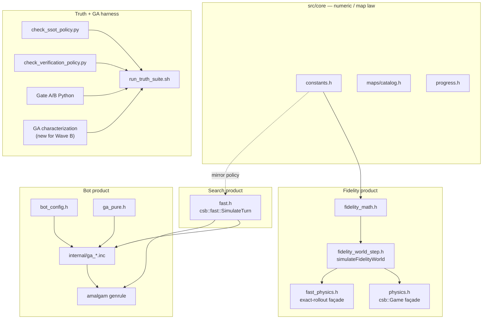
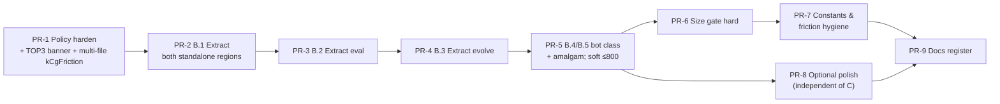
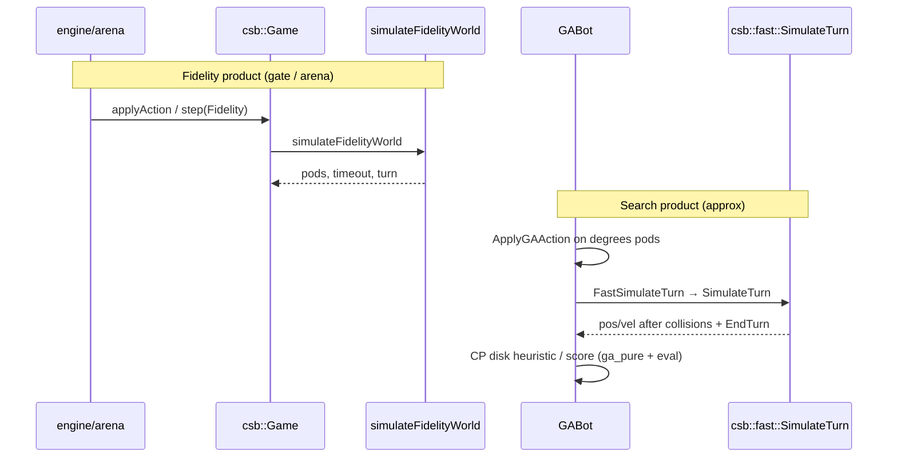
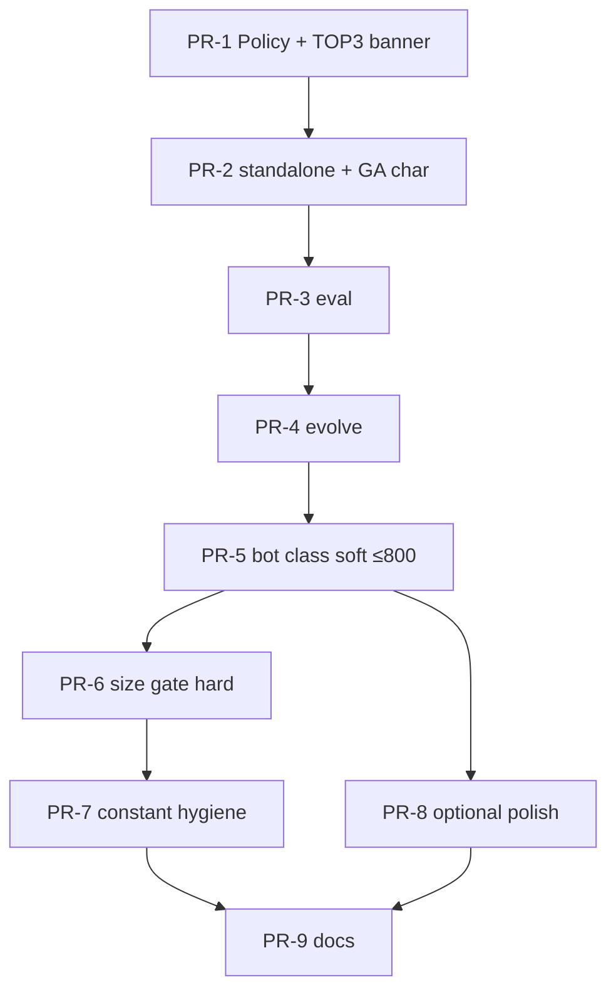

# Design: Finish Code-Knowledge SSOT for mad_pod_arena

| Field | Value |
|---|---|
| **Title** | Finish Single Source of Truth (SSOT) — Remaining Ownership & Fowler Smells |
| **Author** | (implementer) |
| **Date** | 2026-07-09 |
| **Status** | Draft (rev 3 — include order + KD12 recipe locked) |
| **Repo** | `/Users/samsi/csb/mad_pod_arena` |
| **Behavioral authority** | `./tools/run_truth_suite.sh` (Fidelity/ownership/amalgam contracts; **not** full GA search oracle — see KD12) |
| **Sequencing authority** | `docs/archive/SSOT_IMPLEMENTER_RUNBOOK.md` **v2** (wins on conflicts) |
| **Living ownership** | `docs/SSOT.md` (update every phase PR) |
| **Gate policy** | `docs/VERIFICATION_TRUTH_POLICY.md` — `GATE_*` frozen; job id `physics-accuracy` |

---

## Overview

**mad_pod_arena** is a CodinGame Mad Pod Racing / CSB monorepo: C++ Fidelity physics (gate/arena), an intentionally approximate GA search collision fragment (`csb::fast`), a genetic-algorithm bot, Python verification gates, and large battle JSON corpora. Phases 0–3 and 5 of the SSOT program already closed the *critical* dual-ownership hazards: one Fidelity world-step body, one Fast fragment, no `GAPhysicsSimulator`, constants and maps centralized, CG paste generated via amalgam.

What remains is **not** another physics ruleset extract. The residual SSOT/DRY work is:

1. **Large Class / Long Function** in `src/cg/internal/ga_prelude_and_search.inc` (~2446 LOC) — the primary open Fowler High smell. The file is **not** one contiguous standalone block; it interleaves two discontinuous `#ifdef CG_STANDALONE` regions with shared GA types and bot logic (see §Inventory E).
2. **Constant / config mirror hygiene** — intentional amalgam mirrors already policy-checked; several bot heuristic literals and the free-flight friction default are still soft dual knowledge.
3. **Phase 4 finish + Wave C/D polish** — size gates, multi-file policy discovery after split, `BotConfig` default sync under `CG_STANDALONE`, optional global-friendly-collision cleanup; **without** mixing Fidelity numeric long-tail fixes.
4. **Bot search behavioral net** — truth suite does not characterize `SimulateAndEvaluate` / `RunGA` / `GetActions`; Wave B requires an explicit GA oracle (KD12).

This design inventories as-built ownership with file evidence, proposes only the remaining refactor sequence, and breaks it into independently mergeable PRs under green gates between steps.

### SSOT principle (code knowledge, not enterprise MDM)

From Hunt & Thomas (*The Pragmatic Programmer*): **DRY** means *every piece of knowledge must have a single, unambiguous, authoritative representation within the system* — not “never type the same characters twice.” Code generators, automated equality checks, and a living ownership register are valid ways to keep knowledge single when physical copies are required (e.g. CG single-file paste).

Applied here:

| Pattern | Role |
|---|---|
| **One editable owner** | Prefer edit `constants.h` / `fidelity_world_step.h` / `fast.h` once |
| **Intentional mirrors** | Amalgam cannot `#include` core; mirrors allowed **only** with automated equality (`sim/check_ssot_policy.py`) |
| **Living register** | `docs/SSOT.md` |
| **Continuous monitoring** | Truth suite + verification policy + **GA characterization** (Wave B) |
| **Not this program** | Master Data Management / multi-system data SSOT |

---

## Background & Motivation

### Why SSOT was needed

Historically the repo had competing collision owners (engine `GAPhysicsSimulator`, CG standalone twin, dual Fidelity bodies in `physics.h` vs `fast_physics.h`). A Fidelity fix could land in one façade while the other silently diverged; GA search could re-inline collision; agent docs taught “two physics SSoTs.” That violated DRY and made Fowler self-testing code unreliable.

### Current state (verified 2026-07-09 against tree)

| Concern | Authority (as-built) | Evidence |
|---|---|---|
| Numeric law | `src/core/constants.h` | `kFriction=0.85`, radii, shield mass, `kGaFarApartC`, … |
| Fidelity scalars | `src/physics/fidelity_math.h` | Aliases `csb_constants::*`; owns `frictionTrunc`, `cpCollide`, `newCollideTime` |
| Fidelity world step | `src/physics/fidelity_world_step.h` → `simulateFidelityWorld` | Sole Fidelity loop: `while (t > 0.0 && safety++ < 200)` (~L106) |
| Fidelity façade | `csb::Game` in `src/physics/physics.h` (~691 LOC) | `simulateWorld()` packs → `simulateFidelityWorld` → unpacks (~L520) |
| Fidelity-equal rollout | `csb::fast_physics::Game` in `fast_physics.h` | Same call; EXACT suite enforces bit-parity |
| Fast GA fragment | `csb::fast::SimulateTurn` in `src/physics/fast.h` | Degrees pods; **not** full Fidelity; goldens exact `==` |
| Maps | `src/core/maps/catalog.h` only | `physics/maps.h` deleted; policy fails if resurrected |
| Bot pure math | `src/cg/ga_pure.h` (`ga_pure::*`) | Unit-tested by `//src/cg:ga_pure_test` |
| Bot config | `src/cg/bot_config.h` | `engine/bot.h` is thin `IBot` only |
| Bot search | `src/cg/internal/ga_*.inc` via thin `cg_bot.cpp` | Collision only via `FastSimulateTurn` → `csb::fast` |
| CG paste | `//src/cg:cg_bot_amalgam` genrule + `tools/export_cg_submission.sh` | `CG_STANDALONE` stubs retained for paste |
| Gate tolerances | `sim/tolerance_policy.py` | `GATE_* = (5.0, 3.0, 1.0, 1)` frozen |
| Friendly flag | One symbol `g_friendly_collision` | Def production: `engine.cpp`; standalone def under `#ifdef` |

### Phase status (from `docs/SSOT.md` — verified)

| Phase | Status | Note |
|---|---|---|
| 0 Teaching | **done** | GEMINI/README point at one package |
| 1 Fast + goldens | **done** | `csb::fast`, `Game::step(Fast)` no-op/assert |
| 2 OQ2 harness | **done** | `arena_fidelity_trace_test`; L4 soak still deferred |
| 3 GA → fast; delete GAPhysics | **done** | No second SimulateTurn body in engine |
| 4 Amalgam | **partial / minimum** | Genrule + export + smoke; standalone type stubs remain **by design** for CG paste |
| 5 Engine zero collision | **done** | |
| 6 Constants hygiene | **partial** | Mirrors checked; bot heuristic literals remain |
| 7 Docs + L4 | docs aligned; L4 deferred | |
| 8 No new forks | **done hygiene** | `experiments/cg_rust` removed |

### Pain points that remain

1. **Reviewability:** `ga_prelude_and_search.inc` mixes two standalone regions, shared GA types, eval, evolution, bot I/O, heuristics (~2446 lines). Not a dual *physics* owner, but a Large Class that invites accidental reintroduction of collision math.
2. **Soft dual knowledge:** `FreeFlightFrictionVel(..., friction = 0.85)`, `kCgFriction = 0.85`, raw `360000` / `18.0` / `650` in bot paths, and `CG_STANDALONE` `BotConfig` field defaults mirrored by hand.
3. **Stale annex hazard:** `docs/SSOT.md` still links `artifacts/SSOT_TOP3_AND_CG_WORKFLOW.md` as “Plan detail” while that artifact still claims dual Fidelity bodies — agents may re-open closed work until a supersession banner lands (**blocking** on PR-1).
4. **Truth suite gap for search:** suite locks Fidelity/Fast/ownership/amalgam; it does **not** lock GA eval scores or tournament outcomes.
5. **Orthogonal debt:** golden long-tail Fidelity fails (~10 of 200 all-tier) — **Fidelity-only PRs**, never same PR as ownership moves.

---

## Goals & Non-Goals

### Goals

1. **Inventory as-built SSOT** vs residual dual owners / smells with concrete file evidence (this doc §Inventory).
2. **Finish true code-knowledge SSOT** for remaining High smells without redoing Phases 1–3/5.
3. **Split the GA Large Class** into review-sized modules (target: no single `internal/ga_*.inc` > ~800 LOC without documented exemption), using a **structure-accurate** extract map.
4. **Tighten mirror policy** so every intentional physics-law restatement is equality-checked across multi-file modules; ban raw `0.85` under `src/` except approved sites.
5. **Order PRs** so each step is independently reviewable, green under truth suite + **GA characterization** where extracts touch search code.
6. Keep **two hats**: structure PRs never change Fidelity numerics; fidelity long-tail never restructures ownership.

### Non-Goals

| Non-goal | Why |
|---|---|
| Change `GATE_*` or job id `physics-accuracy` | Frozen by verification policy |
| Fix golden long-tail / Fidelity snap / friction special cases in same PR as structure | Different hat |
| Invent a third physics ruleset or make Fast ≡ Fidelity | Product boundary; runbook Alt E |
| Delete `csb::fast` or run GA on Fidelity by default | Out of scope unless staff product decision |
| Touch `third_party/referees/**` | Read-only |
| Full immutable pods / pure FP redesign | Domain mismatch |
| Apply every Fowler catalog entry everywhere | Smell-driven only |
| Enterprise MDM / multi-repo data SSOT | Wrong abstraction |
| Re-extract world step (already done) | Do not reopen closed Critical smells |
| Prove EXACT-identical free-flight *bypass* in `fast_physics` | No such path remains (vestigial macros only) |

### Non-negotiables

1. Do not change `GATE_*` or job id `physics-accuracy` as a side effect.
2. Do not change Fidelity numerics in the same PR as pure ownership moves.
3. Two hats: structure vs fidelity numeric fixes.
4. Small Fowler steps under green tests (truth suite + GA oracle for bot extracts).
5. Do not invent a third physics ruleset.
6. `third_party/referees/**` read-only.
7. `PR_MERGE_OK` = retention ∧ build ∧ physics-accuracy (U∧A∧B).

---

## Inventory: As-Built SSOT vs Residual Duals

### A. Closed Critical ownership (do not redo)



| Check | Status | File evidence |
|---|---|---|
| Single world-step body | **Closed** | Only `fidelity_world_step.h` has Fidelity `while (t > 0.0 && safety++ < 200)`; façades call `simulateFidelityWorld` (`physics.h` ~L520; `fast_physics.h` ~L353) |
| No façade `bounce` redefinition | **Closed** | `check_ssot_policy.py` fails on `void bounce(` in façades |
| Fast goldens | **Closed** | `//src/physics:test_physics` + `testdata/fast_goldens.json` |
| `Game::step(Fast)` honesty | **Closed** | Assert / no-op; never `nextTurn()` (`physics.h` ~L589–598) |
| GAPhysics deleted from live code | **Closed** | No class under `src/engine/`; golden JSON `"source": "GAPhysicsSimulator"` is **provenance metadata only**, not a live owner |
| Engine no collision | **Closed** | `FastSimulateTurn` bridge in `engine.h` ~L72–85; no `CheckpointCollide` |
| Maps single owner | **Closed** | Policy forbids `src/physics/maps.h` |
| BotConfig not in engine | **Closed** | `engine/bot.h` has no `struct BotConfig` |
| Experiments fork gone | **Closed** | No `experiments/cg_rust` |
| CG paste generated | **Closed (minimum)** | Genrule cats `fast.h` + `ga_pure.h` + `ga_prelude_and_search.inc` + factory + main |
| `fast_physics` always uses shared world step | **Closed** | `simulateWorld()` always calls `simulateFidelityWorld`; active opts are `TRIG_CACHE` / `SINCOS` only |

### B. Intentional mirrors (allowed dual *representation*, single *knowledge*)

| Mirror | Why required | Enforced by |
|---|---|---|
| `fast.h` `kFriction`, `kMinImpulse`, `kPodCollisionRsq`, … | Amalgam cannot include `core/constants.h` | `check_ssot_policy.py` value equality vs core |
| Amalgam-visible `kCgFriction = 0.85` (today in prelude) | Free-flight eval under standalone | Policy parse vs core; **must survive multi-file split** via scan of `internal/ga_*.inc` |
| `CG_STANDALONE` Pod / BotConfig / IBot block | Single-file CG paste needs self-contained types | Docs + layout `static_assert` vs `csb::fast::Pod`; **BotConfig defaults not yet auto-checked** |
| `csb::fast::Pod` vs `engine::Pod` | Layout-compatible degrees pods | `static_assert` offsets in `engine.h` and standalone bridge |

### C. Residual duals / smells (this design’s scope)

| ID | Smell / dual | Severity | Evidence | Target |
|---|---|---|---|---|
| **R1** | Large Class / Long Function | **High** | `ga_prelude_and_search.inc` **2446** lines; interleaved standalone + shared + eval + evolve + bot | Extract modules Wave B with accurate boundaries |
| **R2** | Soft friction default | **Med** | `ga_pure.h` `FreeFlightFrictionVel(..., friction = 0.85)` — third restatement; **not** in policy | Require named constant; allowlist raw `0.85` only at mirror definitions |
| **R3** | Heuristic Feature Envy | **Med** | Many `FreeFlightFrictionVel(..., kCgFriction)` call sites in eval/seed | Single `ApplyFrictionOnly(Pod&)` helper |
| **R4** | Magic CP/rotate/boost literals | **Med** | `360000` CP disk; bare `18.0`; `650` boost | Named amalgam-safe mirrors equality-checked vs core |
| **R5** | `BotConfig` standalone drift | **Med** | `bot_config.h` vs `#ifdef CG_STANDALONE` struct (~L119–150) hand-synced (values currently match) | Policy equality of defaults |
| **R6** | Standalone `Pod::Mass` / rotate literals | **Low–Med** | `(shield_cd == 4) ? 10.0 : 1.0`; `diff > 18.0` | Named mirrors / `ga_pure` clamps |
| **R7** | `GetCPIntersectionTime` local TOI | **Low** | Quadratic with `360000.0` — bot heuristic, not second Fast kernel | Named `kCgCpRsq` only; do not swap in Fidelity `cpCollide` without product PR |
| **R8** | Global `g_friendly_collision` | **Low** | `engine.cpp` + standalone impl | Optional Wave D |
| **R9** | `physics.h` still large (~691 LOC) | **Low** | Façade + I/O + applyMove — not dual world step | Optional Wave D file split |
| **R10** | Stale TOP3 artifact + SSOT.md link | **Doc / agent hazard** | Claims dual Fidelity body still open | **Blocking banner on PR-1**; full cleanup PR-9 |
| **R11** | Weight constants dual | **Low** | File-scope `RUNNER_BYPASS_WEIGHT` etc. match `BotConfig` fields today | C.4: BotConfig sole default owner; file-scope become aliases or `config.` reads |
| **R12** | No GA search characterization in truth suite | **High for extracts** | Suite never runs tournament / `SimulateAndEvaluate` golden | KD12 oracle required on Wave B/C bot PRs |
| **R13** | Policy hard-codes prelude path | **Med** | `check_ssot_policy.py` `read(.../ga_prelude_and_search.inc)` for `kCgFriction` | Multi-file discovery before/with first extract |
| **R14** | Trailing dead lines in prelude | **Nit** | L2445–2446 orphan factory comment + `#include <memory>` (factory lives in `ga_factory.inc`) | Delete on any prelude touch |
| **R15** | Vestigial `CSB_FP_OPT_FREE_FLIGHT` / `FAST_EPILOGUE` | **Low** | `#define` only; no `#if` body; bench script may still name freeflight stage | Document/remove macros; align bench script |

### D. Explicit non-duals (do not “fix” into one algorithm)

| Pair | Relationship | Policy |
|---|---|---|
| Fidelity world step vs `csb::fast::SimulateTurn` | **Two products** (referee vs approx search) | Must remain separate; both owned under `src/physics/` |
| Free-flight friction in bot heuristics vs Fast/Fidelity `EndTurn` | Heuristic path intentionally partial | Name functions to reflect partial physics |
| Gate A 312/312 vs golden all-200 long-tail | Different corpora / hats | Long-tail = Fidelity PRs only |
| Golden JSON `"source": "GAPhysicsSimulator"` | Historical provenance string | Not live dual ownership |

### E. Structure-accurate map of `ga_prelude_and_search.inc` (as-built 2026-07-09)

**Source of truth for extracts:** this table (re-verified against the file). Do **not** treat L56–498 as one contiguous standalone block.

| Lines | LOC | Kind | Contents |
|---|---:|---|---|
| 1–55 | 55 | Shared | Includes, `ga_pure` include, **`kCgFriction`**, time limits, heuristic weights, shield costs |
| **56–177** | **122** | **Standalone region A** | First `#ifdef CG_STANDALONE` … `#else` engine includes … `#endif` — Pod/BotConfig/IBot/Timer/Vec2 **declarations** only |
| **178–340** | **163** | **Shared always** | `MAX_*`, **`Action` / `Solution`**, `GABotThreadPool`, `MigrationChannel`, **`GABot` class decl**, `Evolution` — **must not** go into a “standalone-only” file |
| **341–498** | **158** | **Standalone region B** | Second `#ifdef CG_STANDALONE` … `#endif` — engine **implementations**, LUT/RNG, Pod methods, **`FastSimulateTurn` bridge** (+ nested `#ifndef CG_BOT_AMALGAM` include of `fast.h`) |
| 499–645 | 147 | Shared | `g_sim`, `GetCPIntersectionTime`, Action/Solution/`BotConfig::Randomize` bodies, **`SimCtx`**, `TeamAction` |
| 646–1081 | 436 | Shared eval | `EvaluateTacticalCell`, `SimulateAndEvaluate` |
| 1082–1688 | 607 | Shared evolve | `RunGA`, `RunGAParallel` |
| 1689–2348 | 660 | Shared bot | `GABot::Initialize` / helpers / `GenerateHeuristicOpponentModel` / **`GetActions`** |
| 2349–2446 | 98 | Shared helpers | `HeuristicBlocker`, `OutputAction`, `GetTrollMessage`, **orphan** factory comment + `#include <memory>` |

```text
┌─────────────────────────────────────────────────────────────┐
│ L1–55   shared header / kCgFriction / weights               │
├──────────────────────┬──────────────────────────────────────┤
│ L56–177 STANDALONE   │  #ifdef CG_STANDALONE decls          │
│                      │  #else #include engine + bot_config  │
├──────────────────────┴──────────────────────────────────────┤
│ L178–340 SHARED types: Action, Solution, GABot decl, pool   │
├──────────────────────┬──────────────────────────────────────┤
│ L341–498 STANDALONE  │  #ifdef CG_STANDALONE implementations│
├──────────────────────┴──────────────────────────────────────┤
│ L499+   shared bot: helpers → eval → evolve → GetActions    │
└─────────────────────────────────────────────────────────────┘
```

#### Post-split size projections (if map followed; ≤800 target)

| Destination module | Approximate contents | Projected LOC |
|---|---|---:|
| `ga_prelude_hdr.inc` (or top of `ga_prelude.inc`) | **L1–55 only**: includes, **`kCgFriction`**, weights, shield costs | ~55 |
| `ga_standalone_types.inc` | Region A + Region B (both `#ifdef` blocks, keep `#else`) | ~280 |
| `ga_types.inc` (or rest of `ga_prelude.inc`) | L178–340 + L499–645 (+ optional 2349–2444 helpers) | ~310–410 |
| `ga_eval.inc` | L646–1081 | ~436 |
| `ga_evolve.inc` | L1082–1688 | ~607 |
| `ga_bot_class.inc` | L1689–2348 (+ helpers if not in types) | ~660–758 |
| `ga_factory.inc` / `ga_main.inc` | unchanged | 14 / 239 |

All projected under **800** if B.1 does **not** swallow the shared middle. Re-`wc -l` after each extract; PR-5 soft-requires all modules ≤800 before merge.

**Compile dependency (locked):** standalone region B `Pod::EndTurn` (~L475–480) uses `kCgFriction`. That symbol **must** be visible **before** region B is parsed. Therefore **L1–55 / `ga_prelude_hdr.inc` is always included before `ga_standalone_types.inc`**. Never cat standalone before the friction header fragment.

#### Locked B.1 extract strategy (**KD11**)

**Chosen:** single always-included module `ga_standalone_types.inc` that contains **both discontinuous** standalone regions (L56–177 and L341–498), preserving the `#else // !CG_STANDALONE` include branch and the second region’s `#ifndef CG_BOT_AMALGAM` / `fast.h` include. Shared middle (L178–340) and everything from L499+ **stay** outside that file until later extracts.

**Header-before-standalone (required):** L1–55 (`kCgFriction` + weights) lives in `ga_prelude_hdr.inc` (or the head of `ga_prelude.inc`) and is included **before** `ga_standalone_types.inc`. Region B’s `Pod::EndTurn` calls `FreeFlightFrictionVel(..., kCgFriction)` — as-built order was L1–55 → A → shared → B; packaging must preserve “friction symbol before region B,” not invent `standalone → prelude`.

**Not implementable:** “cut L56–498 into standalone” as one contiguous range (would mis-file `Action`/`Solution`/`GABot` decl). **Also not implementable:** amalgam order `ga_standalone_types.inc` before the L1–55 friction fragment.

**Accepted alternate tactics (do not change end-state modules):**

- **B.1a:** two files `ga_standalone_decls.inc` + `ga_standalone_impl.inc` included in order from prelude.
- **Bottom-up (Alt 5):** extract `ga_bot_class.inc` / `ga_evolve.inc` / `ga_eval.inc` from the **tail** first, then standalone last — often safer for include graphs; still ends at the same module set. PR Plan default order is top-down (B.1 first) because it removes the most confusing dual regions early; reverse order is allowed if B.1 is blocked.

**Must remain outside standalone modules:** `Action`, `Solution`, `GABot` / `GABotThreadPool` declarations, `Evolution`, `SimCtx`, `TeamAction`, all eval/evolve/bot method bodies.

**Must appear before standalone modules:** L1–55 header fragment with `kCgFriction` (and weights). Optional later: region B could use `csb::fast::kFriction` after Wave C, but default packaging keeps `kCgFriction` in the early header so policy + as-built call sites stay simple.

---

## Proposed Design

### Design thesis

**Phases 1–3 and 5 already achieved physics algorithm SSOT.** Remaining work is *code-knowledge SSOT for the bot product and mirror policy*, executed as Fowler Extract steps under the truth suite **plus a GA characterization oracle** — not a rewrite of physics.

### Target architecture (end state)

```text
src/core/                 constants, maps, progress          [numeric SSOT]
src/physics/
  fidelity_math.h         scalar helpers                    [done]
  fidelity_world_step.h   simulateFidelityWorld             [done]
  physics.h               Game API, applyMove, I/O          [thin façade]
  fast_physics.h          exact-rollout façade only         [done shape]
  fast.h                  GA collision fragment             [done]
src/engine/               arena, degrees Pod, thin IBot     [done]
src/cg/
  bot_config.h            BotConfig                         [done]
  ga_pure.h               pure scoring/action math          [done]
  internal/
    ga_prelude_hdr.inc        L1–55: kCgFriction + weights  [BEFORE standalone]
    ga_standalone_types.inc   both #ifdef CG_STANDALONE regions
    ga_types.inc / ga_prelude shared Action/Solution/SimCtx/helpers
    ga_eval.inc               tactical + SimulateAndEvaluate
    ga_evolve.inc             RunGA / RunGAParallel
    ga_bot_class.inc          GABot methods / GetActions
    ga_factory.inc            CreateGABot                   [exists]
    ga_main.inc               CG I/O main                   [exists]
  cg_bot.cpp              thin include driver               [exists]
sim/check_ssot_policy.py  multi-file mirrors + size gate    [extend]
tools/run_truth_suite.sh  Fidelity/ownership/amalgam        [unchanged contract]
//src/cg:ga_search_char_* characterization (new)            [Wave B]
```

### Wave plan (remaining only)



#### Wave A — Guardrails (small, first)

| Action | Detail |
|---|---|
| **A.1 World-step uniqueness (false-positive-safe)** | Scope: under `src/physics/`, files **other than** `fidelity_world_step.h` and `fast.h`. Forbid a collision-time loop matching the Fidelity pattern `while (t > 0` (covers as-built `while (t > 0.0 && safety++ < 200)`). **Do not** ban Fast’s different shape `while (t_current < 1.0 && col_count < 10)` via that rule. Façades (`physics.h`, `fast_physics.h`) must keep calling `simulateFidelityWorld` and must not redefine `bounce`. PR-1 must leave checker **exit 0** on current tree. |
| **A.2 Vestigial free-flight macros (not a bypass audit)** | `CSB_FP_OPT_FREE_FLIGHT` and `CSB_FP_OPT_FAST_EPILOGUE` are **only `#define`d** in `fast_physics.h` (L23–28); **no `#if` body** remains. `simulateWorld()` always calls `simulateFidelityWorld`. Work: remove or comment as dead; align `tools/bench_fp_incremental.sh` if it still names a freeflight stage. **Do not** budget “prove EXACT-identical free-flight bypass.” |
| **A.3 Multi-file friction discovery** | Stop hard-coding only `ga_prelude_and_search.inc`. Resolve `kCgFriction` by scanning `src/cg/internal/ga_*.inc` (or an allowlist including future `ga_prelude.inc` / `ga_constants.inc`). Fail if zero or conflicting values vs core. |
| **A.4 TOP3 supersession banner (blocking)** | At top of `docs/artifacts/SSOT_TOP3_AND_CG_WORKFLOW.md`: mark dual-Fidelity extract **done** (`fidelity_world_step.h`); remaining work = this design (bot modules + mirrors). Prevents agents reopening closed Refactor 1. Full register cleanup can wait for PR-9. |
| **A.5 Optional** | Policy ban resurrected `GAPhysicsSimulator` / `PhysicsSimulator` type definitions under `src/engine/` (beyond GEMINI heuristics). |

**Success:** `check_ssot_policy` + `./tools/run_truth_suite.sh --quick` green on tip; TOP3 banner landed.

#### Wave B — Split Large Class (primary remaining quality gap)

Fowler moves: **Extract Class / Extract Function / Move Function** (file-level includes, same TU semantics).

| Step | Extract | Keep behavior by |
|---|---|---|
| **B.1** | `ga_standalone_types.inc` — regions A+B only; **after** `ga_prelude_hdr` (L1–55 / `kCgFriction`) | Amalgam compiles EndTurn; KD12(a); policy finds `kCgFriction` |
| **B.2** | `ga_eval.inc` — `EvaluateTacticalCell`, `SimulateAndEvaluate` (~L646–1081) | GA char (score path) |
| **B.3** | `ga_evolve.inc` — `RunGA`, `RunGAParallel` (~L1082–1688) | GA char |
| **B.4** | `ga_bot_class.inc` — `GABot` methods, heuristic opponent, `GetActions`, blocker/troll (~L1689–2444) | GA char (actions path); delete R14 orphan lines |
| **B.5** | Update `cg_bot.cpp` / `ga_all.inc` includes + `BUILD.bazel` modules + amalgam `cmd` cat order | Export markers; **soft exit: every new `ga_*.inc` ≤800 LOC** (`wc -l`) |
| **B.6** | Hard size gate in policy: fail if any `internal/ga_*.inc` > **800** without `// SSOT-SIZE-EXEMPT: reason` + SSOT.md note | `check_ssot_policy` |

**Critical constraint:** Remain **one translation unit** for amalgam (include chain). Do **not** require multi-TU linkage for CG paste.

**Include order (shared TU + amalgam) — dependency-safe, locked:**

```text
fast.h
→ ga_pure.h
→ ga_prelude_hdr.inc          # L1–55: kCgFriction + weights  (MUST be before standalone)
→ ga_standalone_types.inc     # regions A+B only; Pod::EndTurn sees kCgFriction
→ ga_types.inc                # L178–340 + L499–645 shared types/helpers
   # (or single ga_prelude.inc = hdr + types if preferred, still with hdr text first)
→ ga_eval.inc
→ ga_evolve.inc
→ ga_bot_class.inc
→ ga_factory.inc
→ ga_main.inc
```

**PR-2 compile check:** under `CG_STANDALONE`, `Pod::EndTurn` must still see `kCgFriction` (or an approved alias defined earlier — see optional C path). Prefer keeping the named `kCgFriction` in the header fragment so policy equality continues to work.

Prefer one `ga_all.inc` that only `#include`s modules in **this** order so `cg_bot.cpp` stays tiny.

**After each B.* step:** `./tools/run_truth_suite.sh --quick` **and** GA characterization (KD12).  
**After B.5:** full `./tools/run_truth_suite.sh` + GA char + export.

#### Wave C — Mirror / magic / Feature Envy residue

| Step | Change |
|---|---|
| **C.1** | `ApplyFrictionOnly(Pod&)` (or one helper wrapping `ga_pure::FreeFlightFrictionVel`) |
| **C.2 Raw `0.85` allowlist (explicit)** | Token-aware match (not comments). **Allow only:** (1) `src/core/constants.h` `kFriction = 0.85`; (2) `src/physics/fast.h` `kFriction = 0.85`; (3) exactly one amalgam-visible `kCgFriction = 0.85` **or** `kCgFriction = csb::fast::kFriction` after amalgam pastes `fast.h`. **Remove** default `= 0.85` from `FreeFlightFrictionVel` signature. Update **`ga_pure_test.cpp`** call sites that rely on the default (e.g. `FreeFlightFrictionVel(200.0)` must pass named constant). |
| **C.3** | Named mirrors for CP rsq / max rotate / boost used by bot heuristics; equality-check vs `csb_constants` |
| **C.4 Weights rule** | **`BotConfig` is the sole default owner** for knobs that already exist as fields (`runner_bypass_weight`, facing/stay-in-front, time limits, …). File-scope `RUNNER_BYPASS_WEIGHT` etc. become either (i) `static constexpr` initialized from `BotConfig{}` defaults, or (ii) deleted in favor of `config.` / `ctx.config->` reads. Do not maintain a second editable numeric table. |

**Success:** suite green; GA char green; `rg` for raw `0.85` only hits allowlisted definition lines.

#### Wave D — Optional polish (not blocking core SSOT DoD items 1–12)

| Step | Change |
|---|---|
| D.1 | `g_friendly_collision` → return value / `CollisionOut` (preserve Fast golden exactness) — **independent of Wave C** |
| D.2 | Split `physics.h` for readability only |
| D.3 | Inline `CGBotWrapper` if pure forwarder |
| D.4 | Angle wrappers at I/O boundaries only — after B/C |

### GA characterization oracle (**KD12**) — concrete locked recipe

Truth suite alone is **insufficient** to claim behavior-preserving bot extracts.  
Also: option (a) is **not** “`cc_test` deps `//src/cg:ga_bot` and calls private `static` helpers” — that **does not link**.

#### Constraints from as-built code

| Fact | Implication |
|---|---|
| `SimulateAndEvaluate` / `RunGA` / `RunGAParallel` are **`static`** in the `.inc` TU | Not visible from a normal library dep on `ga_bot` |
| `ga_bot.h` public surface is `CreateGABot` / `IBot::GetActions` only | Cannot call eval without a test hook or same-TU include |
| `GetActions` → `RunGA*` is **wall-clock** limited (`Timer::ElapsedMs` vs `time_limit_ms`) | Bit-exact action/score goldens via full search **will flake** across machines/load even with `SeedRand` + `num_threads=1` |

#### Primary contract (required default for PR-2, PR-3, PR-7) — option (a)

**Target:** `//src/cg:ga_search_char_test`  
**Driver shape:** same-TU include driver **like `cg_bot.cpp`** (include the modular `ga_*.inc` chain with `CG_BOT_NO_MAIN`; **do not** only link `//src/cg:ga_bot` and expect to call statics).

**Fixture (deterministic, no timer):**

1. Build a fixed `vector<Pod>` (4 pods), fixed checkpoints / `SimCtx` fields (`cps`, `dist_to_end`, `entry_points`, indices, `BotConfig` pointer).
2. Build a fixed `Solution` (explicit `runner_moves[]` / `blocker_moves[]` / shield steps — no `Randomize()` in the scored path).
3. Call **`SimulateAndEvaluate(sol, pods, ctx, horizon)`** once (or a small fixed set of solutions).
4. Golden = **exact** `double` score bits (e.g. store as hex `uint64_t` via `memcpy`/`bit_cast`, or `EXPECT_EQ` on a stable serialization). No wall-clock, no threads, no `RunGA`.

**What this locks:** eval extract (PR-3) and free-flight/scoring terms touched by PR-7; also compiles the include chain (PR-2 standalone packaging).  
**What this does not lock:** wall-clock search iteration counts inside `RunGA` / `GetActions`.

Golden path: `src/cg/testdata/ga_search_char_score.json` (or `.txt` with hex bits). Record on tip in PR-2; assert equality thereafter.

#### Secondary contract (PR-4 evolve / PR-5 bot class)

Do **not** promise bit-exact `GetActions` goldens on wall-clock GA.

| Sub-option | Use |
|---|---|
| **(b) Tournament smoke band** | `BOT_THREADS=1` map0 (or `--start-map 0 --end-map 1 --repeats 1`) with recorded winner / coarse score band — **required** at least on PR-5 merge (recommended on PR-4 too) |
| **(b′) Weak action smoke** | Same-TU call `GetActions` with huge `time_limit_ms` + fixed seed: assert **2** actions, finite coords, thrust in allowed set — **not** bit-exact; optional complement to (b) |
| Iteration-capped GA | **Out of scope** unless staff adds a test-only flag later |

#### Option (c) residual-risk waiver

Document “compile + amalgam + policy only” — **forbidden** if the PR claims a behavior-preserving extract without (a) and, for PR-4/5, without (b) or (b′).

#### Checklist wording (use verbatim)

```text
[ ] KD12(a): bazel test //src/cg:ga_search_char_test
    # same-TU include driver; fixed Solution → SimulateAndEvaluate; exact score golden
[ ] KD12(b) if PR-4/PR-5: tournament map0 smoke band OR weak GetActions finite-action smoke
```

Do **not** fold GA char into job id `physics-accuracy`. Optional later truth-suite step is fine; extract PRs must run the Bazel target even if suite not yet updated.

### Sequence diagram — ownership at runtime (unchanged products)



### Policy expansion sketch (`check_ssot_policy.py`)

```python
# Incremental across PR-1 / PR-6 / PR-7

# A.1 — Fidelity collision loop ownership (false-positive-safe)
# Under src/physics/, for each .h/.cpp except fidelity_world_step.h and fast.h:
#   fail if re.search(r"while\s*\(\s*t\s*>\s*0", text)  # matches t > 0.0 as well
# Keep existing: façades must call simulateFidelityWorld; no void bounce(

# A.3 — multi-file kCgFriction
# Scan src/cg/internal/ga_*.inc (and keep ga_prelude_and_search.inc name until renamed)
# Exactly one kCgFriction constexpr; value == csb_constants::kFriction

# A.5 optional — ban class/struct GAPhysicsSimulator|PhysicsSimulator under src/engine/

# B.6 — size gate
# each internal/ga_*.inc line count <= 800 unless SSOT-SIZE-EXEMPT

# C.2 — raw 0.85 token allowlist (definitions only; skip // and /* */ comments)
ALLOW_085_FILES = {
    "src/core/constants.h",      # kFriction
    "src/physics/fast.h",        # mirrored kFriction
    # one ga_*.inc line defining kCgFriction — discovered, not hard-coded path
}

# C.4 / R5 — BotConfig default field equality: bot_config.h vs CG_STANDALONE struct body
```

**Every extract PR checklist item:** “policy still finds `kCgFriction`; module file list matches BUILD + amalgam cat order.”

### Amalgam include contract (locked shape)

```text
// GENERATED
#define CG_STANDALONE
#define CG_BOT_AMALGAM 1
// cat fast.h
// cat ga_pure.h
// cat ga_prelude_hdr.inc        // L1–55: kCgFriction FIRST
// cat ga_standalone_types.inc   // both #ifdef regions A+B (EndTurn sees kCgFriction)
// cat ga_types.inc              // shared Action/Solution/GABot decl/SimCtx/helpers
// cat ga_eval.inc
// cat ga_evolve.inc
// cat ga_bot_class.inc
// cat ga_factory.inc
// cat ga_main.inc
```

**Forbidden cat order:** `ga_standalone_types.inc` before `ga_prelude_hdr.inc` (or any order where region B is parsed before `kCgFriction` is declared).

Non-standalone library path:

```cpp
// cg_bot.cpp — prefer:
#include "internal/ga_all.inc"  // must encode the locked order above
#include "internal/ga_factory.inc"
#ifndef CG_BOT_NO_MAIN
#include "internal/ga_main.inc"
#endif
```

**Char test TU** (PR-2): same include chain as library bot (`ga_all.inc` / modules) + `CG_BOT_NO_MAIN`, then call `SimulateAndEvaluate` on fixed inputs — not `deps = [":ga_bot"]` alone.

---

## API / Interface Changes

### Public APIs — **no intentional change**

| API | Stability |
|---|---|
| `csb::Game` / `step` / `nextTurn` / string driver | Unchanged |
| `csb::simulateFidelityWorld` | Unchanged |
| `csb::fast::SimulateTurn` | Unchanged |
| `csb::fast_physics::Game` | Unchanged |
| `CreateGABot` / `ga_bot.h` | Unchanged signature |
| `IBot` | Unchanged |
| Python gate CLI / `GATE_*` | Frozen |

### Internal interfaces (new)

```cpp
// After Wave B — still file-static / same TU; no new exported linkage required
// ga_eval.inc
static double SimulateAndEvaluate(...);
static double EvaluateTacticalCell(...);

// ga_evolve.inc
static Solution RunGA(...);
static Solution RunGAParallel(...);

// Wave C helper
inline void ApplyFrictionOnly(Pod& p) {
  p.vel.x = ga_pure::FreeFlightFrictionVel(p.vel.x, kCgFriction);
  p.vel.y = ga_pure::FreeFlightFrictionVel(p.vel.y, kCgFriction);
}

// ga_pure.h after C.2 — no default 0.85
inline double FreeFlightFrictionVel(double v, double friction);  // friction required
```

### New test API (characterization)

```text
//src/cg:ga_search_char_test
// srcs: ga_search_char_test.cpp + same internal/*.inc chain as cg_bot (CG_BOT_NO_MAIN)
// NOT: link-only //src/cg:ga_bot hoping to call static SimulateAndEvaluate
// Body: fixed Solution + pods + SimCtx → SimulateAndEvaluate → exact score golden
// Golden: src/cg/testdata/ga_search_char_score.*
// PR-4/5 additionally: tournament smoke band (see KD12 secondary)
```

### `Game::step(Fast)` — remains unsupported

```cpp
// physics.h ~L589–598 — do not “fix” by implementing Fast on radians Game
if (opt.profile == PhysicsProfile::Fast) {
  assert(false && "use csb::fast::SimulateTurn");
  return;  // never nextTurn()
}
```

---

## Data Model Changes

| Area | Change |
|---|---|
| Battle JSON / corpora | **None** |
| Gate tolerances | **None** |
| Pod layouts | **None** (layout asserts stay) |
| `BotConfig` fields | Single default table; no semantic rename without char tests |
| GA char golden | **New** small fixture file(s) under `src/cg/testdata/` (or `sim/tests/fixtures/`) |
| Maps catalog | **None** |

Migration: pure source moves + new characterization golden; no battle schema migration.

---

## Key Decisions

| # | Decision | Rationale |
|---|---|---|
| **KD1** | Do **not** re-extract Fidelity world step or merge Fast into Fidelity | Critical dual-owner already closed; products intentionally differ (runbook Alt E) |
| **KD2** | Remaining SSOT program = bot modularity + mirror policy + doc honesty + GA oracle | Only open High structure smell is Large Class; soft duals are literals/mirrors |
| **KD3** | Keep amalgam as **single TU** include-chain; extract files, not link units | CG paste constraint; Phase 4 already chose genrule cat |
| **KD4** | Intentional mirrors stay; expand **automated equality**, never hope | Hunt/Thomas DRY |
| **KD5** | Size gate **800 LOC** per `ga_*.inc` with exemption path; PR-5 soft-requires ≤800 | Prevents silent re-monolith; avoids PR-6 forced emergency split |
| **KD6** | Free-flight friction is **bot heuristic**, not world-step | Must not call `simulateFidelityWorld` from GA eval “to simplify” |
| **KD7** | Two-hat rule enforced by PR boundaries | Structure PRs: no Fidelity math diffs |
| **KD8** | Truth suite is sole **Fidelity/ownership/amalgam** behavioral SSOT; docs update after code | Fowler self-testing for those products |
| **KD9** | `g_friendly_collision` global deferred to optional Wave D; **independent of Wave C** | Low severity; goldens depend on side effect today |
| **KD10** | TOP3 dual-body claim closed via **PR-1 blocking banner**; full docs in PR-9 | Avoid agent thrash without bloating every extract PR |
| **KD11** | B.1 = both discontinuous `#ifdef` regions in `ga_standalone_types.inc`; shared L178–340 stays out; **`ga_prelude_hdr` (L1–55 / kCgFriction) always before standalone** | Structure-accurate + compile-safe EndTurn friction use |
| **KD12** | Primary: same-TU `SimulateAndEvaluate(fixed Solution)` exact score golden; secondary: tournament band for evolve/GetActions (no bit-exact wall-clock GetActions) | `static` eval + wall-clock RunGA make link-ga_bot / full-search goldens wrong |
| **KD13** | C.4: `BotConfig` sole default owner; file-scope weights become aliases or `config.` reads | Eliminates R11 dual tables while values already match |
| **KD14** | Policy discovers `kCgFriction` via multi-file scan **before or in** first module rename | Prevents silent loss of friction SSOT check |

---

## Alternatives Considered

### Alternative 1 — “Big bang” rewrite of bot into multi-TU library + separate CG codegen

| Pros | Cons |
|---|---|
| Cleaner Bazel graph | High risk to search behavior; amalgam harder; large PR unreviewable |

**Rejected** for this program. Prefer include-module extract under existing amalgam.

### Alternative 2 — Force GA to use Fidelity / `fast_physics` for “one physics”

| Pros | Cons |
|---|---|
| One algorithm | Destroys search budget product; runbook forbids default |

**Rejected** as SSOT finish. Optional future OQ1 only.

### Alternative 3 — Leave Large Class; only expand policy greps

| Pros | Cons |
|---|---|
| Minimal diff | Reviewability debt remains |

**Rejected** as sole strategy; policy-only is **Wave A**, not complete.

### Alternative 4 — Codegen constants into `fast.h` from `constants.h`

| Pros | Cons |
|---|---|
| Strongest numeric SSOT | Build complexity |

**Deferred** (optional follow-on). Equality policy is sufficient for now.

### Alternative 5 — Bottom-up extract order (tail modules first)

| Pros | Cons |
|---|---|
| Often safer for include dependencies; can land `ga_bot_class` / evolve / eval before touching standalone dual regions | Standalone confusion remains longer; size projections similar |

**Accepted tactic** if B.1 boundaries prove painful mid-flight. End-state modules identical to top-down. Default PR Plan stays B.1→B.2→B.3→B.4 for clarity of dual-region removal.

### Alternative 6 — Keep one `ga_prelude_and_search.inc`; section markers + size exemption only

| Pros | Cons |
|---|---|
| Zero include-order risk | Fails reviewability / High smell bar; reintroduction risk remains |

**Rejected** as primary plan (overlaps rejected Alt 3). Temporary exemption only if a single module slightly exceeds 800 after honest split.

### Chosen approach

**Wave A → B (structure-accurate extracts) → C → (optional D)** with GA characterization on bot PRs; dual products Fast vs Fidelity preserved; intentional amalgam mirrors under multi-file checks.

---

## Security & Privacy Considerations

| Topic | Assessment |
|---|---|
| Auth / multi-tenant | N/A — local sim + CG paste |
| Untrusted battle JSON | Existing parsers; no new surface in structure PRs |
| Supply chain | Do not vendor new physics from `third_party/referees` into first-party SSOT |
| Secret leakage | Amalgams must not embed credentials |
| Threat: silent physics fork | Mitigated by `check_ssot_policy` + EXACT + gate A/B |
| Threat: silent search regression | Mitigated by **KD12** characterization (not by gate A/B) |

---

## Observability

| Layer | Mechanism | Alert / fail mode |
|---|---|---|
| Ownership static | `python3 sim/check_ssot_policy.py` | Exit 1 → truth suite fail |
| Gate governance | `sim/check_verification_policy.py` | Exit 1 |
| Unit / Fast goldens | `bazel test //src/physics:test_physics` | CI `physics-accuracy` (U) |
| Exact rollout | `validate_fast_physics_corpus.py --limit 100` | Truth suite step 3 |
| Gate A/B | `verify_battles.py --gate`, golden `--tier pass` | Job `physics-accuracy` |
| CG paste | `export_cg_submission.sh` + amalgam smoke | Missing GENERATED / SimulateTurn |
| Arena harness | `arena_fidelity_trace_test` | Bazel unit in truth suite |
| **GA search char** | `//src/cg:ga_search_char_test` same-TU fixed-Solution score (primary); tournament band on PR-4/5 | Exit 1 on extract PR |
| Logging | Existing `cerr` bot verbose | — |

**Developer loop:**

```bash
./tools/run_truth_suite.sh --quick
# plus, for bot extract / Wave C:
bazel test //src/cg:ga_search_char_test   # same-TU; fixed Solution → SimulateAndEvaluate
# PR-4/5 also: BOT_THREADS=1 tournament map0 smoke band
./tools/run_truth_suite.sh                # before merge of PR-5, PR-7, PR-9
```

**Metrics targets (structure PRs):**

| Metric | Target |
|---|---|
| `ga_*.inc` max size | ≤ 800 LOC (soft at PR-5; hard at PR-6) |
| Truth suite full | Exit 0 |
| GA char | Exit 0 / band hold |
| Gate A | 312/312 under GATE_* |
| Gate B pass tier | 188/188 |
| EXACT 100 | 0 fails |
| Fast goldens | exact `==` |

---

## Rollout Plan

### Feature flags

None required for pure extract/move.

### Staged rollout

1. PR-1: multi-file policy + world-step uniqueness + TOP3 banner (+ optional vestigial macro cleanup).
2. Land GA char fixture early (with PR-2 or as first commit of PR-2).
3. B.1…B.5 extracts (or bottom-up Alt 5) with char + quick suite each step; soft ≤800 at PR-5.
4. PR-6 hard size gate.
5. PR-7 constant hygiene + char.
6. PR-8 optional (may parallelize after PR-5; not blocked on PR-7).
7. PR-9 docs register finalization.

### Rollback

| PR type | Rollback |
|---|---|
| Extract-only | `git revert`; amalgam order is pure structure |
| Policy tighten | Revert checker |
| Char golden update | Only with intentional behavior change (forbidden in extract PRs) |

### Merge bar (every PR)

```text
PR_MERGE_OK =
  battle-retention
  ∧ build-and-test (bazel)
  ∧ physics-accuracy: (U) test_physics ∧ (A) gate test_session ∧ (B) golden pass
```

Plus local truth suite (full before merge of PR-5 / PR-7 / PR-9) and KD12 char on bot PRs.

### Risk register

| Risk | Severity | Mitigation |
|---|---|---|
| Contiguous L56–498 extract swallows shared types | **High** | KD11 map; code review against §E |
| Include-order break → ODR / missing types | **High** | One cat order; amalgam_bin compile each PR |
| Accidental eval change passes truth suite | **High** | KD12(a) fixed-Solution `SimulateAndEvaluate` exact score |
| Accidental evolve/GetActions change | **High** | KD12(b) tournament band on PR-4/5; not bit-exact wall-clock golden |
| Char test only deps `ga_bot` and cannot call statics | **High** | Same-TU include driver (locked in KD12) |
| Standalone before `kCgFriction` in amalgam | **High** | Locked cat order: prelude_hdr → standalone |
| Policy path still points at deleted prelude name | **High** | A.3 multi-file scan; checklist item every extract PR |
| Policy too strict on comments containing `0.85` | **Med** | Token/comment-aware matcher |
| Size gate after bad split | **Med** | Soft ≤800 at PR-5 before hard PR-6 |
| Mixing Fidelity long-tail into B/C | **High** | Two-hat checklist |
| Standalone BotConfig drift | **Med** | C.4 / R5 policy after modules settle |

---

## Open Questions

| ID | Question | Default if undecided |
|---|---|---|
| **OQ-S1** | Codegen `fast.h` constants from `constants.h`? | **No** this program |
| **OQ-S2** | Promote L4 soak? | Still deferred per SSOT.md |
| **OQ-S3** | Replace bot CP disk checks with `cpCollide`? | **No** by default |
| **OQ-S4** | Multi-TU bot? | Out of scope |
| **OQ-S5** | 800 LOC cap? | Start 800 |
| **OQ-S6** | Land GA char inside `run_truth_suite.sh` or only PR checklist? | Checklist required; suite integration **recommended** in PR-2/PR-5 but not blocking if Bazel test is in CI `build-and-test` |
| **OQ1/4/5/6/7** (runbook) | Deferred items | **Do not invent** |

---

## References

| Doc / code | Role |
|---|---|
| `docs/SSOT.md` | Living ownership register |
| `docs/archive/SSOT_IMPLEMENTER_RUNBOOK.md` v2 | Sequencing; wins conflicts |
| `docs/VERIFICATION_TRUTH_POLICY.md` | GATE_* / job id |
| `docs/FOWLER_2018_ZERO_SMELL_REFACTOR_PLAN.md` | Waves A–E smell plan |
| `docs/FOWLER_2018_REPORT_AND_TEST_TRUTH.md` | Tests-as-truth |
| `docs/FOWLER_REFACTORING_COMPLIANCE.md` | Compliance snapshot |
| `docs/artifacts/SSOT_TOP3_AND_CG_WORKFLOW.md` | **Superseded for dual-Fidelity** (banner PR-1); historical CG workflow still useful |
| `src/physics/README.md`, `src/README.md`, `sim/README.md` | Package maps |
| `sim/check_ssot_policy.py` | Ownership enforcement |
| `tools/run_truth_suite.sh` | Fidelity/ownership/amalgam behavioral suite |
| Hunt & Thomas DRY; Fowler *Refactoring* 2nd ed. 2018 | Principles |

### As-built file sizes (2026-07-09, re-measured)

| Path | LOC |
|---|---:|
| `src/cg/internal/ga_prelude_and_search.inc` | 2446 |
| `src/physics/physics.h` | **691** |
| `src/physics/fast_physics.h` | 391 |
| `src/physics/fast.h` | 182 |
| `src/physics/fidelity_world_step.h` | 164 |
| `src/physics/fidelity_math.h` | 116 |
| `src/cg/ga_pure.h` | 143 |
| `src/cg/internal/ga_main.inc` | 239 |
| `src/cg/cg_bot.cpp` | 8 |
| `src/core/constants.h` | 40 |

---

## Definition of Done (true remaining SSOT)

1. Truth suite full green on default branch after final PR.
2. No second Fidelity world-step implementation (policy + code).
3. No second Fast collision kernel under `src/cg/` (only bridge to `csb::fast`).
4. No single bot module > 800 LOC without documented exemption.
5. Raw physics friction `0.85` only on allowlisted mirror **definition** lines; free-flight requires named constant (no default arg).
6. `CG_STANDALONE` `BotConfig` defaults equality-checked vs `bot_config.h`.
7. CG paste only via generated amalgam; export markers intact.
8. `docs/SSOT.md` phase 4/6/gaps table matches reality; TOP3 dual-body claim **banner-closed** (PR-1) and register-finalized (PR-9).
9. Gate A 312/312, Gate B 188/188, EXACT 100, Fast goldens exact — all still hold.
10. No Fidelity numeric long-tail changes mixed into structure PRs.
11. **GA characterization oracle green** on bot extract / Wave C PRs (KD12); residual search risk not papered over by truth suite alone.
12. Policy finds `kCgFriction` via multi-file discovery after renames (KD14).

---

## PR Plan

Ordered, independently reviewable PRs. Full suite before merge of **PR-5, PR-7, PR-9**. GA char on **PR-2…PR-5, PR-7**. Doc bulk in **PR-9**; PR-1 only blocking TOP3 banner + policy.

### PR-1: Harden SSOT policy + TOP3 banner (tiny docs)

| | |
|---|---|
| **Title** | `ssot: multi-file kCgFriction; world-step uniqueness guard; TOP3 supersession banner` |
| **Files** | `sim/check_ssot_policy.py`; `docs/artifacts/SSOT_TOP3_AND_CG_WORKFLOW.md` (banner only); optional `fast_physics.h` dead macro comments; optional `tools/bench_fp_incremental.sh` |
| **Dependencies** | None |
| **Description** | (1) Scan `src/cg/internal/ga_*.inc` for `kCgFriction` equality vs core — stop depending on a single hard-coded prelude path only. (2) A.1 uniqueness rule: under `src/physics/`, forbid `while (t > 0` collision loops outside `fidelity_world_step.h` and `fast.h`; keep façade `simulateFidelityWorld` / no-`bounce` checks; confirm checker exit 0 on tip. (3) **Blocking** one-line+paragraph supersession at top of TOP3 artifact: dual Fidelity body extract is done (`fidelity_world_step.h`); remaining SSOT = bot modules + mirrors (this design). (4) A.2: remove or document vestigial `CSB_FP_OPT_FREE_FLIGHT` / `FAST_EPILOGUE` — no bypass-path EXACT proof. (5) Optional: ban engine resurrection of `GAPhysicsSimulator` type names. **No bot logic changes.** Full register rewrite stays PR-9. Run truth suite full. |

### PR-2: Extract standalone regions + land GA char (Wave B.1 + KD12)

| | |
|---|---|
| **Title** | `cg: extract ga_standalone_types.inc (both CG_STANDALONE regions); add ga_search_char_test` |
| **Files** | `ga_prelude_hdr.inc` (L1–55, if split now) and/or keep L1–55 ahead of standalone in prelude; `ga_standalone_types.inc` (new); shrunk prelude; `BUILD.bazel` amalgam **cat order**; `ga_search_char_test.cpp` + `src/cg/testdata/ga_search_char_score.*` |
| **Dependencies** | PR-1 (policy multi-file must land first or in same PR) |
| **Description** | Move **L56–177 and L341–498 only** into `ga_standalone_types.inc`. Leave **L178–340** shared types outside. **Include/amalgam order:** `ga_prelude_hdr` (L1–55 / `kCgFriction`) **before** standalone so `Pod::EndTurn` compiles. Land KD12(a): same-TU test, fixed `Solution` → `SimulateAndEvaluate`, exact score golden (not link-only `ga_bot`, not wall-clock `GetActions`). Policy still finds `kCgFriction`. `--quick` suite + char. |

### PR-3: Extract eval module (Wave B.2)

| | |
|---|---|
| **Title** | `cg: extract ga_eval.inc (tactical + SimulateAndEvaluate)` |
| **Files** | `ga_eval.inc` (new); prelude; `BUILD.bazel` amalgam order |
| **Dependencies** | PR-2 |
| **Description** | Move ~L646–1081 only. Zero scoring logic edits. Char + quick suite. |

### PR-4: Extract evolution module (Wave B.3)

| | |
|---|---|
| **Title** | `cg: extract ga_evolve.inc (RunGA / RunGAParallel)` |
| **Files** | `ga_evolve.inc` (new); prelude; `BUILD.bazel` |
| **Dependencies** | PR-3 |
| **Description** | Move ~L1082–1688 only. KD12(a) still green; **recommend** KD12(b) tournament smoke (evolve changes are not locked by fixed-Solution eval alone). Quick suite. |

### PR-5: Extract bot class + amalgam finalize (Wave B.4–B.5)

| | |
|---|---|
| **Title** | `cg: extract ga_bot_class.inc; finalize modular amalgam include chain` |
| **Files** | `ga_bot_class.inc` (new); shrink prelude; delete R14 orphan lines; `cg_bot.cpp` / `ga_all.inc`; `BUILD.bazel`; export script verify |
| **Dependencies** | PR-4 |
| **Description** | Move bot methods / GetActions / helpers. Soft exit: **`wc -l` every `internal/ga_*.inc` ≤ 800**. Full truth suite + KD12(a) + **KD12(b) tournament map0 smoke band** (GetActions not bit-exact). Verify amalgam order still hdr→standalone→…. Export markers. Light SSOT note (full docs PR-9). |

### PR-6: Size gate on bot modules (Wave B.6)

| | |
|---|---|
| **Title** | `ssot: fail check_ssot_policy if any ga_*.inc exceeds 800 LOC without exemption` |
| **Files** | `sim/check_ssot_policy.py`; optional SSOT.md exemption note |
| **Dependencies** | PR-5 (soft ≤800 already) |
| **Description** | Hard gate. Prefer no exemptions if PR-5 met soft criterion. |

### PR-7: Friction / magic-constant hygiene (Wave C)

| | |
|---|---|
| **Title** | `cg+ssot: named free-flight friction; ban raw 0.85; BotConfig default sync` |
| **Files** | `ga_pure.h`; **`ga_pure_test.cpp`** (required — default-arg call sites); `ga_*.inc`; `check_ssot_policy.py`; bot_config / standalone defaults |
| **Dependencies** | PR-6 (or PR-5 if size gate deferred) |
| **Description** | C.1–C.4 per design. Explicit `0.85` allowlist rows; comment-safe matching. Char + full suite. **No Fidelity world-step edits.** |

### PR-8: Optional polish (Wave D) — independent of PR-7

| | |
|---|---|
| **Title** | `ssot: optional g_friendly_collision context; physics.h readability split` |
| **Files** | `fast.h`, engine, tests, goldens if flag plumbing changes; optional physics header split |
| **Dependencies** | **PR-5** (stable module layout). **Not dependent on PR-7.** |
| **Description** | Optional. Split into 8a friendly-collision / 8b physics.h if needed. Skip under schedule pressure. |

### PR-9: Docs register finalization

| | |
|---|---|
| **Title** | `docs: SSOT phase 4/6 complete; align Fowler plan §2 with as-built modules` |
| **Files** | `docs/SSOT.md`; Fowler plan/compliance; `GEMINI.md` if needed; ensure TOP3 banner still present / plan-detail wording fixed |
| **Dependencies** | PR-7 (and PR-8 if taken) |
| **Description** | Living register matches tree. Phase 4 modular amalgam done; Phase 6 friction/magic policy done. Do not claim golden long-tail fixed. |

---

### PR dependency graph



**Note:** Bottom-up extract (Alt 5) may reorder PR-2…PR-5 internals but should not skip PR-1 policy/multi-file or KD12 char.

### Per-PR checklist (paste)

```text
[ ] Two-hat: no Fidelity numeric diffs (or no structure diffs if fidelity PR)
[ ] bazel build //src/cg:cg_bot_amalgam //src/cg:cg_bot_amalgam_bin
[ ] bazel test //src/physics:test_physics //src/cg:amalgam_fast_smoke_test //src/cg:ga_pure_test
[ ] python3 sim/check_ssot_policy.py
[ ] Policy still finds kCgFriction; ga_*.inc set matches BUILD + amalgam cat order
[ ] ./tools/run_truth_suite.sh --quick
[ ] KD12(a): bazel test //src/cg:ga_search_char_test  # same-TU; fixed Solution → SimulateAndEvaluate; exact score
[ ] KD12(b) if PR-4/PR-5: BOT_THREADS=1 tournament map0 smoke band (not bit-exact GetActions)
[ ] Amalgam/include order: ga_prelude_hdr (kCgFriction) before ga_standalone_types
[ ] ./tools/run_truth_suite.sh           # before merge of PR-5, PR-7, PR-9
[ ] wc -l src/cg/internal/ga_*.inc       # PR-5: all ≤800 soft
[ ] docs/SSOT.md updated if ownership/modules changed (bulk PR-9)
[ ] third_party/referees untouched
```

---

*End of design (rev 3). Fidelity/ownership/amalgam truth remains `./tools/run_truth_suite.sh`. GA extracts require KD12(a) same-TU fixed-Solution eval golden; PR-4/5 also KD12(b) tournament band. Include order: prelude_hdr / kCgFriction before standalone. If this document and the suite disagree after implementation, fix code or suite—not by redefining GATE_*.*
