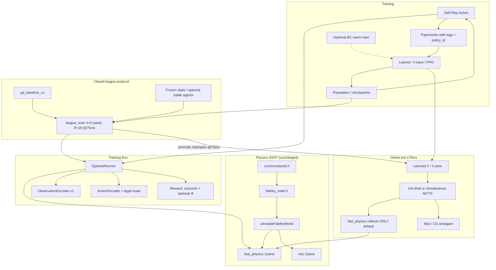
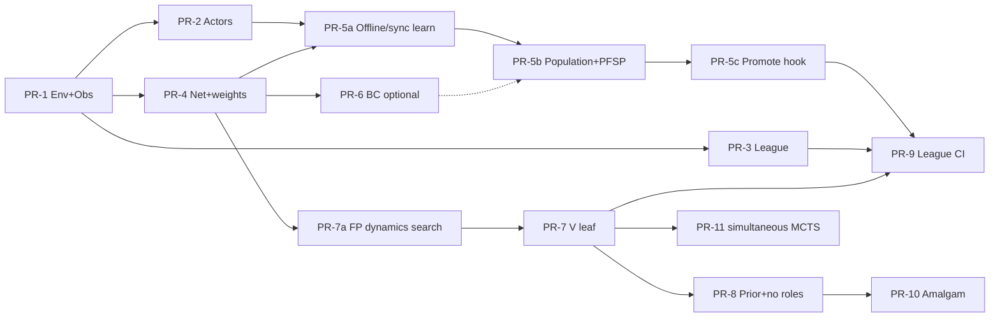
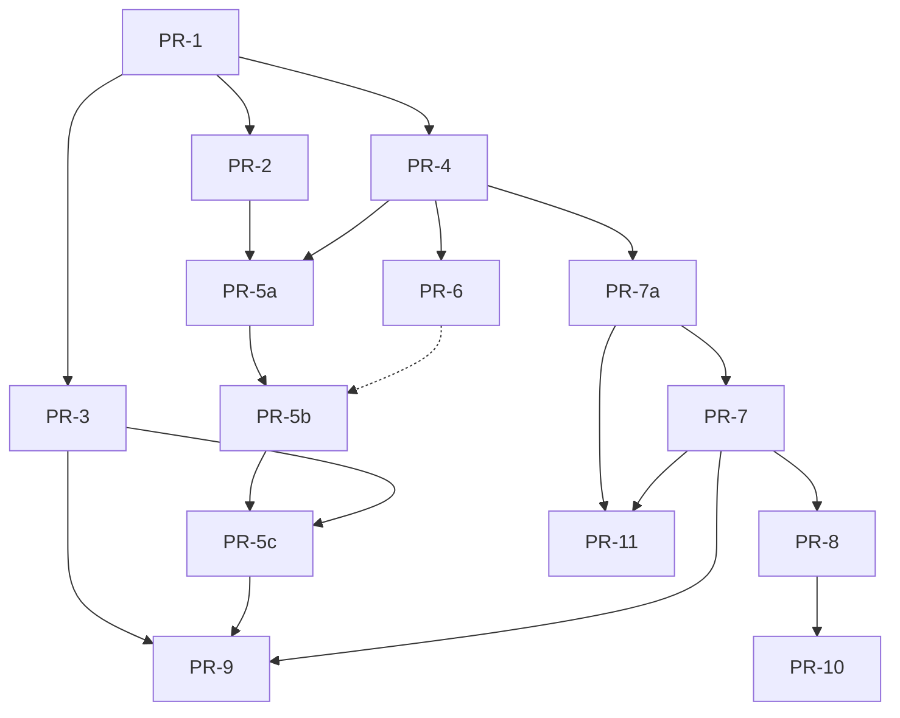

# Zero-Bias Self-Play Training + Learned-Value Search for Mad Pod Arena

| Field | Value |
|---|---|
| **Document** | Zero-Bias Policy/Value Training & League Evaluation |
| **Product** | mad_pod_arena (CodinGame Mad Pod Racing / Coders Strike Back) |
| **Author** | TBD |
| **Date** | 2026-07-09 |
| **Status** | Draft (rev 3.2 — multi-critic upgrade + simultaneous MCTS) |
| **Repo** | `/Users/samsi/csb/mad_pod_arena` |
| **Related** | `docs/SSOT.md`, `docs/artifacts/ZERO_BIAS_BOT_TRAINING.md`, `docs/rules.md`, `./tools/run_truth_suite.sh` |

---

## Overview

The current CodinGame bot is a genetic algorithm (GA) search over short-horizon action sequences, scored by a large hand-tuned heuristic (`BotConfig` weights + runner/blocker role logic in `src/cg/internal/ga_prelude_and_search.inc` and pure terms in `src/cg/ga_pure.h`). That search is strong under a 75 ms budget, but **style is encoded by humans**, not discovered from outcomes. Non-transitive strategies (pure race vs ram-block vs shield timing) and map diversity make a single hand-shaped fitness a permanent ceiling.

This design proposes an end-to-end **Environment + Reward + League** system that:

1. Trains a **policy π** and **value V** on the **EXACT** Fidelity simulator (same numeric law as the gate oracle).
2. Uses **self-play** as the primary training signal (optional short behavioral-cloning warm-start from CG battle JSON, then BC weight → 0).
3. Evaluates candidates with a **closed multi-opponent league protocol on all 18 tournament maps** (promotion only at 75 ms).
4. Replaces `BotConfig` heuristic evaluation inside online search with the **learned value** (and optional policy prior)—so “best bot” is defined by **win outcomes**, not by human racing mythology.
5. Keeps **train/serve dynamics consistent**: ValueSearchBot rollouts use **`csb::fast_physics::Game`** (Fidelity-equal), **not** the approximate `csb::fast::SimulateTurn` fragment, unless an explicit hybrid A/B fails to show a strategy gap.

**Non-negotiable constraint:** do **not** redesign or fork Fidelity world-step. Training, league, and online search dual-use existing physics SSOT: `simulateFidelityWorld` via `csb::Game` / `csb::fast_physics::Game`. Strategy trained on wrong bounce is free Elo in sim and free loss on CG.

### Implementation phases (who can code what now)

| Phase | Scope | Gate |
|---|---|---|
| **Phase 0 — Implement now** | PR-1…PR-4, PR-3 league harness, weight format, observation schema | Truth suite green; harness mergeable |
| **Phase 1 — Learning** | PR-5a/b/c, PR-6 optional BC, learning ladder thresholds | Research metrics; not a merge blocker for plumbing |
| **Phase 2 — Search + ship** | PR-7a dynamics, PR-7 V-leaf, PR-8 prior, PR-9 promote, PR-10 amalgam | p99 ≤75 ms; promotion protocol; GA rollback |

---

## Background & Motivation

### Current state (grounded in repo)

| Layer | Authority | Role today |
|---|---|---|
| Numeric law | `src/core/constants.h` | friction 0.85, max rotate 18°, thrust 0–200, boost 650, CP r=600, pod r=400, timeout 100, max turns 500 |
| Fidelity scalar math | `src/physics/fidelity_math.h` | `frictionTrunc`, `cpCollide`, `newCollideTime`, snap |
| Fidelity world step | `src/physics/fidelity_world_step.h` → `simulateFidelityWorld` | bounce, CP pass, commit |
| Fidelity façade | `csb::Game` in `src/physics/physics.h` | gate / replay_driver oracle; `initializeFromTrack`, `checkWinner`, `teamAlive` |
| Fidelity-equal rollout | `csb::fast_physics::Game` in `src/physics/fast_physics.h` | fixed buffers, `step(Move[4])` → same world-step |
| GA collision fragment | `csb::fast::SimulateTurn` in `src/physics/fast.h` | degrees pods; **not** full Fidelity (no CP/timeout/won) |
| Maps | `src/core/maps/catalog.h` | **18** tournament maps (necessary, not exhaustive of live CG) |
| Progress | `src/core/progress.h` | global next ↔ lap/local CP |
| Arena | `src/engine/arena.{h,cpp}` | IBot×IBot via Fidelity `Game::step`; terminal via `checkWinner` + timeouts |
| IBot | `src/engine/bot.h` | `Initialize` / `GetActions` / optional `SetRoles` |
| GA bot | `ga_prelude_and_search.inc` (~2446 LOC) + `ga_bot.h` | horizon default 6, pop default 50; multi-stage IBR; Fast rollouts |
| Config weights | `src/cg/bot_config.h` | dist/align/speed/lateral/angle/block/shield/… |
| Pure scoring | `src/cg/ga_pure.h` | characterization-locked terms for unit tests |
| Tournament harness | `src/tournament/benchmark_tournament.cpp` | CGBot vs CGBot, all maps, sides swapped |
| Battle corpora | `battles/**` | physics gates + optional imitation data |
| Truth | `./tools/run_truth_suite.sh` | SSOT + EXACT fp + gate A/B |
| CG amalgam size | `dist/cg_submission.cpp` | ~125 KB today (size budget pressure for MLP) |

**Pain points:**

1. **Human bias in eval.** `SimulateAndEvaluate` combines ~dozen weighted terms. Tuning `BotConfig` is local search in weight space, not discovery of optimal play.
2. **Roles and force_boost are hardcoded.** Runner/blocker assignment, role-specific scores, and `force_boost` when dist>5000 & angle<5° force a style.
3. **Opponent model is weak.** Search uses proxy / optional opp GA; non-transitivity is not handled by a population.
4. **No outcome-based training loop.** `benchmark_tournament` measures same-bot self-play; it does not train.
5. **Battle JSON is underused for strategy** (correctly reserved for physics EXACT). It can warm-start competence without becoming the reward.
6. **Train/serve risk if ignored:** today’s GA leaves are Fast-fragment states; V trained on EXACT must not score those states by default.

### Why now

Physics SSOT and EXACT validation are mature (`docs/SSOT.md`, gate A 312/312 culture). That is the rare CG asset that makes **closed-loop self-play** legitimate. The missing piece is a training stack that treats the sim as ground truth for **wins**, not as a canvas for more heuristic weights.

---

## Goals & Non-Goals

### Goals

1. **G1 — Exact env.** Headless episode runner whose transitions are bit-faithful to Fidelity (`simulateFidelityWorld`), dual-using `csb::fast_physics::Game` for throughput and `csb::Game` for audit. Spawn = `initializeFromTrack` law; terminal = `Arena::PlayGame` branch order.
2. **G2 — Outcome reward.** Primary reward = race outcome (win / loss / draw). Optional **potential-based** shaping only on **team** checkpoint progress (`max` global next), never style features. Enable Φ only via the **learning ladder** thresholds (below).
3. **G3 — Self-play league.** Train against a diverse pool of past selves; evaluate with a **closed panel** on all 18 catalog maps. Catalog-18 is necessary but **not sufficient** for live CG transfer (holdout later).
4. **G4 — Learned value in search.** Online bot (≤75 ms/turn, larger first turn) uses search with **V(s)** (and optional π prior) instead of `BotConfig` heuristic weights. **Rollout dynamics = `fast_physics` by default** (KD14).
5. **G5 — Zero *strategy* bias.** No forced runner/blocker roles, no hand BOOST schedule, no “always shield on contact,” no strategy features in reward/obs. **Structure** (action discretization, legal masks, architecture) is allowed and is **not** tabula rasa. Temporary BC is a **prior**, not a permanent objective.
6. **G6 — Optional BC warm-start.** Short imitation from battle JSON, then self-play must surpass demos (λ_bc → 0) with a mandatory from-scratch ablation.
7. **G7 — Ship path.** C++17 amalgam inference + search under CG limits; dual path rollback to classic GA; hard weight blob size budget.

### Non-Goals

1. **NG1** — Redesigning Fidelity world-step, changing physics constants, or training on intentionally approximate dynamics (including “train V on Fast-fragment states” as champion path).
2. **NG2** — Replacing the truth suite / gate culture with training curves.
3. **NG3** — Guaranteeing top-1 CG ladder on day one; we optimize measurable sim league + staged CG deploy.
4. **NG4** — Full multi-agent theory research platform.
5. **NG5** — Hand-feature engineering races as default inputs.
6. **NG6** — Using GA heuristic scores as training labels.
7. **NG7** — Live CG matchmaking as the primary training loop.
8. **NG8** — Using research outcome “beat GA” as a **merge criterion** for plumbing PRs (it is a research / ship gate only).

---

## Proposed Design

### Architecture (end-to-end)



### Dual-use physics (no fork) — train/serve consistency

| Purpose | API | Constraint |
|---|---|---|
| **Training / league full games** | `csb::fast_physics::Game` | EXACT vs Fidelity; `validate_fast_physics_corpus` + goldens |
| **Audit / gate** | `csb::Game` + `replay_driver` | Truth suite unchanged |
| **Arena bot-vs-bot** | `Arena::PlayGame` (Fidelity) | Pluggable IBots |
| **Online search rollouts (champion default)** | **`csb::fast_physics::Game`** full step every tick | **KD14.** ValueSearchBot MUST NOT call `FastSimulateTurn` / `csb::fast::SimulateTurn` on the champion path |
| **Hybrid (optional, non-default)** | Shallow `csb::fast` kinematics + V leaf | Only after written A/B: strategy gap ≤ 1 pp win-rate vs full `fast_physics` search on promotion panel at 75 ms (paired). Until then: **rejected** |

**Rule:** training env physics MUST continue to pass EXACT checks. Any new training binary depends on `//src/physics` as a **consumer only**—never a second world-step.

**Severity of train/serve skew:** **Critical** if V is trained on EXACT and scored on Fast-fragment states (missing CP/timeout/won in the Fast kernel). PR-7a exists specifically to prevent shipping that configuration as champion.

### Episode API (Env)

Package: `src/rl/` (C++ env + inference); `train/` (Python learner).

```cpp
// src/rl/episode.h  (sketch)
namespace csb::rl {

struct TeamAction {
  struct PodCmd {
    double tx = 0, ty = 0;
    int thrust = 0;       // 0..200
    bool shield = false;
    bool boost = false;
  };
  PodCmd pods[2];
};

// Observation is defined by Encode() byte layout — see Observation schema v1.
struct StepResult {
  // Encoded float32 views for team 0 and team 1 (team-relative).
  // Also raw fields for debugging.
  bool done = false;
  int winner = -1;          // 0, 1, or -1 draw
  float r_team0 = 0.f;
  float r_team1 = 0.f;
  std::string reason;       // race | timeout | max_turns | dual_finish | dual_elim | ongoing
};

class EpisodeRunner {
public:
  // map_idx in [0, 17]; spawn law = Game::initializeFromTrack
  void Reset(int map_idx, int laps = 3, uint32_t seed = 0);
  StepResult Step(const TeamAction& a0, const TeamAction& a1);
  const csb::fast_physics::Game& Game() const;
  // Terminal probe mirroring Arena::PlayGame order (see Terminal contract).
  int CheckTerminal(std::string* reason) const;
};

}  // namespace csb::rl
```

#### Spawn contract (normative)

**Normative spawn = same law as `csb::Game::initializeFromTrack`** (`physics.h`):

- Track from `GetTournamentMapsRaw()[map_idx]`, `laps` default 3.
- Start mults: `{500,-500}, {-500,500}, {1500,-1500}, {-1500,1500}` relative to unit CP0→CP1.
- Position commit: `roundHalfUp` (Fidelity), not engine `Round` alone.
- Angle sentinel: **−1° in radians** (`-1.0 * kDegToRad`), `hasRotated=false`, `next=1`, `shieldtimer=0`, `boosted=0`, vel=0, timeouts=`kTimeoutLimit`.

**Do not** treat `Arena::GenerateMap` degrees view as SSOT: that view is immediately overwritten by `SyncViewFromGame` in `PlayGame`. For A/B tests, compare `fast_physics` post-`Reset` pod positions/angles to a `csb::Game` after `initialize(track, laps)` on all 18 maps.

#### Terminal contract (normative)

Mirror **`Arena::PlayGame` branch order** (`arena.cpp`).  
**Important:** `csb::fast_physics::Game` has **no** `checkWinner` / `teamAlive` methods—only `pods[].won`, `playerTimeout[2]`, `turn`. Implement `EpisodeRunner::CheckTerminal` by **porting** the free-function logic of `csb::Game::teamWon` / `teamAlive` / `checkWinner` (or extract shared helpers under `src/rl/terminal.h` that operate on those fields). Do **not** assume methods on `fast_physics::Game`.

Ported semantics (same as `csb::Game::checkWinner` + Arena branch order):

```text
// Shared helpers over fields (fp or csb::Game):
teamWon(t)   := pods[2*t].won || pods[2*t+1].won
teamAlive(t) := playerTimeout[t] > 0
checkWinner() :=
  if teamWon(0) && teamWon(1): return -1      // draw both finished
  if teamWon(0): return 0
  if teamWon(1): return 1
  if !teamAlive(0) && !teamAlive(1): return -1
  if !teamAlive(0): return 1
  if !teamAlive(1): return 0
  return -2   // ongoing — NOT terminal (done=false)
```

`EpisodeRunner::CheckTerminal` / Arena-equivalent order after each step:

1. `w = checkWinner_fp()`; if `w == 0` or `1` → that team wins (`reason=race`).
2. If `w == -1` and (dual won or dual not alive) → draw.
3. Dual elimination by timeout (`!teamAlive(0) && !teamAlive(1)`) → draw; single timeout → other team wins.
4. Dual finish same turn → draw.
5. Single team won flags → that team wins.
6. `turn >= kMaxGameTurns` (500) → draw.
7. If `w == -2` and none of the above → **ongoing** (`done=false`).

PR-1 tests: spawn equality all 18 maps; forced fixtures for win / timeout / max-turns / dual-finish; A/B terminal parity vs `csb::Game::checkWinner` on same action sequences (including ongoing = −2).

#### Env adapters

- `FidelityEpisodeRunner` uses `csb::Game` for A/B equality vs `fast_physics` (`statesEqual` spirit + terminal parity).
- Actors: **C++ multi-process** writing versioned trajectory shards (see On-policy schema); Python learner for V-trace/PPO.

### Observation schema v1 (frozen for C++/Python bitmatch)

**Versioning:** `obs_schema_version = 1`. Any field change bumps version; weight header embeds `obs_dim` + version.

**Angle / sentinel:**

| Source | Representation |
|---|---|
| Fidelity pod | `angle` radians; uninit ≈ `-1°` rad (`kInitAngleSentinel`) |
| Encoder | `has_rotated` ∈ {0,1}; if false → `sin=0`, `cos=1` (canonical “east” placeholder) + `has_rotated=0`; if true → `sin(angle)`, `cos(angle)` from **radians** |

**Progress:** encode **both** `next_global` (Fidelity `pod.next`) and `next_cp_local = next % track_n` (and lap via decode). Training uses both; no ambiguity.

**Boost observability & CG-parity masking (KD20):**

CG stdin / IBot view exposes **no** boost-remaining field for any pod (`docs/rules.md`: x,y,vx,vy,angle°,nextCheckPointId only). Self boost is **agent-tracked** online; opponent boost is **not** reliably known.

| Mode | Own `boost_available` | Opp `boost_available` | `opp_boost_known` (all pods) |
|---|---|---|---|
| **Champion train + ship (`cg_parity=true`, default)** | true state / agent bookkeeping | **forced 0** | **forced 0** |
| Research-only full-info (`cg_parity=false`) | sim truth | sim truth | 1 for all | analysis only; **never** champion weights |

- **Legal BOOST action mask** (own pods only) still follows per-pod `boosted` (KD13), never team-shared folklore from `docs/rules.md`.
- Default `Encode(..., EncodeOptions{cg_parity=true})` so V/π **never** rely on privileged opp-boost bits unavailable on CG.
- PR-1/PR-4 golden: under `cg_parity=true`, all opp boost fields and `opp_boost_known` are zero in the float layout.

**Team-relative order (`team_id`):**

```text
encoded pods = [own0, own1, opp0, opp1]
team_id=0: own = global 0,1; opp = 2,3
team_id=1: own = global 2,3; opp = 0,1
```

**Normalization constants** (`src/rl/obs_constants.h`, not physics SSOT):

```cpp
inline constexpr float kNormPosX = 16000.f;
inline constexpr float kNormPosY = 9000.f;
inline constexpr float kNormVel  = 1000.f;
inline constexpr float kNormTimeout = 100.f;
inline constexpr float kNormTurn = 500.f;
inline constexpr float kNormNextGlobal = 40.f; // ~laps*cp + margin
```

**Float32 layout (fixed order, little-endian):**

```text
For each of 4 pods (team-relative):
  x/kNormPosX, y/kNormPosY, vx/kNormVel, vy/kNormVel,
  sinθ, cosθ, has_rotated,
  next_cp_local / 8, next_global / kNormNextGlobal,
  shield_timer / 4, boost_available, opp_boost_known
= 12 floats × 4 = 48

Track (pad to 8 CPs with zeros):
  for i in 0..7: cp_x[i]/kNormPosX, cp_y[i]/kNormPosY  = 16
  cp_count/8, laps/5, turn/kNormTurn,
  timeout_own/kNormTimeout, timeout_opp/kNormTimeout,
  team_id (0 or 1)
= 6

TOTAL obs_dim = 48 + 16 + 6 = 70
```

`Encode(span<float, 70>)` is the sole writer; golden vector test in PR-1; PR-4 C++/Python match on the same fixture.

### Bias inventory

| Class | Examples | Status |
|---|---|---|
| **Rules / physics (unavoidable)** | win condition, EXACT dynamics, 18° clamp | Required |
| **Structure allowed** | discrete 7×5×3 grid, R=5000 decode, MLP inductive bias, team-relative obs | Allowed; document coverage limits |
| **Strategy forbidden** | roles, force_boost, BotConfig weights, −dist-only reward, GA score labels, shield-on-contact rules | Never in reward/features/roles for champion path |
| **Temporary prior** | BC from LB (λ_bc anneal → 0); optional Φ on global progress | Allowed only under ladder; ablations required |

**G5 restated:** no human *strategy* priors in reward, features, or roles—not absolute tabula rasa.

### Action space

Online CG output is `tx ty thrust|BOOST|SHIELD` with max 18° rotate then thrust along facing.

**Training encoding (factorized discrete):**

| Channel | Discretization | Notes |
|---|---|---|
| Angle shift | 7 bins: {-18,-12,-6,0,6,12,18}° | Physics clamp |
| Thrust | 5 bins: {0,50,100,150,200} | |
| Special | {NONE, BOOST, SHIELD} | Mask BOOST if `boosted!=0` **per pod** |

Decode:

```text
facing' = angle + shift
tx = x + R * cos(facing')
ty = y + R * sin(facing')
R = 5000
```

**Coverage limit:** grid cannot express all legal CG commands. Online residual mutations are **clamped**:

- Angle residual ∈ continuous but projected into [−18,18]; optional residual radius anneals from bin centers.
- Thrust residual snaps to nearest legal integer in [0,200] or stays on grid if `residual_radius=0`.
- Deploy never invents OOD special tokens.

**Legal masks:**

- BOOST iff `pod.boosted == 0` (Fidelity SSOT; **not** team-shared).
- SHIELD always legal; physics sets `shieldtimer = 4` on activation and forces thrust 0 while `shieldtimer > 0` (activation frame + 3 subsequent endTurns).
- Decoder never emits invalid thrust outside 0–200.

Cardinality: 7×5×3 = **105** actions per pod; two independent heads (not full joint 11k).

### Reward design

**Primary (sparse):**

```text
R_terminal(team) =
  +1  if team wins
  -1  if team loses
   0  if draw
```

**Optional potential-based shaping (Ng et al.):**

```text
Φ(s, team) = max_{pod in team}( pod.next )   // global next only for v1
// non-terminal steps (if Φ enabled):
r_t = γ Φ(s_{t+1}) − Φ(s_t)
// at done: r_t = R_terminal (±1 or 0)   // sparse outcome ONLY; Φ not added on top of terminal
// logp for factorized heads: logp_pod = logp_angle + logp_thrust + logp_special
```

Φ is a **team** potential (max of both pods). Flag `CSB_RL_REWARD_POTENTIAL` default **off**. Enable only via learning ladder (below).

**Reject as primary reward:** GA `evaluate_state`, bare −distance_to_CP, LB imitation accuracy.

### Learning ladder (numeric thresholds)

Committed in `train/configs/default.yaml` sketch:

| Stage | Environment | Success criterion | On failure |
|---|---|---|---|
| L0 | Map 0 only; opp = random legal; sparse R | Win rate ≥ 0.70 over 200 eval games within **5×10⁷** env steps | Enable Φ (global_next); restart stage clock **2×10⁷** steps |
| L1 | Map 0; opp = ga_baseline_v1 @75 ms; Φ if enabled | Win rate ≥ 0.45 over 200 games within **1×10⁸** steps | Enable BC warm-start (λ_bc schedule); +**5×10⁷** steps |
| L2 | Uniform maps 0–17; PFSP self-play; λ_bc→0 | Win rate ≥ 0.55 vs random pool median over league smoke | Increase entropy / population; do not ship |
| L3 | Full promotion protocol (below) vs ga_baseline_v1 @75 ms | Research gate: **Wilson LB@95% ≥ 0.50** vs prev_champion (≈ WR̂ ≥ 0.537 at N=720); secondary GA gate per KD17 | Iterate training; plumbing already merged |

γ = 0.997, GAE-λ = 0.95. Ladder criteria are **objective**; vague “fails to leave start line” is replaced by L0 WR.

### Self-play training loop & on-policy schema

```mermaid
sequenceDiagram
  participant Actor as SelfPlay Actor
  participant Env as EpisodeRunner
  participant Pop as Population Pool
  participant Learner as V-trace learner
  participant League as League Eval

  loop every batch
    Actor->>Pop: sample opp (PFSP)
    Actor->>Env: Reset(map ~ U{0..17})
    loop until done
      Actor->>Actor: a0 ~ π_θ (store logp), a1 ~ π_opp
      Actor->>Env: Step(a0,a1)
      Env-->>Actor: obs, r, done
    end
    Actor->>Learner: shard {s,a,r,done,logp,mask,policy_id,map_id,team_id}
    Learner->>Learner: V-trace / PPO update
    Learner->>Pop: periodic checkpoint freeze
  end
  League->>Env: closed panel @75ms
  League-->>Pop: promote or reject
```

#### Algorithm default (KD15)

| Deployment | Algorithm | Why |
|---|---|---|
| **Multi-process actors (default scale-out)** | **IMPALA-style V-trace** | Async shards stale π; need logp + V-trace |
| **Single-machine prototype** | Synchronous PPO in-process | Simpler; no stale policy |

**Trajectory schema (required fields):**

```text
{ s[obs_dim], a_pod0, a_pod1, logp_pod0, logp_pod1, mask_pod0, mask_pod1,
  r, done, policy_id, map_id, team_id, opp_id, bootstrap_v }
```

NPZ/binary shards without `logp`/`policy_id` are **invalid** for on-policy updates.

#### Credit assignment / value target (KD16)

- **Centralized team value** `V(s)` under **team-relative observation** (one forward per acting team).
- Both pods’ discrete actions share the **same team advantage** (joint team reward).
- Data augmentation: with p=0.5 **swap own pod 0/1** (and swap action heads) for role-agnostic symmetry.
- Each game produces **two** team-relative trajectories (team0 and team1) training the same net.
- Fancy counterfactual multi-agent baselines deferred (OQ); Phase 1 default is centralized critic + shared advantage.

**Opponent sampling (PFSP-style):**

- 40% latest policy  
- 40% historical checkpoints weighted by (1 − win_rate) vs current  
- 20% `ga_baseline_v1` / frozen battle agents  

**Population size:** N=16 frozen checkpoints initially; grow to 32–64.

**Map sampling:** uniform over 18 catalog maps during L2+; optional loss-weighted later.

### Optional battle warm-start (BC)

**Data:** `battles/leaderboard_battles/`, `sim/battle_parser.py`.

**Procedure:**

1. Filter decisive games (`ranks` known; prefer non-timeout-crash).
2. Reconstruct states from keyframes; actions from stdout.
3. Map thrusts → nearest bins; BOOST/SHIELD exact; **per-pod** boost labels from state, not team folklore.
4. BC: maximize log π(a|s); default all agents (hyperparam: winners-only).
5. λ_bc: 1.0 → 0.0 over K learner steps; then **λ_bc ≡ 0 forever**.
6. **Ablation required:** from-scratch vs BC-warm on closed league after λ_bc=0; if BC-warm does not improve research gate within L1 budget, discard BC path for that run.
7. Success: self-play Elo / WR exceeds pure-BC checkpoint; architecture may still carry BC-shaped early features—ablation is the honesty check.

### Network sketch & latency budget (75 ms)

**Architecture (size-capped for amalgam):**

```text
obs_dim = 70
Torso: 70 → 128 → 128
Policy: 2 × factorized heads (7 + 5 + 3) logits
Value: scalar team V
Approx params: ~70*128 + 128*128 + heads ≈ 3e4–5e4 floats
float32 blob ≈ 120–200 KB; int8 quantize target ≤ 64 KB weights
Hard max champion weight blob: 256 KB (PR-4/PR-10 acceptance)
```

Existing amalgam ~125 KB code; total CG paste must stay practical (soft target **≤ 400 KB** total file; hard fail if export > 1 MB).

#### Latency budget table (champion path @ 75 ms turn)

Measured numbers are **placeholders until PR-2/PR-7a microbenches**; formulas are normative.

| Component | Symbol | v1 budget (ms) | Notes |
|---|---|---|---|
| Safety buffer | `B_safe` | **8.0** | Match GA `RunGAParallel` for budgets ≥50 ms |
| Encode obs | `T_enc` | 0.05 | float fill |
| Net forward (π+V) once | `T_net` | ≤ **0.3** | microbench required; fail if p99>0.5 |
| Policy prior sample / logit bias | `T_prior` | ≤ 0.1 | optional |
| Per rollout tick `fast_physics::step` | `T_step` | **measure** (`bench_fast_physics` + ValueSearch harness) | EXACT path |
| Per leaf V eval | `T_V` | ≤ `T_net` | may share torso cache if same state |
| Candidates evaluated | `N_cand` | timer-capped | |
| Horizon | `H` | 6 default (8 first turn / close combat, match GA scaling intent) | |
| Usable search | `T_search` | `75 - B_safe - T_enc - T_net ≈ 66.5` | first turn: `1000 - 100` safety if ≥500 ms |

**Capacity model:**

```text
N_cand * (H * T_step + T_V)  ≤  T_search
```

Example if `T_step=2µs`, `T_V=0.05ms`, `H=6`: cost/cand ≈ 0.062 ms → ~1000 cands/turn theoretical; real will be lower with copies/snapshots. **PR-7a must print measured `T_step`, `N_cand`, p99 wall.**

#### Search schedule (ValueSearchBot vs legacy IBR)

Legacy GA (`ga_prelude_and_search.inc`) non-tight budget:

| Stage | Fraction of `total_budget` | Role |
|---|---|---|
| t0 | 0.13 | early IBR |
| t1 | 0.46 | mid |
| t2 | 0.60 | late |
| full | 1.00 | final (wall is timer inside stages) |
| Safety | 8 ms @ ≥50 ms; 100 ms @ ≥500 ms; 1.5 ms @ <15 ms | |
| Tight <15 ms | pop=16, horizon=4, 2-stage | |

**ValueSearchBot v1 decision:**

- **Keep single timer-capped GA shell** (not full 4-stage IBR initially) to simplify leaf accounting: one population, amplitude anneal `1 - elapsed/limit`, stop at `adjusted_limit = turn_time_limit_ms - B_safe`.
- **Opp model:** sample from π_opp ensemble / frozen checkpoint (no nested opp GA by default; `opp_model_ms=0` like current default).
- Optional later: reintroduce multi-stage IBR fractions if single-stage underperforms.
- **MCTS** (if used): **simultaneous-move only** (KD21 / OQ-RL5 resolved). After PR-7a dynamics. **Alternating turn-based MCTS is forbidden.**

**PR-7 / PR-7a smoke (merge):** p99 wall time ≤75 ms/turn on warm and cold caches, fixed seeds, reference hardware documented in test log.

### Search with learned value (replacing BotConfig)

Today:

```text
rollout: FastSimulateTurn (csb::fast)
score   = evaluate_state(BotConfig + ga_pure)
```

Champion target:

```text
rollout: fast_physics::Game snapshot step  // PR-7a
score   = V_θ(encode_team_rel(state))
// + terminal ±huge if race decided mid-horizon
// optional: prior_mix * log π_θ(a|s) in mutation / PUCT
```

**Not minimal leaf-only swap:** PR-7a replaces dynamics **before** PR-7 enables V leaf as default. Feature flag matrix:

| Flag | Default | Effect |
|---|---|---|
| `CSB_SEARCH_DYNAMICS_FP` | **on** for ValueSearchBot | Use fast_physics rollouts |
| `CSB_USE_LEARNED_VALUE` | **off** until weights exist (`SearchConfig` default false) | Leaf = V |
| `CSB_USE_POLICY_PRIOR` | **off** until V enabled | Mutation bias; may turn on with V |
| `CSB_HEURISTIC_FALLBACK` | off | Emergency only |
| `CSB_SEARCH_HYBRID_FAST` | **off** | Hybrid Fast+V; requires A/B pass |

**Roles:** `SetRoles` no-op; no `force_boost` heuristic on ValueSearchBot.

**MCTS constraint (user-locked, KD21):** Any MCTS backend (PR-11) must be **simultaneous-move**: each ply both teams (all 4 pods) act together; expand joint or factored simultaneous action sets; roll out with one `fast_physics::step` per ply. **Classic alternating turn-based MCTS is forbidden**—CSB is simultaneous every turn (all pods act each game turn); a turn-based tree would mis-model the game and disagree with simultaneous self-play / training dynamics.

#### Online state bridge (CG / IBot → `fast_physics` root) — PR-7a acceptance

Each `GetActions(const vector<Pod>& view)` must **re-root** a `fast_physics::Game` from the live view before search. Training `EpisodeRunner` already owns FP end-to-end; online does not.

**Inputs:** 4× engine/IBot `Pod` (degrees, local `next_cp_id`, view timeouts), track from `Initialize`, `team_id`, agent-side **own** boost bookkeeping (`own_boosted[2]`), turn counter.

**Procedure (`BridgeViewToFastPhysics` sketch):**

1. **Track / timeouts / turn:** `setTrack` from stored CP xy + laps; `setTimeouts` from view (or team timeout derived as in Arena `SyncViewFromGame` inverse best-effort); set `turn`.
2. **Per pod i ∈ 0..3:**
   - Position/velocity: `px,py,vx,vy` from view (doubles as committed integers).
   - **Angle:** if `view.angle` is sentinel `≈ -1` (degrees) → set FP angle to `-1°` rad and `hasRotated=false` (same rules as `setPodState` / `kInitAngleSentinel`); else `angle_rad = degrees * kDegToRad`, `hasRotated=true`.
   - **Global next:** `next = csb_progress::GlobalNext(laps_completed, next_cp_id, track_n)` — prefer reconstructing from `laps_completed` + local id; if only local id is trustworthy mid-race, use `Decode`/`GlobalNext` consistently with training.
   - **Shield:** `shieldtimer = view.shield_cd`.
   - **Boost:** own pods (`team_id` pair): `boosted = own_boosted[local]`; after emitting BOOST, set bookkeeping true. Opp pods: `boosted = 0` under champion path (unknown); do not invent.
3. **Encode for V/π:** call `Encode` with **`cg_parity=true`** (opp boost fields zero)—same as training champion path.
4. **Search:** snapshot FP game; roll out with FP steps; restore snapshot between candidates.
5. **Action out:** decode best first-step to `PodAction` degrees targets for CG stdout.

**Golden test (PR-7a / PR-4):** take a mid-race Fidelity/`Arena` frame → `SyncViewFromGame` → bridge → `Encode(cg_parity=true)` must **bitmatch** training `Encode` on the same underlying FP/Fidelity state under cg_parity (positions, angles, next, shields; boost fields per policy above).

### League evaluation protocol (closed)

#### Fixed panel v1 (k=5)

| Slot | Agent id | Definition |
|---|---|---|
| P0 | `subject` | Candidate under test |
| P1 | `prev_champion` | Last promoted weights (or random-init if first) |
| P2 | `ga_baseline_v1` | See below |
| P3 | `ckpt_median` | Population checkpoint with median Elo vs subject in last train epoch |
| P4 | `ckpt_hard` | Checkpoint with **lowest** win-rate vs subject (hardest) |

**Optional later (not in v1 promotion):** frozen BC-cloned nets; open-loop battle replay IBot (`ReplayBot` feeds recorded actions for one side—eval only, not training opp by default).

#### `ga_baseline_v1` pin

```text
agent_id: ga_baseline_v1
BotConfig: defaults from bot_config.h (horizon=6, population=50, all default weights)
turn_time_limit_ms: 75.0
first_turn_time_limit_ms: 1000.0
num_threads: 1
CreateGABot(config) — full role assignment + force_boost behavior AS SHIPPED
git pin: record ga_prelude_and_search.inc blob SHA in models/baselines/ga_baseline_v1.json
```

Promotion “vs GA” is **only meaningful at 75 ms** with this pin. 7.5 ms GA is a different, weaker agent—use only for smoke.

#### Grids

| Grid | Maps | Sides | R (repeats per map×side×pairing) | Time budget | Purpose |
|---|---|---|---|---|---|
| **Promotion** | 0–17 (18) | 2 | **20** | **75 ms only** | Ship/promote decisions |
| **CI smoke** | 0–17 | 2 | 1–2 | 7.5 ms | Non-blocking hygiene |
| **Dev iterate** | subset | 2 | 5 | 75 ms | Local |

**Pairings for promotion:** subject vs each of {prev_champion, ga_baseline_v1, ckpt_median, ckpt_hard} → 4 pairings.

**Games per pairing:** `18 × 2 × 20 = 720`.  
**Total promotion games:** `720 × 4 = 2880`.

**Wall-clock estimate:** if ~0.5–2 s/game with bots at 75 ms × ~100 turns ≈ 7.5 s think/game worst-case, wall time is dominated by think time; with `BOT_THREADS` batch parallelism like `benchmark_tournament`, expect **hours on a workstation**—run promotion offline, not in blocking CI. Document measured wall time in PR-9 on reference machine (e.g. “M-series Mac / N-core Linux”).

#### Statistical promotion rule (KD17)

Let each game be a Bernoulli trial for the subject: **v1 scoring for WR tests: win=1, loss/draw=0** (draws do not count as wins). Separately track Elo with draw=0.5 for dashboards only—not for the promotion test.

**Authoritative primary rule (vs `prev_champion`) — option A, single statistic:**

- N = 720 paired games (map × side × repeat).
- Paired design: same map, side, shared env seed stream; **seed both bots’ RNG** from `hash(map, side, repeat, agent_id)`.
- **Promote iff Wilson lower 95% confidence bound on WR ≥ 0.50.**
- **No separate point-estimate ≥ 0.52 gate** (that dual rule was inconsistent: at N=720, WR̂=0.52 ⇒ Wilson LB ≈ 0.483 < 0.50; binding bar is ~**53.7%** point WR for LB ≥ 0.50).
- Implementers of `promote.py` use **only** the Wilson LB criterion as the pass/fail boolean.
- Optional soft dashboard: also log WR̂ and Elo; if draws are very frequent, log a 3-way table but do not change the Boolean rule without a design amendment.

**Secondary gate (vs `ga_baseline_v1`) — same statistic, same grid:**

- Compute subject Wilson LB@95% **and** prev_champion Wilson LB@95% vs `ga_baseline_v1` on the **identical** seeded map×side×repeat grid (or store prev_champion’s GA grid report at promotion time).
- **Non-decreasing:** `WilsonLB(subject vs GA) ≥ WilsonLB(prev_champion vs GA) − ε` with **ε = 0.01** (one percentage point of the bound, slack for noise).
- **First champion** (no prev): require `WilsonLB(subject vs GA) ≥ 0.45`.
- Do **not** compare subject LB to prev point estimate (apples-to-oranges).

**Promotion only at 75 ms.** 7.5 ms results never promote.

**RNG policy:**

- Arena map fixed by `map_idx` (deterministic spawn).  
- `SeedRand(seed)` / bot seeds as above.  
- League report stores seeds for replay.

### Package layout

```text
src/rl/
  BUILD.bazel
  episode.{h,cpp}
  terminal.h             # ported checkWinner/teamAlive over FP fields
  observation.h          # Encode v1 + cg_parity option + golden
  obs_constants.h
  action.h
  reward.h
  bridge.h               # IBot/CG view → fast_physics root
  value_net.{h,cpp}
  weights_format.h       # magic, version, obs_dim, sha256
  policy_bot.h
  value_search_bot.*     # IBot: bridge + fast_physics GA shell + V
  league_eval.cpp
  agent_registry.*
  replay_bot.*           # optional open-loop
  microbench_*.cpp
train/
  bc_from_battles.py
  vtrace_selfplay.py
  export_weights.py
  population.py
  promote.py
  configs/default.yaml   # ladder N, λ, γ
models/
  baselines/ga_baseline_v1.json
  README.md
```

### Throughput estimates & SPS gates

| Gate | Metric | Target | Hardware note |
|---|---|---|---|
| PR-2 env-only | steps/s stub random policy | ≥ **10k**/s single process | Document CPU model in log |
| PR-2 actor+net | steps/s with MLP forward | ≥ **2k**/s / thread | Separate from env-only |
| IPC | default | **memory-mapped ring** of trajectories | Prefer over per-game NPZ for on-policy |
| Offline shards | freshness | V-trace ρ clipping; max policy_id lag **K=3** learner steps | Drop older shards |

Reference: Apple Silicon / x86 workstation both acceptable; no claim of cross-machine equality—gates are local.

---

## API / Interface Changes

### IBot

Existing contract unchanged. Add:

- `CreateValueSearchBot(SearchConfig, WeightsBlob)`  
- `CreatePolicyBot` (reactive π, no search) for ablation  
- `CreateReplayBot(path)` optional  
- `SetRoles` no-op on value/policy bots  

### SearchConfig

```cpp
struct SearchConfig {
  int horizon = 6;                 // align BotConfig default
  int population = 50;             // align BotConfig default
  double turn_time_limit_ms = 75.0;
  double first_turn_time_limit_ms = 1000.0;
  double safety_buffer_ms = 8.0;   // ≥50 ms budgets; scale like GA for first turn
  double prior_mix = 0.3;
  // Fail-closed defaults: V/prior OFF until explicit enable + valid weights.
  bool use_policy_prior = false;          // enable only with use_learned_value + valid blob
  bool use_learned_value = false;         // matches CSB_USE_LEARNED_VALUE default
  bool use_fast_physics_rollouts = true;  // ValueSearchBot product path (after construction)
  bool use_hybrid_fast = false;           // requires A/B
  bool use_heuristic_fallback = false;
  int num_threads = 1;
  std::string weights_id;
};
```

**Precedence:** env/CLI flags & config file > explicit `SearchConfig` fields set by caller > compile-time struct defaults.  
**Fail closed:** if `use_learned_value==true` but weight blob missing/invalid sha256 → refuse ValueSearch path and fall back to `CreateGABot` (same as security canary). `CreateValueSearchBot` only sets `use_learned_value=true` after successful load.

### CLIs

```bash
bazel run //src/rl:selfplay_actor -- \
  --maps 0-17 --opponent pool.json --weights current.bin \
  --out-ring /tmp/traj_ring --games 1000

bazel run //src/rl:league_eval -- \
  --panel subject.bin,prev.bin,ga_baseline_v1,ckpt_med.bin,ckpt_hard.bin \
  --start-map 0 --end-map 18 --repeats 20 --time-budget 75 \
  --seed-mode hash --report out/league.json
```

---

## Data Model Changes

### No game physics schema changes

### New artifacts

| Artifact | Format | Notes |
|---|---|---|
| Weights | magic `CSBW`, version, obs_schema, obs_dim, arch_id, **sha256**, float32/int8 payload | load fail → GA fallback |
| Population registry | JSON: id, path, elo, step, bc_fraction, sha256 | |
| Trajectories | ring/shard with logp + policy_id | see schema |
| BC dataset | regenerable cache | |
| League reports | JSON + seeds | promotion audit |
| ga_baseline_v1.json | pin BotConfig + git SHA | |

---

## Alternatives Considered

### A1 — Keep GA + tune BotConfig forever

Retain as **baseline opponent**, not champion path.

### A2 — Pure behavioral cloning of leaderboard

**Optional warm-start only**, annealed off + ablation.

### A3 — Train value to regress GA heuristic scores

**Rejected** (reintroduces human bias).

### A4 — End-to-end RL without search online + distillation

- Phase 1 may train reactive π.  
- **Production target:** π-prior + V-backed search.  
- **Distillation path (G7):** if search cannot fit 75 ms after PR-7a measurement, distill search-chosen actions into reactive π for CG; keep search offline for data generation. Distilled π still trained from outcome-driven search, not BotConfig.

### A5 — Approximate physics for faster training

**Rejected** for champion. Use optimized EXACT `fast_physics`.

### A6 — MCTS-only from scratch (no NN)

**Rejected** as primary; NN value is the leaf. If MCTS is used as a search backend at all, it must be **simultaneous-move** (KD21)—never classic alternating turn-based MCTS (CSB is simultaneous).

### A7 — Evolutionary strategies on BotConfig or small net weights

- **Pros:** Pure C++; no autodiff; fitness = league WR.  
- **Cons:** Sample-inefficient; BotConfig ES preserves human features; net ES still needs EXACT env.  
- **Decision:** **Secondary research path** only if V-trace stack fails operationally; not Phase 0 default. OQ-RL1 remains ES as fallback, not primary.

### A8 — Train V on Fast-fragment-induced states (consistent hybrid train/serve)

- **Pros:** Consistent with today’s GA rollouts; more iters/sec.  
- **Cons:** Fast fragment is **not** Fidelity (no CP/timeout/won in kernel); policies/values optimize the wrong game; contradicts EXACT culture and KD1.  
- **Decision:** **Rejected** for champion. Hybrid Fast+V only as optional after A/B gap proof, still with EXACT training preferred.

---

## Security & Privacy Considerations

| Topic | Notes |
|---|---|
| Battle JSON | Public CG / in-repo; respect `battles/RETENTION.md` |
| Weights supply chain | Header magic + version + **sha256**; refuse load on mismatch |
| Load failure | **Fail closed to `CreateGABot` / ga_baseline path**; log error |
| Canary | Boot test: load champion blob once at process start; on failure stay on GA for session |
| Rollback | Feature flag + dual amalgam path |
| No secrets in amalgam | |

---

## Observability

### Training

- mean return, WR vs pool, entropy, value/policy loss, BC loss, λ_bc, grad norm, SPS, games/hour  
- per-map heatmap (18)  
- win matrix top-K  
- BOOST/SHIELD/timeout histograms (descriptive only)

### Collapse detector

- Entropy mean over last **W=1000** updates < **ε=0.05 nats** (factorized heads sum) **and** win matrix near-diagonal → alert; raise entropy coeff / PFSP hard fraction.

### League / CI

- Promotion reports with Wilson intervals and seeds  
- **Physics truth suite hard-fail always separate** from Elo  
- CI smoke R=1–2 @7.5 ms **non-blocking** for Elo; blocking only for crashes/timeouts  
- Do **not** hard-fail CI on champion-vs-GA regression without Issue-3 statistics (promotion is offline)

### Online bot

- net_ms, search_iters, N_cand, T_step (local builds)  
- CG: strip verbose stderr by default  

---

## Rollout Plan

Aligned with **PR-1 … PR-11** (not a separate P0–P5 labeling).



### Feature flags

| Flag | Default | Meaning |
|---|---|---|
| `CSB_RL_REWARD_POTENTIAL` | off | Φ shaping |
| `CSB_RL_BC_WARMSTART` | off | BC phase |
| `CSB_SEARCH_DYNAMICS_FP` | on (ValueSearch) | fast_physics rollouts |
| `CSB_USE_LEARNED_VALUE` | off until ready | V leaf |
| `CSB_USE_POLICY_PRIOR` | on with V | prior |
| `CSB_SEARCH_HYBRID_FAST` | off | hybrid |
| `CSB_HEURISTIC_FALLBACK` | off | emergency |

### Staged rollout

1. Phase 0 plumbing merge (env, league, weights).  
2. Learning ladder L0–L2 offline.  
3. PR-7a/7 search path; p99 ≤75 ms.  
4. Promotion grid offline → champion blob.  
5. Amalgam private CG → ladder.  
6. Rollback = GA path.

### Risks

| Risk | Severity | Mitigation |
|---|---|---|
| Train/serve dynamics skew (V on Fast states) | **Critical** | KD14; PR-7a; hybrid off by default |
| Sim ≠ CG drift | **Critical** | Truth suite + EXACT fp |
| Sparse reward no learning | High | Learning ladder + Φ/BC criteria |
| Strategy collapse | High | PFSP, entropy ε detector |
| 75 ms budget blow with FP+V | High | Latency table; timer-cap; microbench; distill A4 |
| Overfit catalog-18 | Medium | Holdout maps later; note transfer risk |
| BC meta lock-in | Medium | λ_bc→0 + from-scratch ablation |
| Amalgam size | Medium | 256 KB weight cap; quantize |
| On-policy staleness | Medium | logp + V-trace + lag K |
| Promotion CI flap | Medium | Offline promotion; smoke non-blocking |
| Compute cost | Medium | Start small net; scale actors |

---

## Key Decisions

| # | Decision | Rationale |
|---|---|---|
| KD1 | Training dynamics = Fidelity-equal `fast_physics` → `simulateFidelityWorld` | SSOT; EXACT culture |
| KD2 | Primary reward = win/loss/draw; optional Φ only on **team** max global_next | Zero strategy bias; Ng shaping |
| KD3 | Self-play + PFSP league is main learning signal | Non-transitive 2v2 |
| KD4 | LB battles = optional BC + eval; never sole reward | Competence without meta lock-in |
| KD5 | Online champion = search with learned V (+ optional π prior), not BotConfig leaf; search form = GA shell and/or **simultaneous** MCTS (KD21) | Outcome-driven look-ahead |
| KD6 | Discrete factorized actions for train; clamped residual online | Tractable RL + limited OOD |
| KD7 | No forced runner/blocker / force_boost on learned bot | Roles emerge |
| KD8 | `ga_baseline_v1` pinned BotConfig@75ms/1 thread is first-class league member | Regression anchor |
| KD9 | All 18 catalog maps in promotion grid; catalog ≠ full CG distribution | Product v1 + transfer caveat |
| KD10 | Deploy weight blob + C++ inference; dual GA rollback | CG constraints |
| KD11 | Physics PRs orthogonal to training PRs | Truth suite never blocked by ML |
| KD12 | Reject approximate physics and GA-score imitation | Strategy + SSOT |
| **KD13** | **Boost is per-pod (`boosted` in physics.h); masks/BC follow Fidelity, not rules.md team-share** | Code SSOT over docs folklore |
| **KD14** | **Champion online rollouts = `fast_physics` every tick; hybrid Fast+V off until A/B gap ≤1 pp WR** | Prevent train/serve skew |
| **KD15** | **Async actors: trajectory must include logp+policy_id; learner = V-trace. Sync PPO only for single-process prototype** | On-policy correctness |
| **KD16** | **Centralized team V(s) + shared team advantage; pod-swap aug; not independent per-pod critics in v1** | Credit assignment default |
| **KD17** | **Promotion only @75 ms; panel k=5; R=20; sole primary rule Wilson LB@95% ≥ 0.50 (no dual 0.52 point gate); secondary GA uses LB-to-LB; seeded bots** | Operationally closed, statistically consistent |
| **KD18** | **Observation schema v1 frozen (obs_dim=70); weight header versioning** | C++/Python bitmatch |
| **KD19** | **Tiered DoD: merge plumbing ≠ research beat-GA ≠ ship p99** | Avoid infinite merge block |
| **KD20** | **Champion Encode uses `cg_parity=true`: opp boost fields forced unknown/zero at train and serve; self boost agent-tracked online** | Close train/serve obs privilege gap |
| **KD21** | **If MCTS is implemented: simultaneous-move MCTS only (joint/factored simultaneous expansions). Alternating turn-based MCTS forbidden.** | CSB is simultaneous; user-locked 2026-07-09 |

---

## Open Questions

| ID | Question | Default |
|---|---|---|
| OQ-RL1 | Pure C++ ES fallback if Python stack fails? | ES only if V-trace ops fail (see A7) |
| OQ-RL3 | Reactive-only deploy via distillation if search budget fails? | Yes, A4 distillation path |
| OQ-RL4 | Weight storage: git-lfs vs external? | gitignore + small fixtures |
| OQ-RL5 | MCTS vs GA shell long-term? | **Resolved (partial):** GA shell first post-PR-7a. If/when MCTS: **simultaneous-move only** (KD21); never turn-based. PR-11. |
| OQ-RL6 | Procedural holdout maps for promotion v2? | Optional after catalog-18 stable |
| OQ-RL7 | Multi-thread ValueSearch pool? | Start `num_threads=1`; scale if p99 allows |
| OQ-RL8 | Φ add normalized distance later? | global_next only until L0 fails |
| OQ-RL9 | Multi-agent COMA/V-trace baselines? | Deferred; KD16 default |
| OQ-RL10 | Exact T_step on target CG CPU class? | Measure in PR-7a; may force smaller H/pop |

*(OQ-RL2 boost SSOT promoted to KD13.)*

**OQ-RL5 resolved (user-locked 2026-07-09):** If/when MCTS is implemented, it **must** be **simultaneous-move MCTS** (both teams act each ply; joint or factored simultaneous expansions over the simultaneous CSB action model). Classic **alternating turn-based MCTS is out of scope and forbidden** for this product—CSB advances all four pods each turn; a turn-based tree would mis-model dynamics and disagree with simultaneous self-play / `fast_physics::step`. See **KD21** and PR-11. Choice of GA shell vs simultaneous MCTS as the long-term default remains open; the *form* of MCTS is not.

---

## References

- `docs/SSOT.md`, `docs/artifacts/ZERO_BIAS_BOT_TRAINING.md`, `docs/rules.md`, `docs/VERIFICATION_TRUTH_POLICY.md`
- `./tools/run_truth_suite.sh`
- `src/physics/{fidelity_world_step.h,fast_physics.h,fast.h,physics.h}`
- `src/core/{constants.h,maps/catalog.h,progress.h}`
- `src/cg/{bot_config.h,ga_pure.h,internal/ga_prelude_and_search.inc}`
- `src/engine/{arena.cpp,bot.h}`, `src/tournament/benchmark_tournament.cpp`
- `sim/battle_parser.py`, `battles/RETENTION.md`
- AlphaStar PFSP; Ng et al. potential-based shaping; IMPALA V-trace

---

## PR Plan

Independently reviewable PRs. Truth suite stays green. **Tiered DoD** at end.

### PR-1 — EpisodeRunner + frozen observation schema

| Field | Content |
|---|---|
| **Title** | `rl: EpisodeRunner spawn/terminal SSOT + observation Encode v1` |
| **Files** | `src/rl/{episode,observation,obs_constants,action,reward}.*`, `episode_test.cpp`, golden obs vectors |
| **Deps** | None |
| **Description** | `Reset` via `initializeFromTrack` law on `fast_physics`; `terminal.h` ported helpers (no FP methods); spawn equality vs `csb::Game` on 18 maps; `Encode` obs_dim=70 with **cg_parity=true** golden (opp boost zeros); sparse reward. No net. |

### PR-2 — Self-play actor + trajectory ring (logp schema)

| Field | Content |
|---|---|
| **Title** | `rl: selfplay_actor with versioned trajectories (logp, policy_id)` |
| **Files** | `src/rl/selfplay_actor.cpp`, `trajectory_writer.*`, microbench, `train/README.md` |
| **Deps** | PR-1 |
| **Description** | Stub/random policy; mmap ring; schema validation; **env-only SPS ≥10k/s** gate logged; actor+net SPS gate deferred to PR-4. |

### PR-3 — Closed league_eval harness

| Field | Content |
|---|---|
| **Title** | `rl: league_eval k-panel, seeds, Wilson report hooks` |
| **Files** | `src/rl/league_eval.cpp`, `agent_registry.*`, `models/baselines/ga_baseline_v1.json`, factor helpers from `benchmark_tournament.cpp` |
| **Deps** | PR-1; `CreateGABot` |
| **Description** | Implement panel slots, R/side/map flags, seed-mode hash, JSON report with WR + Wilson helper. Pin `ga_baseline_v1`. CI smoke R=1 @7.5 ms non-blocking Elo. |

### PR-4 — MLP weights format + C++ inference + size budget

| Field | Content |
|---|---|
| **Title** | `rl: weights CSBW format (sha256) + C++ forward; obs bitmatch` |
| **Files** | `src/rl/value_net.*`, `weights_format.h`, `value_net_test.cpp`, `train/export_weights.py` |
| **Deps** | PR-1 |
| **Description** | magic/version/obs_dim/sha256; load-fail API; numerical match Python fixture; **blob ≤256 KB** acceptance; PolicyBot IBot. |

### PR-5a — Sync PPO / V-trace learner MVP (no population)

| Field | Content |
|---|---|
| **Title** | `train: single-machine PPO/V-trace on ring shards` |
| **Files** | `train/vtrace_selfplay.py`, `configs/default.yaml` (ladder L0) |
| **Deps** | PR-2, PR-4 |
| **Description** | Learn vs random on map 0; logp required; no PFSP yet. Default BC off. |

### PR-5b — Population registry + PFSP sampling

| Field | Content |
|---|---|
| **Title** | `train: population checkpoints + PFSP opponent sampling` |
| **Files** | `train/population.py`, actor opp sampling flags |
| **Deps** | PR-5a |
| **Description** | Freeze N ckpts; PFSP weights; map uniform 0–17. |

### PR-5c — Promote hook (calls league_eval)

| Field | Content |
|---|---|
| **Title** | `train: promote.py wired to closed league protocol` |
| **Files** | `train/promote.py` |
| **Deps** | PR-5b, PR-3 |
| **Description** | Run promotion grid offline; write champion meta only if KD17 passes. Research gate, not merge gate. |

### PR-6 — Optional BC warm-start

| Field | Content |
|---|---|
| **Title** | `train: BC from battles + λ_bc anneal + ablation entrypoint` |
| **Files** | `train/bc_from_battles.py`, fixtures |
| **Deps** | PR-4; `sim/battle_parser.py` |
| **Description** | Per-pod boost labels; λ_bc→0 test; from-scratch ablation script. Default off in configs. |

### PR-7a — ValueSearchBot dynamics = fast_physics

| Field | Content |
|---|---|
| **Title** | `cg/rl: ValueSearchBot rollouts via fast_physics (no Fast fragment)` |
| **Files** | `src/rl/value_search_bot.*`, microbench vs Fast, timer/safety buffer |
| **Deps** | PR-4 |
| **Description** | Snapshot/step with `fast_physics`; **no** `FastSimulateTurn`; implement **BridgeViewToFastPhysics** + Encode bitmatch golden; measure T_step, N_cand; p99 ≤75 ms with **dummy V**. Hybrid flag off. `use_learned_value` remains false until PR-7. |

### PR-7 — Learned V leaf feature-flagged

| Field | Content |
|---|---|
| **Title** | `cg/rl: CSB_USE_LEARNED_VALUE leaf on ValueSearchBot` |
| **Files** | value_search_bot, optional thin hook from GA only if shared; tests |
| **Deps** | PR-7a; soft PR-5a for real weights |
| **Description** | Leaf = V; terminal overrides; legacy GA path untouched (`ga_pure_test` green). Smoke p99 ≤75 ms with real weights when present. |

### PR-8 — Policy prior + no roles

| Field | Content |
|---|---|
| **Title** | `cg/rl: π-prior mutations; disable roles/force_boost on ValueSearchBot` |
| **Files** | value_search_bot, docs |
| **Deps** | PR-7 |
| **Description** | prior_mix; SetRoles no-op; no force_boost. |

### PR-9 — League smoke CI + promotion docs

| Field | Content |
|---|---|
| **Title** | `ci/tools: run_league_smoke.sh + promotion runbook` |
| **Files** | `tools/run_league_smoke.sh`, optional non-blocking workflow |
| **Deps** | PR-3, PR-5c, PR-7 |
| **Description** | R=1–2 @7.5 ms; crash-blocking only; document offline R=20 @75 ms wall time. |

### PR-10 — Amalgam export

| Field | Content |
|---|---|
| **Title** | `cg: amalgam ValueSearchBot + embedded weights ≤ budgets` |
| **Files** | BUILD genrule, `export_cg_submission.sh`, smoke |
| **Deps** | PR-7, PR-8 |
| **Description** | Dual path GA fallback; weight sha256 verify at startup; size budgets; canary load. |

### PR-11 — Optional simultaneous-move MCTS

| Field | Content |
|---|---|
| **Title** | `rl: optional simultaneous-move MCTS backend (fast_physics + V/π)` |
| **Files** | `src/rl/mcts.*` (simultaneous expansions only) |
| **Deps** | PR-7a, PR-7 |
| **Description** | **Simultaneous-move MCTS only** (KD21): each ply both teams act; joint or factored simultaneous expansions; one `fast_physics` world-step per ply; PUCT with π prior + V leaf. **Do not implement alternating turn-based MCTS**—CSB is simultaneous. Compare to GA shell at equal time budget. |

### Dependency graph



### Definition of Done (tiered)

| Tier | Criteria |
|---|---|
| **Merge (plumbing)** | PR-1…PR-4, PR-3 harness land; truth suite green; obs golden; weight load-fail→safe; league JSON report works |
| **Research** | Learning ladder progresses; offline promotion: Wilson LB@95% ≥ 0.50 vs prev + LB-to-LB non-decreasing vs `ga_baseline_v1` @75 ms |
| **Ship** | ValueSearchBot p99 ≤75 ms; amalgam export; sha256 canary; GA rollback verified; hybrid still off unless A/B logged |

---

*End of design document (rev 3.1 — simultaneous-move MCTS user-locked).*


---

## Amendment rev 3.2 — Multi-critic design upgrade (2026-07-09)

*Five specialist critics (RL, latency/deploy, observation, league/eval, physics-SSOT) reviewed the design. This section is normative: it **overrides** conflicting earlier text.*

**Source synthesis:** `docs/artifacts/DESIGN_CRITIQUE_SYNTHESIS_413e8b9f.md`  
**Raw critic notes:** `/tmp/critique-413e8b9f-{rl,latency,obs,league,ssot}.md` (session artifacts)

### A. New / amended Key Decisions

| # | Decision | Rationale (critic) |
|---|---|---|
| **KD22** | **Path C data path = Expert Iteration**: a non-trivial fraction of training games must be played **with search in the loop** (ValueSearchBot or simultaneous MCTS generating actions), not only reactive π self-play then bolt-on V leaf | RL critic: classic AlphaZero; reactive-trained V is off-policy w.r.t. search-induced states (contacts, timeouts, role switches) |
| **KD23** | **Credit assignment v1**: use **centralized team V** but advantages are **pod-conditioned** (separate baseline or counterfactual: V(s, a_{-i}) − V(s) style, or COMA-lite). Ban pure shared scalar advantage for both pods without ablation | RL critic: free-rider / lazy blocker with factorized heads |
| **KD24** | **cg_parity masks observations only** — never zero opponent boost/shield in the **simulator state** used for rollouts. Masking is `Encode`-time only | SSOT critic: zeroing boost in FP root corrupts collision mass/dynamics |
| **KD25** | **Champion ValueSearchBot TU hard-bans** `#include` / call of `csb::fast::SimulateTurn` / `FastSimulateTurn` (link-time or compile `#error` in champion path) | SSOT/latency: KD14 otherwise reverts under pressure |
| **KD26** | **Ship observation freeze = Encode v1 (obs_dim=70)** until first amalgam ship that meets p99≤75 ms. **v1.1 geometry+history+map** is post-ship ablation, not blocking Path C | Latency/obs critics: dim not free; paste size dominates |
| **KD27** | **Weight embed ship gate**: int8 (or better) + base64/binary section; **float32 C arrays forbidden** in amalgam; max paste growth budget measured vs current ~125 KB baseline + hard CI fail | Latency critic: float32 text ≈ hundreds of KB alone |
| **KD28** | **Fail-closed runtime**: if turn wall time exceeds budget − safety_buffer with incomplete search → emit best-so-far **or** emergency GA leaf; log; never soft-miss CG timeout | Latency critic: sha256-only fail-closed is insufficient |
| **KD29** | **Promotion Gate A (research)**: Wilson protocol vs **fixed external panel** including `ga_baseline_v1` + frozen checkpoints **not** chosen as functions of the candidate alone. Gate B (ship): + **holdout maps or scraped non-catalog layouts** when available | League critic: endogenous k=5 / vs-prev only enables clone cycles |
| **KD30** | **ML claims require physics soak**: shared **applyMove** EXACT suite on self-play action distribution (not only battle corpora) before any “best bot” language | SSOT critic: world-step shared; apply thrust ULP paths may still diverge |

### B. Path C training loop (replacement sketch)

```text
repeat:
  1. Play batch of games:
       - 50–70% search-in-loop (ValueSearchBot, timer-capped, EXACT FP rollouts)
       - 20–30% reactive π self-play (cheap coverage)
       - 10% vs frozen anchors / GA baseline
  2. Store (s, π_search or π_θ, z_outcome, logp) with cg_parity Encode
  3. Update V toward z (and optional search value backup); update π toward search policy / advantage
  4. Every N steps: league_eval promotion protocol (KD29)
```

Reactive-only pretrain is allowed as **Phase 1a**, but **Phase 1b (search-generated data)** is required before calling the bot Path C complete.

### C. Latency capacity (normative formula)

```text
budget_ms = 75
safety_ms = 8   # match ga_prelude for ≥50 ms budgets
usable_ms = budget_ms - safety_ms - encode_ms - bridge_ms - net_overhead_ms

# ValueSearchBot v1 = single-stage timer-capped GA shell (no full IBR 4-stage)
N_cand_max ≈ usable_ms / (H * T_step_fp_ms + T_V_ms + T_prior_ms)

Gate: measure T_step_fp, T_V, T_enc on **target-class CPU**; publish in PR-7a.
If N_cand_max < N_min (e.g. 32): either shrink H/pop, int8 V, or distill to reactive (M5).
```

Do **not** claim “~1000 candidates” without measured `T_V`.

### D. cg_parity privilege audit (Encode checklist)

| Channel | CG stdin? | Encode rule |
|---|---|---|
| pos, vel, angle, next_cp | yes | raw / normalized |
| own boost remaining | agent-tracked | allowed |
| opp boost remaining | **no** | **force 0** (obs only) |
| shield_cd own | reconstruct from own SHIELD history | allowed if agent-tracked |
| shield_cd opp | **not in CG line** | **force 0 or binary unknown** — do not pass sim shieldtimer |
| playerTimeout | not as CG pod line | do not feed raw timeout unless reconstructed policy is documented |
| hasRotated / internal sentinels | internal | map to CG-visible angle only |

### E. League protocol upgrade (summary)

1. **Fixed anchors:** `ga_baseline_v1@75ms`, last shipped champion, random-policy sanity.  
2. **Candidate vs anchors** on 18×2×R with **seeded** bot RNG + shared map seeds.  
3. **Primary research promote:** Wilson LB vs **ga_baseline** and vs **prev champion** both required (or hierarchical: must not lose to GA; must beat prev).  
4. **Noise:** report cluster-bootstrap over maps, not naïve binomial only.  
5. **Ship tag:** additional holdout (non-catalog or reserved maps) when available.  
6. **Diversity veto (optional):** if candidate clones prev (action KL / identical lines) → reject.

### F. Multi-agent reward / advantage

- Team terminal ±1 unchanged.  
- If Φ enabled: shape on **sum or sorted pair** of pod global_next, not only max (avoid one-pod racing).  
- Advantage: pod-specific (KD23).  
- Ladder L1 must include a **blocking competence** proxy (e.g. WR vs pure-racer anchor), not only vs random.

### G. PR plan deltas (additive)

| PR | Addition |
|---|---|
| PR-1 | Privilege audit unit tests (opp boost/shield channels zero under cg_parity) |
| PR-2 | Trajectory fields for `search_used: bool` |
| PR-4 | int8 export path; size CI vs 125 KB baseline |
| PR-5a | Phase 1a reactive OK |
| **PR-5d (new)** | Expert Iteration: search-in-loop actors (KD22) |
| PR-7a | Hard-ban Fast fragment; capacity microbench; apply-move soak hook |
| PR-7 | Fail-closed timeout behavior (KD28) |
| PR-9 | KD29 panel + cluster CI reporting |

### H. Explicit non-overrides

- KD1 physics non-fork stands.  
- KD21 simultaneous MCTS only stands.  
- Path C remains **primary**, but **with KD22** (not naïve bolt-on V).

---
